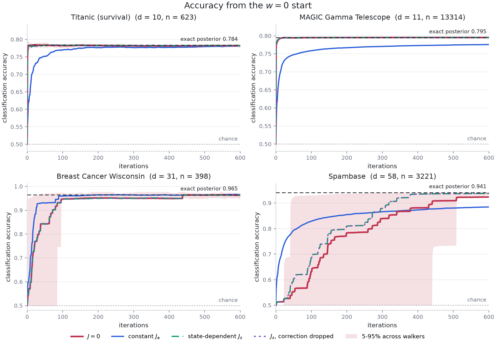
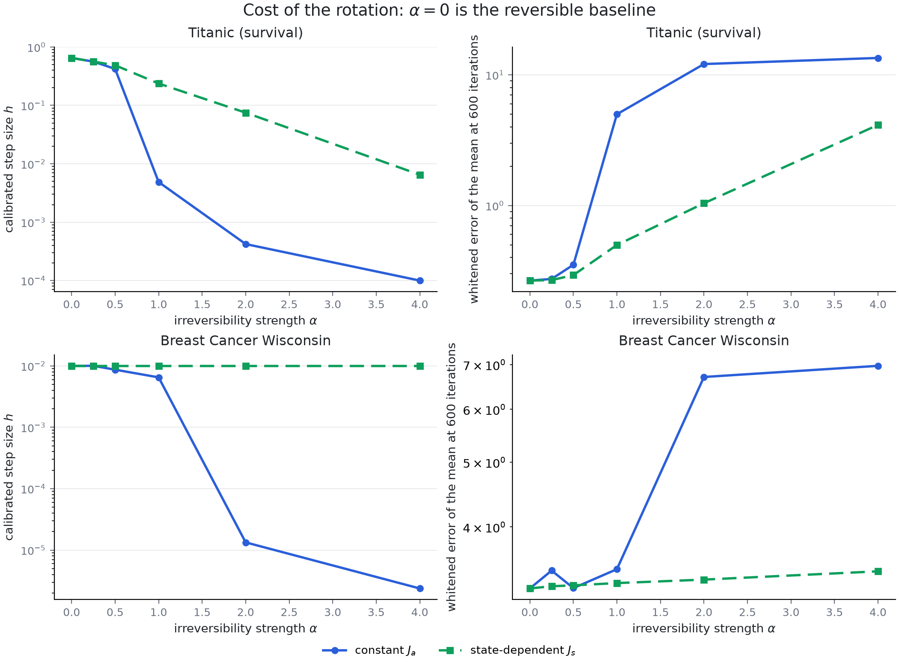
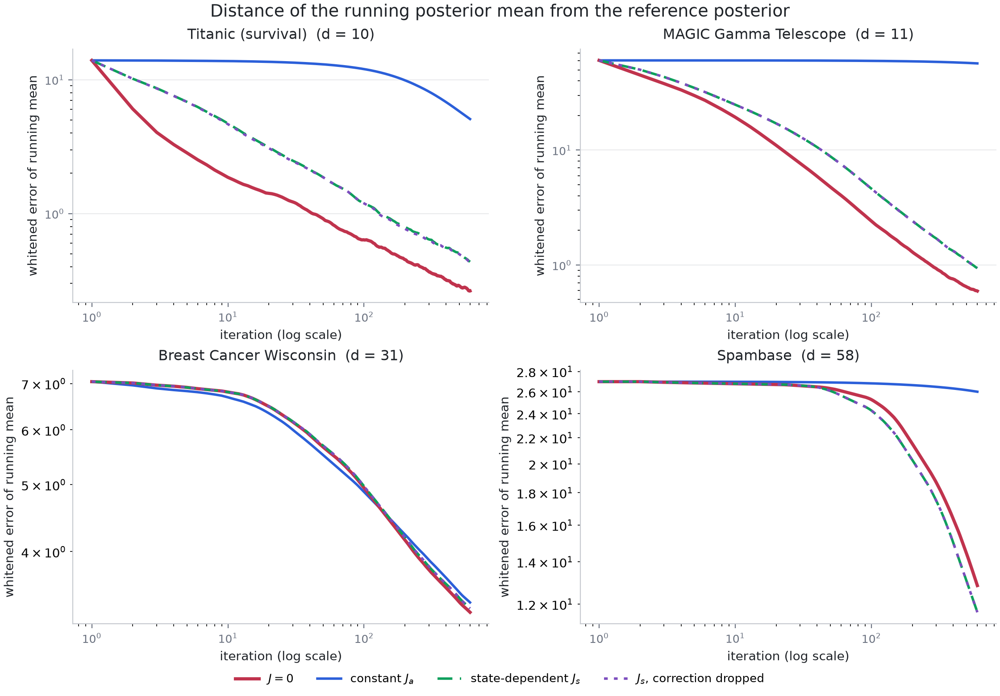
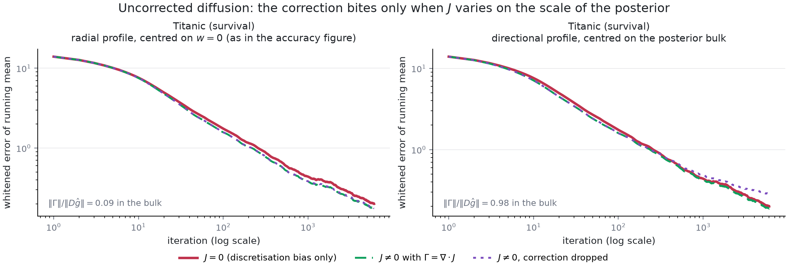

# Accelerating Non-Differentiable Sampling

Does an irreversible (skew-symmetric) perturbation speed up a **derivative-free**
MCMC sampler?  This repository answers that question on four binary
classification posteriors by measuring how fast test-set accuracy converges from
a cold `w = 0` start, for four choices of the perturbation:

| variant | field | divergence correction |
|---|---|---|
| `zero` | `J = 0` (reversible baseline) | not needed |
| `constant` | `J_a = alpha A`, `A` skew-symmetric and constant | zero by construction |
| `state` | `J_s(w) = alpha s(w) A`, radial profile `s` | included |
| `state_nocorr` | the same `J_s(w)` | **dropped** |



## Provenance

The repository held nothing but a one-line README when this code was written, so
the sampler here is a **reconstruction** built to match the earlier two-panel
figure (its legend, its `w = 0` start, its 600-iteration axis, its 5-95% walker
band and its exact-posterior reference line), not the original implementation.
Everything it assumes is stated in [Method](#method) and is a knob in the code;
swap in your own kernel by implementing `nds.skew.SkewField` or by replacing
`nds.target.LogisticPosterior`.  Breast Cancer Wisconsin and Spambase are the two
datasets added here, alongside Titanic and MAGIC.

## Method

### Target

Bayesian logistic regression: `U(w) = -log p(y | X, w) - log p(w)` with a
Gaussian prior (`prior_scale = 2`, the intercept effectively unpenalised at
scale 10).  Features are standardised on the training split and carry an
intercept column, and the posterior is sampled on a stratified 70% training
split while accuracy is measured on the held-out 30%.

### The sampler is derivative free

The dynamics are the irreversible Langevin diffusion of Ma, Chen and Fox (2015),

```
dw = [-(D + J(w)) grad U(w) + Gamma(w)] dt + sqrt(2 D) dB,
Gamma_i(w) = sum_j d/dw_j (D_ij + J_ij(w)),
```

discretised by Euler-Maruyama and corrected by Metropolis-Hastings.  `grad U` is
never evaluated: the drift uses the central-difference surrogate

```
ghat_j(w) = [U(w + eps e_j) - U(w - eps e_j)] / (2 eps),      eps = 1e-2,
```

which costs `2 d` potential evaluations per step and touches only the linear
predictor, `X (w + eps e_j) = Xw + eps X_j`, so no matrix product is repeated.
`Gamma` is the divergence of the field *the user chose*, available in closed
form, so it needs no derivative of `U` either.  (The analytic gradient in
`nds.target.LogisticPosterior.grad` is used only to build the reference
posterior, never by a sampler under test.)

### Why the Metropolis step matters for the comparison

Because `mu(w) = w + h[-(D + J(w)) ghat(w) + Gamma(w)]` is a deterministic
function of `w`, the accept/reject step makes `exp(-U)` the **exact** invariant
law for every variant in the table -- including the one that drops `Gamma`.
Dropping the correction is therefore an efficiency question, not a bias
question, and the `state` and `state_nocorr` curves in the accuracy figure lie
on top of each other by construction.  `tests/test_nds.py` asserts this: all
four variants agree with a long reference run to within half a posterior
standard deviation.

The correction earns its keep in the *uncorrected* diffusion, which is what
`experiments/run_correction_bias.py` measures -- see
[the correction term](#the-correction-term-only-matters-without-the-metropolis-step)
below.

### The fields

`A` is a random skew-symmetric matrix (fixed seed) normalised to unit spectral
norm and then expressed in the geometry of the preconditioner, `A <- L A L^T`
with `D = L L^T`, which keeps it skew and puts `alpha = 1` at "a rotation as
strong as the reversible part" in whitened coordinates.  The state-dependent
field modulates it radially,

```
J_s(w) = alpha s(w) A,   s(w) = 1 - exp(-r(w)^2 / 2 rho^2),   r(w)^2 = w^T D^{-1} w,
Gamma(w) = alpha A grad s(w),   grad s(w) = (D^{-1} w / rho^2) exp(-r(w)^2 / 2 rho^2),
```

so the rotation is switched off at the `w = 0` start, where `|grad U|` is
largest, and switched on once the walker has travelled a whitened distance of
order `rho`.

### Warm-up, preconditioner, step size

Per dataset, two `J = 0` warm-up rounds (derivative free, no held-out data)
produce the shrunk sample covariance used as `D` and the radial scale
`rho = half the whitened distance of the pilot ensemble from the origin`.  Each
variant then gets **its own** step size, bisected so that a run started at
`w = 0` accepts about half of its proposals over the whole transient.  Tuning on
the transient rather than at stationarity is deliberate: a step size that is
only good near the mode leaves a Metropolis chain frozen at the start.  Every
variant is tuned by the same procedure, and the calibrated values are reported
in `results/summary.csv`.

### Reference posterior

The dashed line in each panel is the posterior predictive accuracy of a long
preconditioned MALA run that *does* use analytic gradients and Hessians (MAP,
Laplace preconditioner, 8 chains, 20k iterations after warm-up, thinned).  Its
two halves agree to four decimals on every dataset.

### Accuracy metric

At iteration `t` each walker predicts with the running posterior predictive
mean, `mean_{s<=t} sigmoid(X_test w_s)`, thresholded at one half with ties
counting as one half -- so the `w = 0` start scores exactly 0.5.  Panels show
the mean over 32 walkers, with the 5-95% band across walkers for the baseline.

## Results

Four datasets, 32 walkers each, all started at `w = 0`, 600 iterations, rotation
strength `alpha = 1`.  Full numbers: [`results/summary.md`](results/summary.md),
[`results/summary.csv`](results/summary.csv),
[`results/paired_comparison.md`](results/paired_comparison.md).

| dataset | reference accuracy | `J = 0` | constant `J_a` | state-dependent `J_s` |
|---|---|---|---|---|
| Titanic | 0.7836 | **3** iterations | 478 | 13 |
| MAGIC | 0.7948 | **9** | never (ends at 0.776) | 7 |
| Breast Cancer | 0.9649 | 438 | **110** | 438 |
| Spambase | 0.9413 | never (ends at 0.924) | never (ends at 0.885) | **452** |

The table counts iterations until the mean accuracy curve settles within 0.005
of the reference.  The same iteration budget is much easier for the two
low-dimensional problems (Titanic, MAGIC) than for the two higher-dimensional
ones, where 600 iterations of a derivative-free chain is not enough to settle
the posterior mean at all.

The Breast Cancer column is the one number in this table not to lean on.  There
the accuracy curve advances in visible steps, as individual test points cross
the 0.5 threshold, so the crossing iteration swings with the walker count: in
the strength sweep, run with 16 walkers instead of 32, the baseline settles at
92 iterations and the constant field at 114 -- the opposite order.

Since every variant shares walker seeds, the differences can be paired walker by
walker.  At the final iteration, against the `J = 0` baseline:

* **constant `J_a`** is worse on accuracy on MAGIC (-0.019 +/- 0.001) and
  Spambase (-0.039 +/- 0.014), indistinguishable on Titanic, and very slightly
  better on Breast Cancer (+0.002 +/- 0.001).  Its posterior-mean error is worse
  everywhere, catastrophically so on MAGIC (+56 posterior standard deviations)
  and Spambase (+13).
* **state-dependent `J_s`** is within noise of the baseline on accuracy on all
  four datasets (largest effect: Spambase, +0.014 +/- 0.014), and slightly worse
  on posterior-mean error on Titanic and MAGIC.
* **dropping the divergence correction** changes nothing: `state` and
  `state_nocorr` agree to four decimals, as the Metropolis correction
  guarantees.

So the earlier reading of the two-panel figure holds and extends to four
datasets: **the irreversible perturbation does not accelerate this sampler, and
a constant rotation of the same magnitude as the reversible part makes it
distinctly worse.**  The rest of this section is about why.

### Why the constant rotation costs so much

The step size each variant can run at is not a free parameter -- it is what the
acceptance rate allows, and a rotation destroys the cancellation that lets
MALA-style proposals take large steps.  Writing `w' = w + h b(w) + sqrt(2h) xi`,
the `O(sqrt(h))` terms of the log acceptance ratio cancel when `b = -D grad U`,
leaving `O(h^{3/2})`; with `J != 0` the term `sqrt(2h) (J ghat) . xi` survives,
so the spread of the log ratio decays only like `h^{1/2}` and the step size must
shrink like `1/|J ghat|^2` to hold the acceptance rate.
[`results/acceptance_scaling.txt`](results/acceptance_scaling.txt) measures
exactly that -- the fitted slopes are 1.50 for `J = 0` and 0.50 for the constant
field -- and the calibrated step sizes pay for it:

| dataset | `h` for `J = 0` | `h` for constant `J_a` | ratio |
|---|---|---|---|
| Titanic | 0.649 | 0.00487 | 133x |
| MAGIC | 0.274 | 0.000205 | 1300x |
| Breast Cancer | 0.010 | 0.00649 | 1.5x |
| Spambase | 0.0178 | 0.0000205 | 870x |



The sweep shows the cliff: up to `alpha = 0.5` a constant rotation is free and
also does nothing, and beyond `alpha = 1` its step size falls off a cliff while
the state-dependent field degrades gently.  The gentle degradation is not luck.
Its profile vanishes at `w = 0`, exactly where `|grad U|` -- and therefore the
surviving acceptance term -- is largest, so it keeps the baseline step size
through the cold start; the measured slope for `J_s` is 1.50 at `w = 0` and only
drops to 0.50 near the posterior mean, where the same rotation is cheap.

### Accuracy is a flattering diagnostic

On Breast Cancer and Spambase the constant field's accuracy curve rises
*faster* than the baseline for the first hundred iterations, and on Breast
Cancer it reaches the reference band four times sooner.  It is not sampling
better.  At a step size a thousand times smaller the chain is a near-noiseless
descent: it accumulates drift coherently while the noise it should be
accumulating grows only as `sqrt(t)`, so its running predictive mean is smooth
and lands on the right side of the 0.5 threshold early, while the posterior
itself is nowhere near explored (whitened mean error 26 against 13 for the
baseline on Spambase).



That is why this repository reports both, and why the accuracy panels should not
be read as a mixing comparison.  The log-iteration version of the accuracy
figure,
[`figures/accuracy_four_datasets_logx.png`](figures/accuracy_four_datasets_logx.png),
is the readable one for the first few dozen iterations.

### Without the preconditioner, same story

Everything above runs with the warm-up preconditioner `D`.  Dropping it
(`--geometry identity`, Titanic and Breast Cancer, in
[`results/summary_identity.md`](results/summary_identity.md) and
[`figures/accuracy_four_datasets_identity.png`](figures/accuracy_four_datasets_identity.png))
slows every variant down, as expected, and leaves the ranking untouched: the
constant field's step size is still 65 times smaller on Titanic, its accuracy is
worse by 0.013 +/- 0.002, and the state-dependent field is again
indistinguishable from the baseline (0.0000 +/- 0.0004).  It also removes the
one apparent win in the main table: with `D = I` the constant field's advantage
on Breast Cancer is gone (-0.0005 +/- 0.0015), which is the second reason to
read that column as noise.

### The correction term only matters without the Metropolis step

The two state-dependent curves in the accuracy figure coincide because the
accept/reject step already makes `exp(-U)` invariant; `Gamma` cannot change
that, only the efficiency with which the chain gets there.  To see what the
correction is actually for, `experiments/run_correction_bias.py` runs the same
fields as an **uncorrected** diffusion at one shared step size, where the
`J = 0` curve is the pure Euler discretisation bias to compare against.



On Titanic, in units of reference posterior standard deviations:

| field | correction size relative to the drift, in the bulk | bias with `Gamma` | bias without `Gamma` |
|---|---|---|---|
| `J = 0` | - | 0.204 (discretisation only) | - |
| radial `J_s`, centred on `w = 0` | 0.09 | 0.178 | 0.181 |
| directional `J_c`, centred on the bulk | 0.98 | 0.192 | 0.289 |

The radial field is the one in the accuracy figure, and dropping its correction
is harmless *even without the Metropolis step*, for a reason worth knowing: the
posterior bulk of these problems sits 10 to 66 whitened standard deviations from
`w = 0` (13 on Titanic), where a profile centred on the origin has all but
saturated, so `Gamma` is under a tenth of the reversible drift.  Make the profile vary on the
scale of the posterior instead -- `J_c(w) = alpha tanh(c . (w - w_bulk)) A`,
with `c` a whitened direction -- and `Gamma` becomes as large as the drift.
Then dropping it inflates the bias by half again over the baseline
discretisation error and costs a visible 0.003 of test accuracy.

The same run on Breast Cancer resolves nothing: at this step size the
uncorrected chain has not equilibrated within 6000 iterations, so every field
sits at a whitened error of about 3.05 and the correction is buried in the
transient.  The committed figure is therefore Titanic only, though
`results/bias_breast_cancer.npz` holds the other run.

So "the correction term does not matter" is only true of a slowly varying `J`.
The lesson for a state-dependent field is to compare the size of `Gamma` with
the size of the reversible drift `D ghat` where the chain actually spends its
time, before deciding the term is negligible.

## Datasets

| dataset | n (train/test) | d | source |
|---|---|---|---|
| Titanic (survival) | 623 / 268 | 10 | Kaggle Titanic training split, via the `seaborn-data` mirror |
| MAGIC Gamma Telescope | 13314 / 5706 | 11 | UCI `magic04.data` (19020 events) |
| Breast Cancer Wisconsin | 398 / 171 | 31 | shipped with scikit-learn (`load_breast_cancer`) |
| Spambase | 3221 / 1380 | 58 | UCI `spambase.data`, features `log1p`-scaled |

`nds/data.py` caches the raw files under `data/` (git-ignored) and checks each
one against the SHA256 digest in `EXPECTED_SHA256`, so a mirror that changes its
contents raises rather than silently changing the dataset.  UCI and OpenML are
unreachable from some environments, including the one this was run in, which is
why the two UCI files come from a public GitHub mirror.

## Reproducing

```bash
pip install -r requirements.txt
python3 tests/test_nds.py                    # correctness checks, ~2 minutes
./experiments/run_all.sh                     # four datasets, one process each, ~30 min
python3 experiments/plot_accuracy.py         # figures + results/summary.{csv,md}
python3 experiments/paired_comparison.py     # per-walker paired differences
python3 experiments/acceptance_scaling.py --dataset titanic   # the step-size mechanism
python3 experiments/run_alpha_sweep.py && python3 experiments/plot_alpha_sweep.py
python3 experiments/run_correction_bias.py
python3 experiments/plot_correction_bias.py --datasets titanic
```

The unpreconditioned robustness check, whose outputs are suffixed so that they
do not overwrite the defaults:

```bash
for ds in titanic breast_cancer; do
  python3 experiments/run_accuracy.py --datasets $ds --geometry identity
done
python3 experiments/plot_accuracy.py --datasets titanic breast_cancer \
    --geometry identity --suffix _identity
python3 experiments/paired_comparison.py --datasets titanic breast_cancer \
    --geometry identity
```

Single runs are configurable, for instance

```bash
python3 experiments/run_accuracy.py --datasets magic --alpha 0.5 --geometry identity
```

## Caveats

* The sampler is a reconstruction (see [Provenance](#provenance)); the numbers
  describe *this* kernel, not necessarily the one behind the original figure.
* One split, one preconditioner, one random `A` and one walker seed per dataset.
  Differences quoted with standard errors are paired across the 32 walkers,
  which covers walker noise but not the choice of `A` or of the split.
* `alpha = 1` throughout the accuracy figure; the strength sweep covers
  `alpha = 0` to `4` on Titanic and Breast Cancer only.
* Step sizes are calibrated to about 50% average acceptance from the `w = 0`
  start.  On the near-separable Breast Cancer posterior the acceptance-versus-`h`
  curve is a cliff rather than a slope, so every variant ends up at a
  conservative step size with 0.82-0.93 acceptance, and the `J = 0` versus
  `J_a` step-size ratio there (1.5x) understates the effect seen elsewhere.
* 600 iterations does not equilibrate the posterior *mean* on Breast Cancer or
  Spambase -- the whitened error is still 3 and 12 standard deviations at the
  end.  Accuracy converges anyway, which is the point of the section above.
* The four targets are smooth posteriors.  Nothing in the kernel uses that, but
  a genuinely non-differentiable target -- a Laplace prior, or a hinge
  pseudo-likelihood -- would be a stronger test of the derivative-free claim,
  and `nds.target` is the only file that would have to change.
* Cost is counted in iterations, not in potential evaluations.  Every variant
  pays the same `2 d` evaluations per step, so the ranking is unaffected, but a
  fair comparison against a gradient-based sampler would have to count them.

## Where to go next

The obstacle measured above is specific to putting the rotation inside the
Euler proposal mean: that is what breaks the acceptance-ratio cancellation and
forces the step size down.  Two ways around it, neither implemented here:

1. Apply the rotation as a **separate volume-preserving flow** composed with a
   reversible Metropolis step, rather than as a term in the same proposal.  For
   constant skew `J` the flow `dw/dt = J grad U(w)` conserves `U` exactly
   (`grad U . J grad U = 0`) and preserves volume, so its exact solution leaves
   the target invariant and a discretisation of it needs only its own
   accept/reject step -- it does not have to share the reversible step size.
2. Build irreversibility from a **lifted or guided chain** (a velocity flag that
   persists until a rejection), which buys directed motion without a rotation
   term in the proposal mean at all.

## Layout

```
nds/data.py        dataset loaders, caching, standardisation, splits
nds/target.py      logistic posterior, central-difference surrogate, prediction
nds/skew.py        J = 0, constant, radial and directional fields, and their divergence
nds/sampler.py     Metropolis-corrected irreversible steps, warm-up, calibration
nds/reference.py   MAP, Laplace covariance, long gradient-based reference chain
nds/metrics.py     autocorrelation, ESS, iterations-to-reference
experiments/       runners, plotting scripts, diagnostics
tests/test_nds.py  divergence identities, surrogate accuracy, invariance
results/           traces (.npz), per-dataset summaries, summary.csv
figures/           the figures referenced above
```
