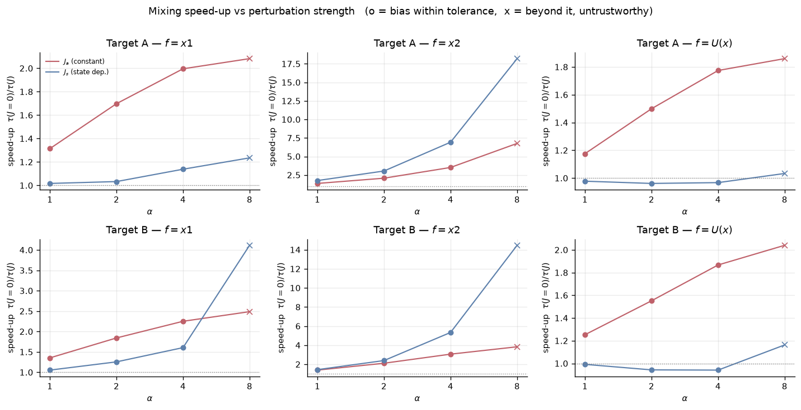
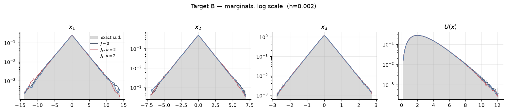
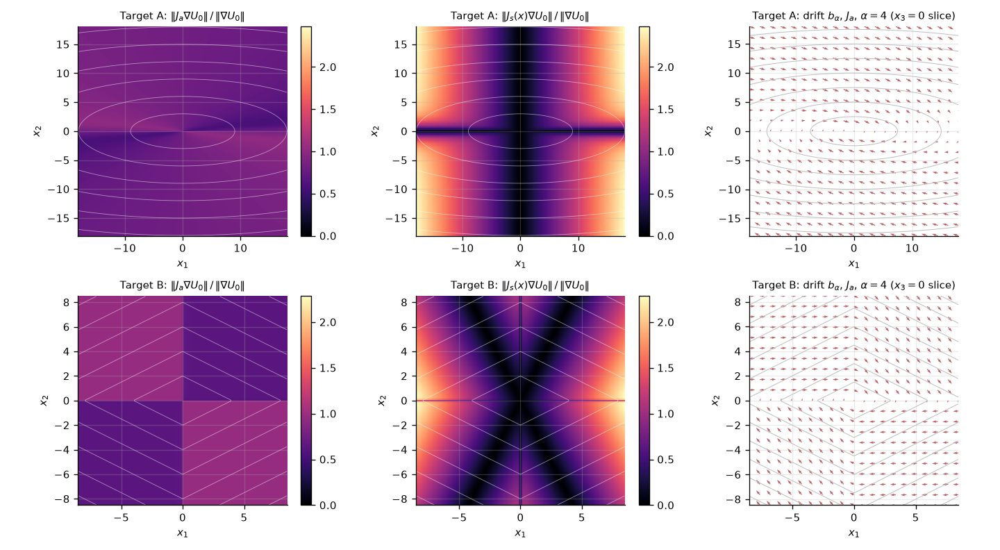
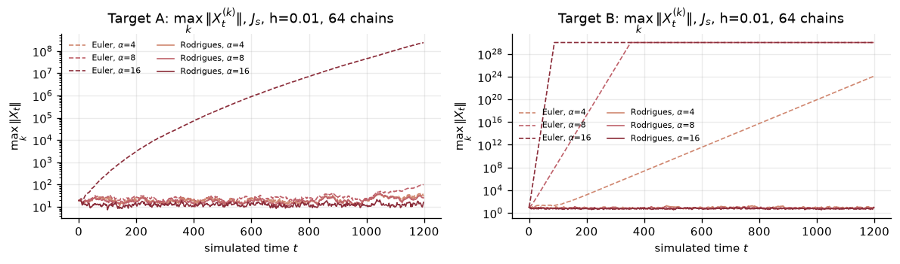
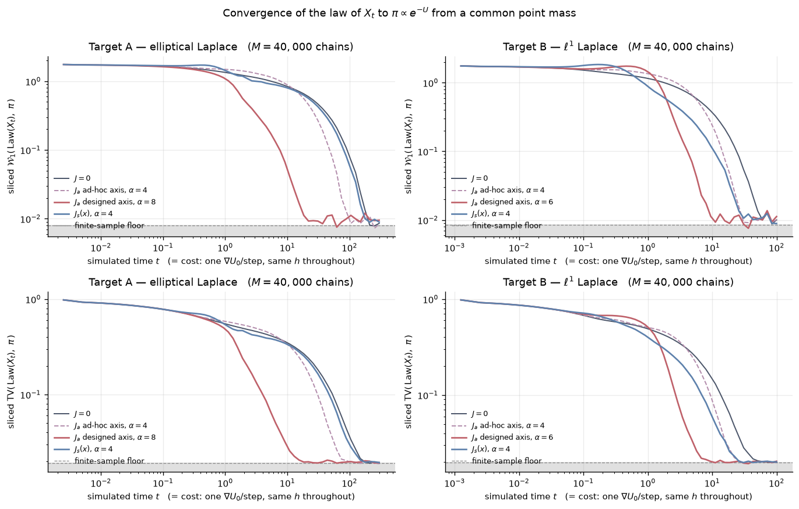

# Accelerating Non-Differentiable Sampling

Numerical experiments for **non-reversible anchored Langevin dynamics (NALD)** on targets whose
potential is only locally Lipschitz.

## The dynamics

For a target $\pi \propto e^{-U}$ with $U$ locally Lipschitz, a $C^2$ *anchor* $U_0$ and a $C^2$
field $\psi$, set

```
a(x)       = exp(U(x) - U0(x))
c(x)       = exp(U(x)) J(x) grad psi(x)
b_alpha(x) = -a(x) grad U0(x) + alpha c(x)

dX_t = b_alpha(X_t) dt + sqrt(2 a(X_t)) dW_t                                   (NALD)
```

With the canonical choice `psi = exp(-U0)` this becomes

```
dX_t = -a(X_t) (I + alpha J(X_t)) grad U0(X_t) dt + sqrt(2 a(X_t)) dW_t        (NALD-c)
```

`grad U` is never evaluated — only the smooth anchor's gradient is. The reversible part has
*identically zero* probability flux against `exp(-U)`, and the antisymmetric part preserves
invariance whenever `J` is skew-symmetric with divergence-free columns.

## Notebook

[`notebooks/nald_laplace_experiments.ipynb`](notebooks/nald_laplace_experiments.ipynb) applies NALD in
$d = 3$ to two non-differentiable targets and compares three perturbations.

**Targets** (each defined in its own cell, with $U$ and $U_0$ written out explicitly):

| | $U(x)$ | anchor $U_0(x)$ | non-smooth set |
|---|---|---|---|
| A — elliptical Laplace | $\sqrt{x^\top\Sigma^{-1}x}$ | $\sqrt{x^\top\Sigma^{-1}x+\delta^2}$ | $\{0\}$ (conical cusp) |
| B — $\ell^1$ Laplace | $\sum_i \lvert x_i\rvert/b_i$ | $\sum_i \sqrt{x_i^2+\delta^2}/b_i$ | $\bigcup_i\{x_i=0\}$ |

Both anchors are hyperbolic (pseudo-Huber) smoothings, so `a = exp(U - U0)` is bounded above and below
and `grad U0` is bounded and Lipschitz. Both targets admit exact i.i.d. sampling, which is used as
ground truth.

**Perturbations**: `J = 0` (reversible), a constant skew-symmetric `J_a = hat(u)` with
`u = (1,1,1)/sqrt(3)`, and the state-dependent

```
          [   0    -s x3   s x2 ]
J_s(x) =  [  s x3    0    -s x1 ]  =  s * hat(x),     J_s(x) v = s (x cross v)
          [ -s x2   s x1    0   ]
```

**What the notebook reports**: verification of the skew / divergence-free conditions and of
`div(J grad psi) = 0`; correctness against exact draws (marginals, Q-Q, moments) and independence of
the invariant law from the smoothing parameter `delta`; a paired stationarity-drift measurement of the
discretisation bias as a function of `alpha` and `h`; integrated autocorrelation times, ESS, speed-ups
and ergodic-average MSE at matched cost; and an analysis of *why* the two `J`s behave differently.

Speed-ups are never reported on their own — the measured discretisation bias is printed next to every
one of them, and configurations whose bias exceeds the tolerance are flagged, because a large `alpha`
at fixed `h` buys apparent mixing with real bias.

### Headline result

Integrated autocorrelation times in simulated time, at the strongest `alpha` whose measured bias stays
within tolerance (`alpha = 4` in all four cases); speed-up over `J = 0` in brackets. Same `h`, same step
count, same one gradient per step for every row.

| target | config | `tau_x1` (slow) | `tau_x2` | `tau_x3` (fast) | `tau_U` | max&#124;bias&#124; |
|---|---|---|---|---|---|---|
| A | `J = 0` | 55.30 | 8.78 | 2.32 | 21.94 | 0.008 |
| A | `J_a` | **27.71 (2.00x)** | 2.50 (3.52x) | 0.64 (3.64x) | 12.37 (1.77x) | 0.014 |
| A | `J_s` | 48.57 (1.14x) | **1.27 (6.93x)** | 0.89 (2.60x) | 22.68 (0.97x) | 0.021 |
| B | `J = 0` | 17.50 | 5.13 | 0.81 | 6.42 | 0.014 |
| B | `J_a` | **7.77 (2.25x)** | 1.67 (3.07x) | 0.24 (3.41x) | 3.44 (1.87x) | 0.018 |
| B | `J_s` | 10.90 (1.61x) | **0.96 (5.34x)** | 0.64 (1.26x) | 6.82 (0.94x) | 0.030 |

`J_a` is the better accelerator of the slow coordinate on both targets; `J_s` gives the larger gains on
the fast ones and essentially none on `U(x)`.



Crosses mark `alpha` values whose measured bias exceeds tolerance — the large `J_s` gains at
`alpha = 8` are discretisation error, not mixing.

Correctness, on the harder target: NALD marginals over exact i.i.d. draws across four orders of
magnitude, for all three perturbations, with `grad U` never evaluated.



Why the two `J`s differ — `||J_s grad U0||` is exactly zero along the principal axes (target A) and
along the per-orthant rays (target B), while `||J_a grad U0||` is nonzero everywhere:



And the instability that forces the Rodrigues splitting (dashed = plain Euler-Maruyama):



Findings worth flagging:

* Plain Euler–Maruyama is **unstable** for `J_s`. The exact `J_s` flow is a rotation
  `dx/dt = omega x x` with `omega = alpha s a grad U0` and conserves `|x|`, but an explicit Euler step
  inflates `|x|` by `sqrt(1 + (h |omega|)^2)` against a *bounded* restoring drift, so the chain escapes.
  The notebook uses a Lie–Trotter split with the rotation integrated exactly (Rodrigues), at the same
  one-gradient-per-step cost.
* The `J_s` perturbation `alpha c = (alpha s a grad U0) x x` **vanishes wherever `x` is parallel to
  `grad U0(x)`** — for target A that is exactly the principal axes of `Sigma`, i.e. the slow directions.
  This is why the constant `J_a` is the better accelerator of the slow coordinate here, while `J_s`
  mostly stirs the fast ones.
* `delta` cannot bias the answer, so it is free to tune — but it is not a free lunch. Small `delta`
  keeps `a = exp(U - U0)` near 1 and mixes fast while stiffening `grad U0`; large `delta` conditions the
  drift but collapses `a` and throttles the diffusion.

## Convergence in Wasserstein and total variation

[`notebooks/nald_wasserstein_tv.ipynb`](notebooks/nald_wasserstein_tv.ipynb) measures how fast the
*law* of `X_t` reaches `pi`, rather than how fast one trajectory decorrelates: 40,000 independent
chains from a common point mass at `x0 = 2 sd_pi`, with `pi` represented by exact i.i.d. draws.
Sliced `W1` over 64 fixed directions in standardised coordinates (exact in each direction), and binned
TV on 50 equiprobable reference bins (a lower bound on the true TV). Both floors are measured and
plotted: the finite-sample floor from applying the same estimator to two independent exact samples, and
the `O(h)` discretisation bias as whatever the curves plateau at above it.



### Designing the constant axis

A constant skew in 3-D is `J_a v = u x v`, so the only freedom is the axis. Linearising with
`S = Cov_pi^-1`, and using `tr(J S) = 0` for skew `J` and symmetric `S`, the three eigenvalues of
`(I + alpha J) S` always sum to `tr(S)`, so

```
min Re spec( (I + alpha J) S )  <=  tr(S)/3
```

for **every** skew `J` and every `alpha` — a hard ceiling, attained when the perturbation equalises the
three relaxation rates. That ceiling is 15.3x the reversible gap on target A and 10x on target B, while
the ad-hoc axis `u = (1,1,1)/sqrt(3)` saturates at 2.6x and 2.3x. `nald.optimal_axis` returns the axis
attaining the ceiling; `alpha` is then chosen by measurement, as the value minimising the worst-mode
`tau` subject to the stationarity drift staying within 4%.

Speed-up in the time for the law to reach a fixed multiple of the finite-sample floor:

| target | metric | `J_a` ad-hoc axis | `J_a` designed axis | `J_s` |
|---|---|---|---|---|
| A — elliptical | `W1` | 1.96–2.07x | **10.70–11.86x** | 1.09–1.13x |
| A — elliptical | TV | 1.59–1.92x | **12.18–13.05x** | 1.12–1.16x |
| B — l1 | `W1` | 1.72–1.87x | **5.76–6.14x** | 1.97–2.08x |
| B — l1 | TV | 1.32–1.69x | **4.21–5.69x** | 1.88–2.00x |

The designed axis costs nothing in accuracy — its measured bias is no worse than the ad-hoc one,
because `alpha` does not have to grow to compensate for a poor direction.

`J_s` is left exactly as specified, and trails on the elliptical target by construction: its drift
`(alpha s a grad U0) x x` vanishes wherever `x` is parallel to `grad U0` — the principal axes, which is
the slow manifold — and only the product `alpha s` is free, so no tuning removes that null set. It
accelerates the fast coordinates strongly and the slow one weakly, and overall convergence is governed
by the slowest mode.

Two negative results are recorded in the notebook rather than dropped: Leimkuhler-Matthews integration
buys nothing here (its superconvergence needs additive noise, while NALD has the state-dependent
diffusion `sqrt(2 a(x))`), and pushing `alpha` higher saturates, exactly as the `tr(S)/3` ceiling
predicts.

## Running

```bash
pip install numpy scipy matplotlib jupyter
jupyter lab notebooks/nald_laplace_experiments.ipynb
```

The notebook is self-contained (NumPy + Matplotlib only) and takes roughly 30 minutes to execute end
to end on a single core; it is committed with outputs, so it can be read without running anything.
All figures are also extracted to `figures/`. `nald.py` at the repository root holds the shared target,
perturbation and integrator definitions used by both notebooks.
