# Accelerating Non-Differentiable Sampling

Does an irreversible (skew-symmetric) perturbation speed up a **derivative-free**
MCMC sampler?  Measured on four binary-classification posteriors by how fast
test-set accuracy converges from a cold `w = 0` start, the answer splits in two,
and the split is the interesting part.

**With a Metropolis-corrected kernel and a random `J`: no**, and a constant
rotation of the same magnitude as the reversible part is distinctly worse.
A Metropolis-Hastings chain satisfies detailed balance by construction, so
accept/reject re-reversibilises whatever proposal it is given: the
irreversibility never reaches the chain, and only the proposal's worse
acceptance rate does.  [Results](#results)


**With unadjusted dynamics and a `J` designed from the geometry: yes.**  In 200
iterations both rotations settle within 0.005 of the reference accuracy on three
of the four datasets while the reversible baseline is still climbing, and the
running posterior mean is 1.1x to 3.6x closer.  The design couples each
slow eigendirection of the warm-up Hessian to a fast one, at the amplitude where
their two relaxation rates collide, which is the only thing a skew term can do:
it cannot raise the mean relaxation rate, only stop one direction from setting
the pace.  The accuracy functional itself barely registers the difference, for a
reason worth knowing.
[Making the rotation pay](#making-the-rotation-pay)

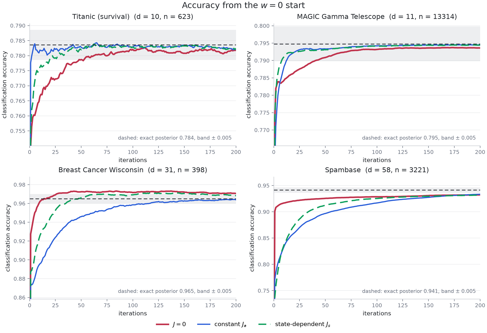

**With a constrained posterior, a stochastic gradient and skew reflection at the
boundary: both prescribed fields win, and the constant one wins twice over.**
Titanic and MAGIC in `d = 9`, restricted to a centred ball `K_r`, sampled by
projected SGLD against skew-reflected non-reversible SGLD at one shared step
size: the running posterior mean is 1.53x +/- 0.12 and 2.04x +/- 0.02 closer to
the exact constrained posterior with the constant tridiagonal `J_a`, and
1.22x +/- 0.04 and 1.065x +/- 0.003 closer with the block-diagonal
state-dependent `J_s(x)`.  The gap between the two fields is predicted to within
a few per cent by how many pairs of directions each one couples.
[Constrained sampling](#constrained-sampling-in-d--9-psgld-against-skew-reflected-srnsgld)

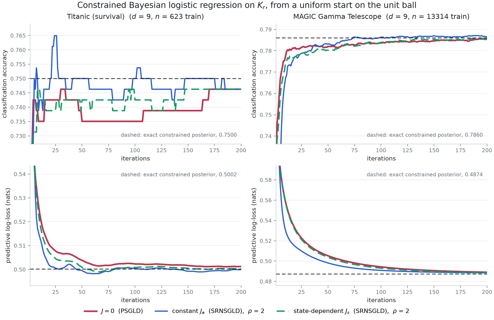

**With a lasso in the potential and anchored Langevin to keep it exact: the
rotation still pays, where the chain is slow enough for it to matter.**  The
experiments of Section 3.3 of
[arXiv:2506.07816](https://arxiv.org/abs/2506.07816) -- synthetic `d = 3`, MAGIC
and Titanic in `d = 9`, a centred ball and a smoothed `l_p` sublevel set -- rerun
with `lam |x|_1` added to the potential and the dynamics replaced by anchored
Langevin composed with the paper's own skew fields, so the kinked target stays
the invariant law and the chain never touches a subgradient.  At the right
amplitude **both** fields reach the exact posterior's accuracy in fewer
iterations than `J = 0` on four of the six problem-and-constraint pairs -- 1.2x
to 4.5x, with no loss of stationary accuracy.  The state-dependent field needs
one change to manage it on a *ball*, and the reason is a two-line calculation:
the paper's choice of a radial `h` makes `J(x) x = 0` everywhere, not just on
the boundary, which freezes the radial drift exactly -- and on these posteriors
the radial direction is the stiff one.  The paper's own recipe allows a
non-radial `h`, which keeps all three of its assumptions and frees the radius.
[The paper's Section 3.3](#the-papers-section-33-with-a-lasso-and-anchored-langevin)

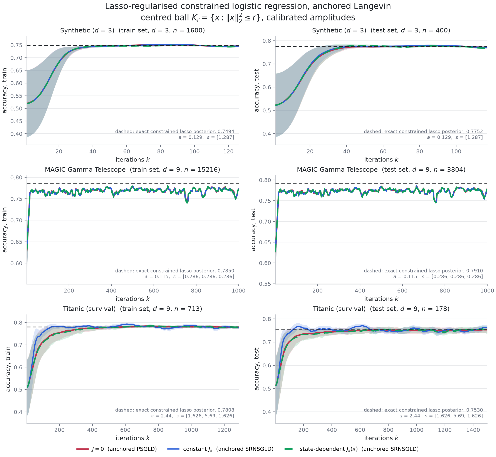

The four fields compared in the first two experiments:

| variant | field | divergence correction |
|---|---|---|
| `zero` | `J = 0` (reversible baseline) | not needed |
| `constant` | `J_a = alpha A`, constant and skew-symmetric | zero by construction |
| `state` | `J_s(w) = alpha s(w) A`, modulated by a profile `s` | included |
| `state_nocorr` | the same `J_s(w)` | **dropped** |

## Provenance

The repository held nothing but a one-line README when this code was written, so
the sampler here is a **reconstruction** built to match the earlier two-panel
figure (its legend, its `w = 0` start, its 600-iteration axis, its 5-95% walker
band and its exact-posterior reference line), not the original implementation.
Everything it assumes is stated in [Method](#method) and is a knob in the code;
swap in your own kernel by implementing `nds.skew.SkewField` or by replacing
`nds.target.LogisticPosterior`.  Breast Cancer Wisconsin and Spambase are the two
datasets added here, alongside Titanic and MAGIC.

## Method

### Target

Bayesian logistic regression.  The potential is the logistic negative
log-likelihood plus a Gaussian (ridge) prior, and nothing else:

```
U(w) = sum_i [ log(1 + exp(x_i . w)) - y_i (x_i . w) ]  +  (1/2) sum_j w_j^2 / sigma_j^2
sigma_j = 2 for every coefficient (prior precision 0.25)
sigma_0 = 10 for the intercept  (prior precision 0.01, so effectively unpenalised)
```

So the regularizer is `lambda ||w||^2 / 2` with `lambda = 0.25`, which is also
the smallest eigenvalue the Hessian can have and therefore what sets the slowest
relaxation rate on a posterior whose likelihood leaves some directions
unidentified.  Features are standardised on the training split and carry an
intercept column; the posterior is sampled on a stratified 70% training split
and accuracy is measured on the held-out 30%.

### The sampler is derivative free

The dynamics are the irreversible Langevin diffusion of Ma, Chen and Fox (2015),

```
dw = [-(D + J(w)) grad U(w) + Gamma(w)] dt + sqrt(2 D) dB,
Gamma_i(w) = sum_j d/dw_j (D_ij + J_ij(w)),
```

discretised by Euler-Maruyama and corrected by Metropolis-Hastings.  `grad U` is
never evaluated: the drift uses the central-difference surrogate

```
ghat_j(w) = [U(w + eps e_j) - U(w - eps e_j)] / (2 eps),      eps = 1e-2,
```

which costs `2 d` potential evaluations per step and touches only the linear
predictor, `X (w + eps e_j) = Xw + eps X_j`, so no matrix product is repeated.
`Gamma` is the divergence of the field *the user chose*, available in closed
form, so it needs no derivative of `U` either.  (The analytic gradient in
`nds.target.LogisticPosterior.grad` is used only to build the reference
posterior, never by a sampler under test.)

### Why the Metropolis step matters for the comparison

Because `mu(w) = w + h[-(D + J(w)) ghat(w) + Gamma(w)]` is a deterministic
function of `w`, the accept/reject step makes `exp(-U)` the **exact** invariant
law for every variant in the table -- including the one that drops `Gamma`.
Dropping the correction is therefore an efficiency question, not a bias
question, and the `state` and `state_nocorr` curves in the accuracy figure lie
on top of each other by construction.  `tests/test_nds.py` asserts this: all
four variants agree with a long reference run to within half a posterior
standard deviation.

The correction earns its keep in the *uncorrected* diffusion, which is what
`experiments/run_correction_bias.py` measures -- see
[the correction term](#the-correction-term-only-matters-without-the-metropolis-step)
below.

### The fields

`A` is a random skew-symmetric matrix (fixed seed) normalised to unit spectral
norm and then expressed in the geometry of the preconditioner, `A <- L A L^T`
with `D = L L^T`, which keeps it skew and puts `alpha = 1` at "a rotation as
strong as the reversible part" in whitened coordinates.  The state-dependent
field modulates it radially,

```
J_s(w) = alpha s(w) A,   s(w) = 1 - exp(-r(w)^2 / 2 rho^2),   r(w)^2 = w^T D^{-1} w,
Gamma(w) = alpha A grad s(w),   grad s(w) = (D^{-1} w / rho^2) exp(-r(w)^2 / 2 rho^2),
```

so the rotation is switched off at the `w = 0` start, where `|grad U|` is
largest, and switched on once the walker has travelled a whitened distance of
order `rho`.

### Warm-up, preconditioner, step size

Per dataset, two `J = 0` warm-up rounds (derivative free, no held-out data)
produce the shrunk sample covariance used as `D` and the radial scale
`rho = half the whitened distance of the pilot ensemble from the origin`.  Each
variant then gets **its own** step size, bisected so that a run started at
`w = 0` accepts about half of its proposals over the whole transient.  Tuning on
the transient rather than at stationarity is deliberate: a step size that is
only good near the mode leaves a Metropolis chain frozen at the start.  Every
variant is tuned by the same procedure, and the calibrated values are reported
in `results/summary.csv`.

### Reference posterior

The dashed line in each panel is the posterior predictive accuracy of a long
preconditioned MALA run that *does* use analytic gradients and Hessians (MAP,
Laplace preconditioner, 8 chains, 20k iterations after warm-up, thinned).  Its
two halves agree to four decimals on every dataset.

### Accuracy metric

At iteration `t` each walker predicts with the running posterior predictive
mean, `mean_{s<=t} sigmoid(X_test w_s)`, thresholded at one half with ties
counting as one half -- so the `w = 0` start scores exactly 0.5.  Panels show
the mean over 32 walkers, with the 5-95% band across walkers for the baseline.

## Results

Four datasets, 32 walkers each, all started at `w = 0`, 600 iterations, rotation
strength `alpha = 1`.  Full numbers: [`results/summary.md`](results/summary.md),
[`results/summary.csv`](results/summary.csv),
[`results/paired_comparison.md`](results/paired_comparison.md).

| dataset | reference accuracy | `J = 0` | constant `J_a` | state-dependent `J_s` |
|---|---|---|---|---|
| Titanic | 0.7836 | **3** iterations | 478 | 13 |
| MAGIC | 0.7948 | **9** | never (ends at 0.776) | 7 |
| Breast Cancer | 0.9649 | 438 | **110** | 438 |
| Spambase | 0.9413 | never (ends at 0.924) | never (ends at 0.885) | **452** |

The table counts iterations until the mean accuracy curve settles within 0.005
of the reference.  The same iteration budget is much easier for the two
low-dimensional problems (Titanic, MAGIC) than for the two higher-dimensional
ones, where 600 iterations of a derivative-free chain is not enough to settle
the posterior mean at all.

The Breast Cancer column is the one number in this table not to lean on.  There
the accuracy curve advances in visible steps, as individual test points cross
the 0.5 threshold, so the crossing iteration swings with the walker count: in
the strength sweep, run with 16 walkers instead of 32, the baseline settles at
92 iterations and the constant field at 114 -- the opposite order.

Since every variant shares walker seeds, the differences can be paired walker by
walker.  At the final iteration, against the `J = 0` baseline:

* **constant `J_a`** is worse on accuracy on MAGIC (-0.019 +/- 0.001) and
  Spambase (-0.039 +/- 0.014), indistinguishable on Titanic, and very slightly
  better on Breast Cancer (+0.002 +/- 0.001).  Its posterior-mean error is worse
  everywhere, catastrophically so on MAGIC (+56 posterior standard deviations)
  and Spambase (+13).
* **state-dependent `J_s`** is within noise of the baseline on accuracy on all
  four datasets (largest effect: Spambase, +0.014 +/- 0.014), and slightly worse
  on posterior-mean error on Titanic and MAGIC.
* **dropping the divergence correction** changes nothing: `state` and
  `state_nocorr` agree to four decimals, as the Metropolis correction
  guarantees.

So the earlier reading of the two-panel figure holds and extends to four
datasets: **the irreversible perturbation does not accelerate this sampler, and
a constant rotation of the same magnitude as the reversible part makes it
distinctly worse.**  The rest of this section is about why.

### Why the constant rotation costs so much

The step size each variant can run at is not a free parameter -- it is what the
acceptance rate allows, and a rotation destroys the cancellation that lets
MALA-style proposals take large steps.  Writing `w' = w + h b(w) + sqrt(2h) xi`,
the `O(sqrt(h))` terms of the log acceptance ratio cancel when `b = -D grad U`,
leaving `O(h^{3/2})`; with `J != 0` the term `sqrt(2h) (J ghat) . xi` survives,
so the spread of the log ratio decays only like `h^{1/2}` and the step size must
shrink like `1/|J ghat|^2` to hold the acceptance rate.
[`results/acceptance_scaling.txt`](results/acceptance_scaling.txt) measures
exactly that -- the fitted slopes are 1.50 for `J = 0` and 0.50 for the constant
field -- and the calibrated step sizes pay for it:

| dataset | `h` for `J = 0` | `h` for constant `J_a` | ratio |
|---|---|---|---|
| Titanic | 0.649 | 0.00487 | 133x |
| MAGIC | 0.274 | 0.000205 | 1300x |
| Breast Cancer | 0.010 | 0.00649 | 1.5x |
| Spambase | 0.0178 | 0.0000205 | 870x |


The sweep shows the cliff: up to `alpha = 0.5` a constant rotation is free and
also does nothing, and beyond `alpha = 1` its step size falls off a cliff while
the state-dependent field degrades gently.  The gentle degradation is not luck.
Its profile vanishes at `w = 0`, exactly where `|grad U|` -- and therefore the
surviving acceptance term -- is largest, so it keeps the baseline step size
through the cold start; the measured slope for `J_s` is 1.50 at `w = 0` and only
drops to 0.50 near the posterior mean, where the same rotation is cheap.

### Accuracy is a flattering diagnostic

On Breast Cancer and Spambase the constant field's accuracy curve rises
*faster* than the baseline for the first hundred iterations, and on Breast
Cancer it reaches the reference band four times sooner.  It is not sampling
better.  At a step size a thousand times smaller the chain is a near-noiseless
descent: it accumulates drift coherently while the noise it should be
accumulating grows only as `sqrt(t)`, so its running predictive mean is smooth
and lands on the right side of the 0.5 threshold early, while the posterior
itself is nowhere near explored (whitened mean error 26 against 13 for the
baseline on Spambase).


That is why this repository reports both, and why the accuracy panels should not
be read as a mixing comparison.  The log-iteration version of the accuracy
figure,
[`figures/accuracy_four_datasets_logx.png`](figures/accuracy_four_datasets_logx.png),
is the readable one for the first few dozen iterations.

### Without the preconditioner, same story

Everything above runs with the warm-up preconditioner `D`.  Dropping it
(`--geometry identity`, Titanic and Breast Cancer, in
[`results/summary_identity.md`](results/summary_identity.md) and
[`figures/accuracy_four_datasets_identity.png`](figures/accuracy_four_datasets_identity.png))
slows every variant down, as expected, and leaves the ranking untouched: the
constant field's step size is still 65 times smaller on Titanic, its accuracy is
worse by 0.013 +/- 0.002, and the state-dependent field is again
indistinguishable from the baseline (0.0000 +/- 0.0004).  It also removes the
one apparent win in the main table: with `D = I` the constant field's advantage
on Breast Cancer is gone (-0.0005 +/- 0.0015), which is the second reason to
read that column as noise.

### The correction term only matters without the Metropolis step

The two state-dependent curves in the accuracy figure coincide because the
accept/reject step already makes `exp(-U)` invariant; `Gamma` cannot change
that, only the efficiency with which the chain gets there.  To see what the
correction is actually for, `experiments/run_correction_bias.py` runs the same
fields as an **uncorrected** diffusion at one shared step size, where the
`J = 0` curve is the pure Euler discretisation bias to compare against.


On Titanic, in units of reference posterior standard deviations:

| field | correction size relative to the drift, in the bulk | bias with `Gamma` | bias without `Gamma` |
|---|---|---|---|
| `J = 0` | - | 0.204 (discretisation only) | - |
| radial `J_s`, centred on `w = 0` | 0.09 | 0.178 | 0.181 |
| directional `J_c`, centred on the bulk | 0.98 | 0.192 | 0.289 |

The radial field is the one in the accuracy figure, and dropping its correction
is harmless *even without the Metropolis step*, for a reason worth knowing: the
posterior bulk of these problems sits 10 to 66 whitened standard deviations from
`w = 0` (13 on Titanic), where a profile centred on the origin has all but
saturated, so `Gamma` is under a tenth of the reversible drift.  Make the profile vary on the
scale of the posterior instead -- `J_c(w) = alpha tanh(c . (w - w_bulk)) A`,
with `c` a whitened direction -- and `Gamma` becomes as large as the drift.
Then dropping it inflates the bias by half again over the baseline
discretisation error and costs a visible 0.003 of test accuracy.

The same run on Breast Cancer resolves nothing: at this step size the
uncorrected chain has not equilibrated within 6000 iterations, so every field
sits at a whitened error of about 3.05 and the correction is buried in the
transient.  The committed figure is therefore Titanic only, though
`results/bias_breast_cancer.npz` holds the other run.

So "the correction term does not matter" is only true of a slowly varying `J`.
The lesson for a state-dependent field is to compare the size of `Gamma` with
the size of the reversible drift `D ghat` where the chain actually spends its
time, before deciding the term is negligible.

## Making the rotation pay

The experiment above answers "does an irreversible perturbation help *this*
sampler" with a clear no.  Two things in it were working against `J`, and both
are fixable, which is what `experiments/run_designed.py` does.

**The Metropolis step was the first.**  A Metropolis-Hastings chain satisfies
detailed balance by construction, so it is reversible with respect to the
target whatever proposal it is handed.  Accept/reject therefore destroys exactly
the property `J` exists to supply, and what survives is only a proposal with a
worse acceptance rate.  Irreversible Langevin samplers are studied as
*unadjusted* dynamics, and that is what this section runs; the bias that comes
with dropping accept/reject is controlled by the step-size rule below and
reported with the results rather than hidden.

**A random `A` was the second.**  What a skew term can do is bounded.  Since
`trace(J H) = 0` for skew `J` and symmetric `H`, the mean relaxation rate of the
linearised dynamics, `trace((D + J) H) / d`, is fixed by `D` and `H` alone: no
rotation can raise it.  What a rotation *can* do is stop the slowest direction
from setting the pace, and a matrix drawn at random does not do that on purpose.

### The design

Near its bulk the target looks like `U(w) = (w - m)^T H (w - m) / 2`, and with
`D = I` the unadjusted dynamics relaxes at `lambda_min(H)` while an explicit
step is capped by `lambda_max(H)`, so the iteration count scales with the
condition number.  `nds.design.paired_skew` works in the eigenbasis of the
warm-up estimate of `H` and couples the `k`-th slowest direction to the `k`-th
fastest.  In a block with eigenvalues `a < b`, the coupling `[[0, s], [-s, 0]]`
turns `diag(a, b)` into `[[a, s b], [-s a, b]]`, whose two rates are real and
collide at the block mean `(a + b) / 2` when `s = (b - a) / (2 sqrt(a b))`.
Pairing slowest with fastest maximises the smallest block mean over all
pairings, so the bottleneck rate moves from the smallest eigenvalue to roughly
the median one.

Three details matter as much as the construction:

* **Stay at or below the collision amplitude.**  Past it the block's rates
  become complex, and an explicit step then has to shrink like `Re / |mu|^2`,
  which costs more than the extra real part gains.  The runs use `0.8` of the
  collision value, which keeps the spectrum real even though the warm-up
  Hessian is only an estimate.  An L-BFGS search over *all* skew matrices,
  maximising the true objective (the worst per-iteration contraction at the
  step size in use), does not improve on the paired construction.
* **Give each field its own step size, by a rule that matches the bias.**
  `h = 2 safety / max Re mu` is the classical explicit optimum for the
  reversible chain up to the `safety` factor, so `J = 0` runs at its own best
  step size rather than one chosen for somebody else.  The unadjusted chain
  inflates the stationary variance of mode `i` by `2 / (2 - h mu_i)`, so fixing
  `h max Re mu` fixes the worst-case inflation and the fields are compared at
  matched discretisation bias.  Inflating a variance does not move the
  posterior mean, which is what both plotted functionals depend on.
* **Guard the step size empirically.**  Shrinkage in the warm-up covariance
  inflates the smallest posterior variances, which understates the largest
  curvature; an explicit unadjusted step is unforgiving about that.
  `nds.sampler.stable_step_size` runs a short pilot and halves `h` while the
  potential fails to settle.  The summary records when it fired.

### Where the state-dependent field earns its keep

The amplitude is derived from a quadratic model of the bulk, so applying it in
the far field -- where that model does not hold and the gradient of `U` is
largest -- deflects the descent and overshoots.  That is exactly what the
calibration finds: on the two posteriors closest to quadratic the constant field
takes the top of the ladder, and on the near-separable Breast Cancer and
Spambase posteriors it has to be backed off to 0.1 and 0.05.

The state-dependent field is the same designed rotation behind a sharp radial
gate on the bulk,

```
J_s(w) = s(w) J_a,   s(w) = 1 / (1 + exp((r(w) - R) / W)),   r(w)^2 = (w - m)^T H (w - m),
```

with `R` three quarters of the whitened distance from `w = 0` to the warm-up
mean and `W` a tenth of it.  Outside the gate the chain is the reversible one;
inside it the full design applies.  That lets the calibration keep amplitude 1.0
where the constant field cannot, and amplitude 1.0 is where the block rates
*collide*, which halves the spectral radius of the drift and so **doubles the
step size** the same step-size rule allows -- both of which show up in the table
below.  Where the gate is actually open, that is; it is not open everywhere, and
[the next section](#the-gate-in-higher-dimension-and-where-it-shuts) measures
where.  Its divergence is
`Gamma(w) = -s(w)(1 - s(w)) J_a H (w - m) / (W r(w))`, in closed form as always.

A Gaussian profile is not sharp enough for this: it decays over a scale
comparable to the distance it is centred on, so with the `w = 0` start only a
factor of two further out than the bulk it still leaves a quarter of the
rotation switched on during the descent.

### The gate in higher dimension, and where it shuts

Nothing in the construction scales with `d`, which is the point of writing the
state dependence as a scalar times a constant matrix rather than as a general
`J(w)`.  A general skew field has `d(d-1)/2` free functions -- 1653 of them at
`d = 58` -- and its divergence needs a derivative of every one.  Here the only
state-dependent object is the scalar `s(w)`, so there is one gradient to take,
`grad s = -s(1-s) H (w - m) / (W r)`, and the divergence is a single
matrix-vector product: `O(d^2)` per step, the same order as applying `J` at all.
The gate needs one extra quadratic form `r(w)^2` per step, no extra potential
evaluations, and `J_a` is built once from the warm-up Hessian estimate as
`floor(d/2)` 2x2 blocks (an odd `d` leaves the middle direction uncoupled).

What does *not* scale is the rule that places the gate.  `R` and `W` are keyed
to `r0`, the whitened distance from the `w = 0` start to the warm-up mean, which
assumes the start lies outside the bulk.  In the same whitened units a
`d`-dimensional bulk sits at radius `sqrt(d)`, so the assumption needs
`r0 >> sqrt(d)`, and [`experiments/gate_diagnostics.py`](experiments/gate_diagnostics.py)
checks it by evaluating the gate on draws from the reference posterior
([`results/gate_in_the_bulk.md`](results/gate_in_the_bulk.md)):

| dataset | `d` | `r0` (start to bulk) | `sqrt(d)` | bulk radius (median) | mean `s` in the bulk |
|---|---|---|---|---|---|
| Titanic | 10 | 13.90 | 3.16 | 3.07 | **0.994** |
| MAGIC | 11 | 58.67 | 3.32 | 3.13 | **0.999** |
| Breast Cancer | 31 | 1.38 | 5.57 | 36.42 | **3e-46** |
| Spambase | 58 | 0.94 | 7.62 | 34.93 | **8e-104** |

Radii are in the gate's own metric, centred at the warm-up mean `m` and measured
in the warm-up inverse covariance `H`.  On the two low-dimensional posteriors the
picture is the intended one: the start is four to eighteen times further out than
the bulk, and the gate is open where the chain ends up.  On the two
high-dimensional, near-separable posteriors it inverts.  Their warm-up never
reaches the bulk -- a bulk radius of 36 where a matched geometry would give 5.6
says the warm-up mean is not the posterior mean and the warm-up covariance is far
too small -- so `r0` measures the distance to where the pilot stalled, not to the
bulk, and comes out *below* `sqrt(d)`.  The gate keyed to it is then shut
everywhere the chain actually lives.

So on Breast Cancer and Spambase the row labelled gated `J_s` is, in the bulk, a
reversible chain running at the design's step size.  Its amplitude of 1.0 in the
table below is nominal: the calibration is free to keep it precisely because
`s(w) J_a` is switched off where the calibration's score is computed, and the
gain that shows up is the 2x step size, not the rotation.  That is also why
`state` and `state_nocorr` agree to four digits there, and it is the honest
reading of Spambase's near-tie.  The fix is one line -- key `R` to the bulk's own
whitened radius (the median `r` over the warm-up ensemble, or `sqrt(d)`) instead
of to `r0`, and give the warm-up enough iterations to find the bulk on a
near-separable posterior -- but the numbers below are from the run as described,
not from that fix.

### What the design buys

200 iterations, 32 walkers from `w = 0`, `D = I` for every field, each field at
its own step size, common walker seeds.  Full numbers in
[`results/summary_designed.md`](results/summary_designed.md).


| dataset | amplitude (`J_a` / `J_s`) | step size vs `J = 0` | iterations to the 0.005 band | mean error at 200 |
|---|---|---|---|---|
| Titanic | 0.8 / 0.8 | 1.2x / 1.2x | 53 -> **2** / **20** | 1.128 -> **0.856** / **0.870** |
| MAGIC | 1.0 / 1.0 | 2.0x / 2.0x | 40 -> **12** / **8** | 3.978 -> **1.099** / **1.142** |
| Breast Cancer | 0.1 / 1.0 | 1.0x / 2.0x | never -> **116** / **169** | 4.113 -> **3.416** / **3.610** |
| Spambase | 0.05 / 1.0 | 1.0x / 2.0x | never / never / never | 12.310 / 15.108 / **11.159** |

On Titanic and MAGIC both rotations are inside the band while the baseline is
still climbing, and they stay ahead for the rest of the run.  On Breast Cancer
the baseline never settles within 0.005 of the reference in 200 iterations and
both rotations do.  Spambase is the one where 200 iterations is not enough for
anybody: the gated field still converges fastest in posterior-mean terms, and
the constant field, held to amplitude 0.05, is worse than the baseline.

### Why `J = 0` leads early on the two high-dimensional sets

It is worth being precise about this, because the raw accuracy panels for Breast
Cancer and Spambase show the baseline *above* both rotations for the first
fifty-odd iterations.

1. **Accuracy is a threshold functional.**  It depends on the predictive mean
   only through `sign(pbar - 0.5)`, so it saturates as soon as each test point
   is on the right side.  Every field gets there within a handful of iterations;
   what is left to measure is a few thousandths.
2. **A rotation cannot speed up the stiff directions, and those are the ones
   that set a decision boundary.**  `trace((D + J) H)` does not depend on `J`,
   so buying rate for the slow directions means selling it from the fast ones.
   The step-size gain at the collision amplitude repays that per iteration --
   which is why the gated field, with its 2x step, tracks or beats the baseline
   where the constant field cannot.
3. **The baseline is the most under-dispersed chain, and on these two datasets
   that flatters it.**  It runs at the smallest step, so it sits near the MAP for
   longer, and the MAP classifies *better* than the true posterior here: the
   baseline passes 0.971 on Breast Cancer against a reference of 0.965 and then
   stays above it.  A curve above the dashed line has not converged, it has
   overshot the functional; the rotations approach the same line from below.

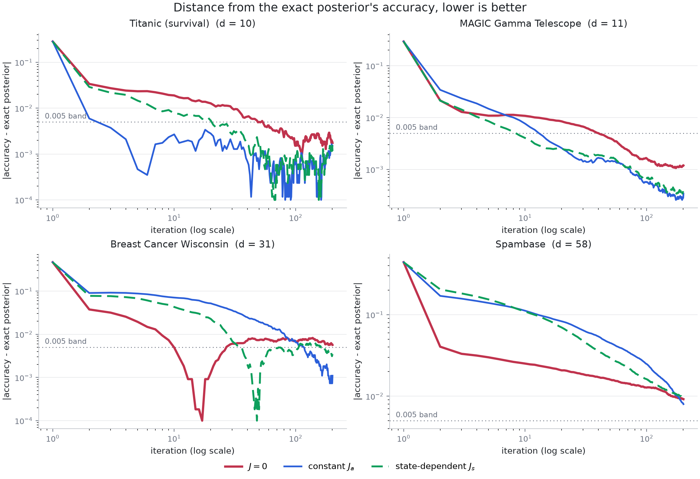

Plotted as distance from the reference accuracy, the crossovers are explicit:
the rotations are ahead from the start on Titanic, from iteration 5 on MAGIC,
from iteration 40 on Breast Cancer, and from iteration 180 on Spambase.

### What is *not* claimed

* The reversible method that spends the same warm-up covariance on a
  preconditioner is faster still on Titanic and MAGIC.  It is recorded in every
  run as `precond` and drawn in
  [`figures/posterior_mean_error_designed.png`](figures/posterior_mean_error_designed.png);
  on Breast Cancer and Spambase its large step throws walkers deep into the
  tails first and it takes hundreds of iterations to recover.  The rotation's
  claim is against `J = 0` *in the same geometry*, which is the comparison the
  irreversible-sampling literature makes, not against preconditioning.
* The unadjusted chain is biased.  The step-size rule caps the worst-case
  variance inflation at 1.18 for every field, and inflating a variance does not
  move the posterior mean, but the invariant law is only correct to `O(h)`
  -- unlike the Metropolis-corrected experiment, which is exact.
* The divergence correction is numerically negligible here too: the gate gives
  `Gamma / |D ghat|` under 0.01 in the bulk, so `state` and `state_nocorr` agree
  to four digits -- on Breast Cancer and Spambase because the gate is shut there
  and `s(1 - s)` vanishes, as
  [the gate measurement](#the-gate-in-higher-dimension-and-where-it-shuts) shows.  The setting where that term is visible is
  [the correction experiment](#the-correction-term-only-matters-without-the-metropolis-step).

## A non-differentiable regularizer, and anchored Langevin

Everything above uses a Gaussian prior, which makes `U` smooth; the
derivative-free claim is then about the *method*, not about the target.  Swap
the prior for a Laplace one and the potential has a kink at every `w_j = 0`,
which is the case the repository is named for.

### The target, the anchor `U_0`, and the clock

```
U(w)   = U_nll(w) + lambda ||w||_1                          the target, non-differentiable
U_0(w) = U_nll(w) + lambda sum_{j>=1} sqrt(w_j^2 + delta^2)  the anchor, smooth
a(w)   = exp(U(w) - U_0(w))                                  the clock, in (0, 1]
```

with `U_nll` the logistic negative log-likelihood, `lambda = 5` (Laplace scale
0.2, strong enough to pull coefficients onto the kink), the intercept
unpenalised, and `delta = 0.02`.  `U_0` is a smooth majorant of `U`: it agrees
with it to within `lambda (d - 1) delta`, which bounds the clock below by
`exp(-lambda (d - 1) delta)` -- 0.41 on Titanic, 0.37 on MAGIC.  Note what `a`
costs: the likelihood cancels in `U - U_0`, so the clock is `O(d)` arithmetic on
the penalties and never touches the data.

### The dynamics

Anchored Langevin ([Gürbüzbalaban, Hu, Yuan and Zhu, *Anchored Langevin
Algorithms*, arXiv:2509.19455](https://arxiv.org/abs/2509.19455)) follows the
gradient of the *anchor* and scales the diffusion by the clock:

```
dw = -a(w) grad U_0(w) dt + sqrt(2 a(w)) dB
```

and `exp(-U)` is exactly invariant.  The one-line reason is the random time
change the authors point to: the anchored process is the `U_0`-diffusion run on
a state-dependent clock of rate `a`, and time-changing a diffusion whose
invariant density is `p` at rate `a` leaves invariant density proportional to
`p / a`, here `exp(-U_0) / exp(U - U_0) = exp(-U)`.

The same argument composes with the skew term of this repository, which is why
the two ideas fit together at all.  The irreversible `U_0`-diffusion
`dy = [-(I + J(y)) grad U_0(y) + div J(y)] dt + sqrt(2) dB` has invariant
density `exp(-U_0)`, so time-changing *it* at rate `a` gives

```
dw = a(w) [ -(I + J(w)) ghat_0(w) + (div J)(w) ] dt + sqrt(2 a(w)) dB
```

with invariant density `exp(-U)` for any skew `J`, state-dependent or not.  The
`ell_1` term never appears inside a gradient: it enters only through the scalar
clock, which is an evaluation.  `ghat_0` is the central-difference surrogate of
`grad U_0`, and differencing the *anchor* is meaningful precisely because the
anchor is smooth -- differencing `U` instead returns
`clip(w / eps, -1, 1)` at the kink, the gradient of an `eps`-Huber smoothing,
so that chain targets the wrong law however small the step size gets.

The gold standard here cannot be the gradient-based MALA reference used
elsewhere in this repository.  It is random-walk Metropolis on `U` itself:
no gradients, no smoothing, exact whatever the kink does.  Its halves agree to
four decimals on both datasets.

### Results

200 iterations, 24 walkers from `w = 0`, three fields, unadjusted, each at its
own step size, on Titanic and MAGIC.  `loss gap` is the predictive log-loss
minus the reference's; `iters to loss band` is the first iteration from which
the loss stays within 1% of the reference; `mean error` is the distance of the
running posterior mean from the reference in reference standard deviations.
Full numbers in `results/summary_{titanic,magic}_anchored.json`.

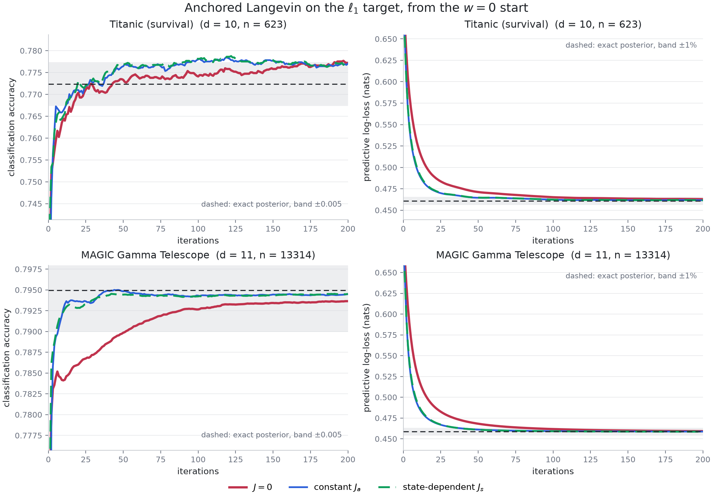

| dataset | field | step size | loss gap | iters to loss band | mean error |
|---|---|---|---|---|---|
| Titanic | `J = 0` | 0.00161 | +0.0021 | 98 | 1.051 |
| Titanic | constant `J_a` | 0.00273 | **+0.0008** | **43** | **0.680** |
| Titanic | gated `J_s` | 0.00273 | **+0.0008** | **44** | **0.681** |
| MAGIC | `J = 0` | 8.97e-05 | +0.0006 | 81 | 4.732 |
| MAGIC | constant `J_a` | 1.76e-04 | **+0.0001** | **36** | **1.491** |
| MAGIC | gated `J_s` | 1.76e-04 | **-0.0000** | **36** | **1.581** |

The design does the same work it does on the smooth target: the slowest
relaxation rate of the anchor's Hessian goes from 17.3 to 84 on Titanic and from
63 to 1050 on MAGIC, and the collision amplitude (which the calibration picks on
both datasets) also buys a step size 1.7x and 2.0x larger.  Both rotations reach
the loss band in less than half the iterations the reversible baseline needs and
end with a posterior mean 1.5x and 3.2x closer.  Accuracy moves in the same
direction but, as before, has very little room: 0.7772 against 0.7771 on
Titanic, 0.7936 against 0.7945 on MAGIC, against references of 0.7724 and
0.7950.

### Ridge against lasso: the same conclusions

The `ell_1` penalty above *is* the lasso regularizer, so the natural question is
whether swapping it for the ridge changes anything.  It does not.  Same protocol
on both targets, and each rotation compared with the reversible baseline inside
its own target, since the two priors give different posteriors
([`results/ridge_vs_lasso.md`](results/ridge_vs_lasso.md), from
`experiments/compare_ridge_lasso.py`):

| dataset | prior | iterations to the loss band, `J = 0` -> `J_a` / `J_s` | speedup | error ratio |
|---|---|---|---|---|
| Titanic | ridge | 74 -> 19 / 21 | 3.9x / 3.5x | 1.61x / 1.60x |
| Titanic | lasso | 97 -> 37 / 42 | 2.6x / 2.3x | 1.65x / 1.64x |
| MAGIC | ridge | 60 -> 25 / 24 | 2.4x / 2.5x | 3.60x / 3.39x |
| MAGIC | lasso | 84 -> 39 / 38 | 2.2x / 2.2x | 2.64x / 2.75x |

The ordering, the mechanism and the step-size gain (1.8x to 2.0x under both
priors) carry over; the lasso speedups are slightly smaller, which is what the
clock's 8 to 15 per cent of effective step size buys the exactness with.

It is also worth checking the sampler against the lasso in its usual form, a
minimisation.  With `C = 1 / lambda` scikit-learn minimises exactly this `U`, and
its solution is the MAP of the posterior that was sampled -- the script asserts
that nudging any coordinate of it either way does not lower `U`:

| | Titanic | MAGIC |
|---|---|---|
| `U` at the minimiser / at the posterior mean | 288.34 / 288.52 | 6102.30 / 6102.39 |
| exact zeros, minimiser / posterior mean | 1 of 9 / 0 of 9 | 1 of 10 / 0 of 10 |
| test accuracy, minimiser / posterior | 0.7724 / 0.7724 | 0.7948 / 0.7950 |
| test log-loss, minimiser / posterior | 0.4631 / 0.4608 | 0.4586 / 0.4586 |

Which is the textbook difference between the two: the minimiser sets a
coefficient exactly to zero, the posterior mean sets none of them to zero and
only pulls them in, and the posterior predictive is the better-calibrated of the
two where they differ at all.

### Is it non-reversible, or only irreversible-looking?

Worth checking rather than asserting, since a skew term can be present in the
code and absent from the dynamics.  Writing the scheme in the complete-recipe
form, the diffusion matrix is `D(w) = a(w) I` and the antisymmetric part is
`a(w) J(w)`.  The reversible drift for that `D` is
`D grad log pi + div D = -a grad U + grad a = -a grad U_0`, which is exactly the
`J = 0` scheme: anchored Langevin on its own is `pi`-reversible, in a
state-dependent metric rather than a flat one.  Everything beyond it is the
antisymmetric part, so `J != 0` should carry a stationary probability current.

`experiments/check_current.py` measures that current directly, as the mean
signed area swept per step in the slow-fast planes the design couples, with
walkers started at stationarity ([`results/stationary_current.txt`](results/stationary_current.txt)):

| field | current in the (slow, fast) plane | max \|z\| |
|---|---|---|
| `J = 0` | +0.0003 +/- 0.0007 | 1.6 |
| constant `J_a` | **-0.0923 +/- 0.0010** | 89 |
| constant `-J_a` | **+0.0999 +/- 0.0011** | 89 |
| gated `J_s` | **-0.0913 +/- 0.0010** | 88 |

So yes: the reversible baseline sweeps no area, the designed rotation sweeps it
at ninety standard errors from zero, and negating the rotation reverses the
current, which is what a probability current does and what a reparametrisation
could not.  The gated field matches the constant one because this measurement is
taken in the bulk, where its gate is open.

Two caveats on the name.  The chains here are unadjusted: adding a Metropolis
step would make them reversible again, for the reason the first experiment
measures.  And the anchored construction is from arXiv:2509.19455 while the
composition with a skew term is derived in `nds/anchored.py` from the time
change; the paper was not reachable from the environment this was written in, so
whether it also treats an irreversible variant is not something this repository
can claim either way.

### What the clock costs, and what it corrects

The clock is not free: the effective step is `h a(w)`, so a coarse anchor slows
the chain in proportion.  Long runs on Titanic, against the same
random-walk-Metropolis reference, with `E ||w||_1` under the posterior mean as
the functional that actually feels the kink (reference value 3.287):

| `delta` | scheme | mean clock | `||w||_1` of the mean |
|---|---|---|---|
| 0.02 | anchored | 0.92 | 3.291 |
| 0.02 | anchor only, `exp(-U_0)` | 1.00 | 3.297 |
| 0.02 | differences of `U` | 1.00 | 3.292 |
| 0.1 | anchored | 0.30 | 3.268 |
| 0.1 | anchor only, `exp(-U_0)` | 1.00 | **3.336** |
| 0.1 | differences of `U` | 1.00 | 3.289 |

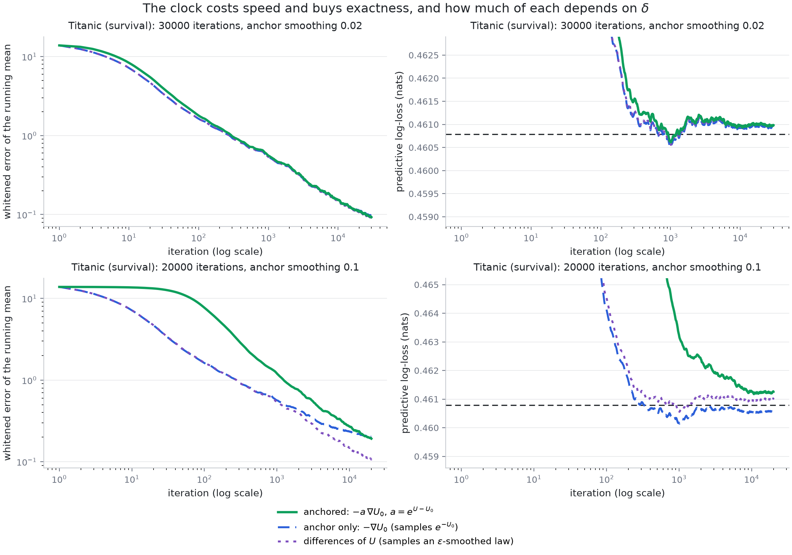

At `delta = 0.02` the clock costs 8% of the step and corrects a bias smaller
than the Monte Carlo error of a 30000-iteration run: all three schemes agree.
At `delta = 0.1` the anchor-only chain is visibly wrong -- it is sampling a
posterior whose prior is smoother and therefore shrinks less, `3.336` against
`3.287` -- and the clock removes that, at the cost of a chain running three
times slower.  The chain that differences `U` directly is not badly wrong here
because its implicit smoothing (`eps = 0.01`) is finer than either anchor, but
its bias is set by `eps` and no step size removes it, whereas the anchored
chain is exact for *any* `delta`.  So `delta` is the knob: large enough that the
anchor is well conditioned, small enough that the clock does not crawl.

Caveats specific to this section: the step size still leaves the unadjusted
`O(h)` bias of every run in this repository; `lambda` and `delta` are fixed
rather than swept; and the comparison is on the two low-dimensional datasets,
where the random-walk reference can be trusted without argument.

## Constrained sampling in `d = 9`: PSGLD against skew-reflected SRNSGLD

This is a different experiment from the ones above, in the setting the
skew-reflected non-reversible dynamics are stated in: a *constrained* posterior,
a *stochastic* (mini-batch) gradient, and the two specific skew fields that
construction prescribes.  Both datasets are reduced to exactly nine features --
Titanic to `n = 891` passengers with `d = 9` engineered features and no
intercept column, MAGIC to its `n = 19020` events with nine of its ten
attributes, dropping `fConc1`, the second-largest pixel's share of the total,
which correlates 0.98 with `fConc`.  Nine is not cosmetic: the state-dependent
field is three `3 x 3` blocks.

The target is the likelihood restricted to a centred ball, with no other
regularisation -- the constraint *is* the prior:

```
pi(x) prop. exp(-U(x)) 1_{K_r}(x),   U(x) = sum_i softplus(x . a_i) - y_i (x . a_i),   K_r = {|x| <= r},   r = 2.
```

Walkers start from the uniform law on the centred *unit* ball, inside `K_2` and
away from the bulk: the constrained MAP sits at `|x*| = 1.734` on Titanic and at
`|x*| = 2.000` -- flat against the boundary -- on MAGIC.

### The two fields, and the two things the block form gives for free

```
J_a          = a on the whole superdiagonal, -a on the subdiagonal, constant;
J_s(x)       = diag( J1(x1,x2,x3), J2(x4,x5,x6), J3(x7,x8,x9) ),
Jk(u,v,w)    = a [[0, w, -v], [-w, 0, u], [v, -u, 0]].
```

Each block of `J_s` is `a` times the hat map of its own coordinate triple, so
`Jk(z) g = a (g x z)`: a step costs one cross product per block, `O(d)` rather
than `O(d^2)`.  Two properties follow, and both are checked in
[`tests/test_nds.py`](tests/test_nds.py):

1. **`div J_s = 0` exactly.**  Row `i` of the correction is
   `sum_j d_j (J_s)_ij`, and every entry of a hat map is free of the coordinate
   it would be differentiated by.  So the Ma-Chen-Fox term vanishes, the drift
   is just `-(I + J_s(x)) ghat(x)`, and -- unlike the gated field earlier in
   this README -- there is no derivative of `J` to estimate or to drop.  The
   same holds trivially for the constant `J_a`.
2. **`J_s(x) x = 0`.**  Each block rotates its triple about itself, so the field
   is tangential to every centred sphere.  That matters at the boundary.  The
   reflection has to be *oblique* when `J != 0`: the stationary current has a
   tangential component, and reflecting along the normal `n` would let it leak
   out and change the invariant law, so the push is along
   `gamma(x_b) = (I + J(x_b)) n`.  It always points inward, because `n . J n = 0`
   for skew `J` gives `n . gamma = 1`.  For `J_s` it gives more than that:
   `J_s(x_b) n = 0`, so `gamma = n` and **skew reflection is plain projection**.
   The state-dependent field needs no boundary machinery that PSGLD does not
   already have; the constant `J_a` does.

The push length is explicit.  With `n = y / |y|` and `gamma = n + J(r n) n`,
`|y - lambda gamma| = r` has the root
`lambda = (|y| - sqrt(|y|^2 - (1 + |Jn|^2)(|y|^2 - r^2))) / (1 + |Jn|^2)`,
using `y . gamma = |y|` and `|gamma|^2 = 1 + |Jn|^2`.  A Langevin step overshoots
the sphere by a little, and for a little the discriminant is positive; when it is
not, the oblique ray misses the sphere altogether and the closest approach is
projected instead.  Every run counts those, and they are what the strongest
rotation below falls over on: none at all up to `rho = 1`, four of 64000 walker
steps at `rho = 2`, and 9424 at `rho = 4`.

### What is held fixed

The step size is `h = 2 safety / lambda_max(H)` at the constrained MAP, with
`safety = 0.15` -- the same rule as before, and here it is computed once per
dataset and **shared by all three fields**.  Nothing in the comparison can be a
difference of step size, which is the flaw the gate measurement above exposed in
the earlier experiment.  Mini-batch sizes are chosen so that the gradient noise
is about the size of the injected Brownian noise (`h |ghat - grad U|` against
`sqrt(2h)`, measured at 1.4-1.6 in the runs): 256 of 623 on Titanic, 4096 of
13314 on MAGIC.  One mini-batch per iteration is shared by all walkers, and the
three fields share the seed, so they run on common random numbers.  The two
fields are applied at matched *operator norm* `rho = |J|`, since `rho = 1` means
"rotates as hard as it descends" for both, and a shared `a` would not.

### Results

200 iterations, 32 walkers, `rho = 2`.  Full tables in
[`results/summary_srnsgld.md`](results/summary_srnsgld.md).


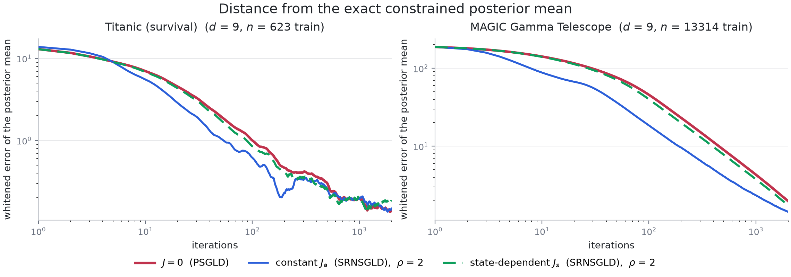

| dataset | field | accuracy at 200 | loss at 200 | whitened error at 200 | error at 2000 |
|---|---|---|---|---|---|
| Titanic | `J = 0` | 0.7463 | 0.5012 | 0.464 | 0.140 |
| Titanic | constant `J_a` | 0.7463 | **0.4999** | **0.227** | 0.149 |
| Titanic | state `J_s` | 0.7463 | 0.5003 | 0.407 | 0.186 |
| MAGIC | `J = 0` | 0.7855 | 0.4890 | 23.14 | 1.977 |
| MAGIC | constant `J_a` | **0.7886** | 0.4890 | **11.73** | **1.016** |
| MAGIC | state `J_s` | 0.7855 | 0.4889 | 21.75 | 1.853 |

Exact constrained posteriors, from a random-walk Metropolis chain that rejects
every proposal outside `K_r`: accuracy 0.7500 and loss 0.5002 on Titanic,
0.7860 and 0.4874 on MAGIC, both with acceptance 0.22 and halves that agree to
four digits.  The posterior mean sits at `|mean| = 1.740` of `r = 2` on Titanic
and 1.987 on MAGIC, where 45% of all steps end up outside the ball and get
pushed back -- the constraint is not decoration.

Both rotations beat `J = 0`, and by more than the seed noise
([`results/srnsgld_seeds.md`](results/srnsgld_seeds.md), six seeds, common
random numbers, ratio of whitened errors at iteration 200):

| dataset | constant `J_a` | state-dependent `J_s` |
|---|---|---|
| Titanic | **1.53x +/- 0.12** | **1.22x +/- 0.04** |
| MAGIC | **2.04x +/- 0.02** | **1.065x +/- 0.003** |

Accuracy is again the least discriminating of the three metrics, for the reason
given [above](#accuracy-is-a-flattering-diagnostic): it reads the predictive
mean only through `sign(pbar - 0.5)`, and every field gets most test points on
the right side within a handful of iterations.  On MAGIC it is also
non-monotone -- `J = 0` leads for the first sixty iterations and the constant
field passes it after, overshooting the reference slightly on the way.  The
log-loss and the whitened error are the metrics that separate the fields at
every iteration.

### Why the constant field wins more than the block-diagonal one

`trace((I + J) H) = trace H`, so a skew term cannot add relaxation rate; it can
only move rate from the fast directions into the slow one.  How much it can move
depends on how many pairs of directions it couples, and the two fields differ
exactly there: `J_a` couples the nine coordinates in one connected chain
`x1 - x2 - ... - x9` and has a single null direction (odd `d`), while `J_s` is
three disconnected triples, each hat map annihilating its own coordinate vector
-- three null directions, and no coupling at all between blocks.

That turns into a prediction.  Near the mode both drifts linearise to
`-(I + J(x*)) H`, so the rate is `min Re mu` over the eigenvalues of
`(I + J(x*)) H`, and [`experiments/srnsgld_spectrum.py`](experiments/srnsgld_spectrum.py)
prints it beside the measured ratio
([`results/srnsgld_spectrum.md`](results/srnsgld_spectrum.md)):

| dataset | field, `rho = 2` | null directions | predicted rate gain | measured |
|---|---|---|---|---|
| Titanic | constant `J_a` | 1 | 2.10 | 2.04 |
| Titanic | state `J_s` | 3 | 1.20 | 1.14 |
| MAGIC | constant `J_a` | 1 | 2.02 | 1.97 |
| MAGIC | state `J_s` | 3 | 1.69 | 1.07 |

Three of the four agree to within a few per cent.  The fourth is the one where
the interior linearisation should not be trusted: MAGIC's posterior mean is
pressed against the boundary and 45% of steps are reflected, so a rate computed
from the interior Hessian overstates what the field can deliver -- and it
overstates it for `J_s`, whose remaining coupling is the weaker one.

The sweep in [`figures/srnsgld_rho.png`](figures/srnsgld_rho.png) says how far
this goes: monotone improvement up to `rho = 2` on Titanic and `rho = 4` on
MAGIC, then a collapse on Titanic at `rho = 4`, where both fields end up ten
times worse than the baseline (1.47 and 1.37 against 0.14) -- and for different
reasons.  The constant field throws walkers so far past the sphere that the
oblique ray misses it in 9424 of 64000 walker steps, so the push degrades to a
projection.  The state-dependent field never misses, because its reflection *is*
a projection; it fails the other way, by orbiting -- being tangential, at that
strength it drives walkers around the sphere rather than into the bulk, and they
are outside the ball on 56% of steps against the baseline's 6%.

### Choosing which directions share a block

If the block structure is what limits `J_s`, the obvious fix is to choose which
directions share a block.  Conjugating by an orthogonal `V` costs nothing and
keeps every property used above -- the matrix stays skew, the divergence stays
zero, `J(x) x = 0` survives, and the ball is `V`-invariant, so the boundary
behaviour is unchanged (`nds.constrained.FramedField`).  So write both fields in
the Hessian eigenbasis with each `3`-block pairing a slow direction with a fast
one, which is what the [designed rotation](#the-design) earlier in this README
does.  Whitened error at iteration 200, `rho = 2`, against `J = 0` at 0.464 and
23.14:

| dataset | field | feature order | eigen frame | predicted rate gain |
|---|---|---|---|---|
| Titanic | constant `J_a` | **0.227** | 0.499 | 2.10 -> 1.71 |
| Titanic | state `J_s` | 0.407 | **0.394** | 1.20 -> 1.59 |
| MAGIC | constant `J_a` | **11.73** | 15.88 | 2.02 -> 1.75 |
| MAGIC | state `J_s` | 21.75 | **19.96** | 1.69 -> 1.05 |

The state-dependent field does improve, in the intended direction and on both
datasets, but by 3-8%, which is the size of the seed noise.  The constant field
gets much worse, and the spectrum says why: pairing slow with fast *lowers* its
predicted rate gain, from 2.10 to 1.71 and from 2.02 to 1.75.  In hindsight the
pairing argument never applied to it: the tridiagonal chain
`x1 - x2 - ... - x9` already couples every coordinate to two others, so
reordering it in the eigenbasis changes which two and nothing says the new pair
is the better one.  Here it is the worse one.

For the block field the reason the fix cannot do much is worth stating, because
it is a property of the hat map and not of these datasets.  Inside a block the
rotation axis is the block's *own coordinate vector* `z_k`, and the rotation
mixes the plane orthogonal to it.  So the frame chooses which triple of
directions shares a block, but not which two of them get mixed -- that is fixed
by where the mode sits.  A construction that could choose would not be a hat
map, and would not have a vanishing divergence for free.  `--frame eigen`
reproduces the table.

### How exact any of this is

The reference is exact: rejecting proposals outside `K_r` is the
Metropolis-Hastings rule for a uniform prior on the ball, so the reference chain
has no discretisation, projection or mini-batch bias.  The samplers have all
three.  What they do not have is a *wrong invariant law*: on a small toy problem
where the ball binds, all three fields land within 0.6 posterior standard
deviations of the exact constrained mean and within 0.2 of each other, and
quartering the step size roughly halves the residual error (0.377 to 0.205 in
those units, and 0.283 and 0.153 at the two steps in between) -- consistent with
the `O(sqrt(h))` boundary bias of a projected Euler scheme, and not with a
biased target.  Both tests are in
[`tests/test_nds.py`](tests/test_nds.py).

The gradients are optional: `--grad fd` replaces the mini-batch gradient with
central differences of the mini-batch potential, `2d` evaluations and no
gradient formula anywhere, and reproduces the Titanic numbers to four digits
(0.1402 against 0.1400 for `J = 0`, 0.1349 against 0.1347 for the constant field
at `rho = 1`).

## The paper's Section 3.3, with a lasso and anchored Langevin

[*Accelerating Constrained Sampling: A Large Deviations Approach*](https://arxiv.org/abs/2506.07816)
(Wang, Tu, Wang and Zhu, arXiv:2506.07816v3) proves a large-deviations
acceleration result for skew-reflected non-reversible Langevin dynamics and
tests it in Section 3.3 on constrained Bayesian logistic regression -- synthetic
data in `d = 3`, then MAGIC and Titanic in `d = 9` -- comparing projected SGLD
(`J = 0`) against SRNSGLD with a constant `J_a` and with the state-dependent
`J_s(x)` on a centred ball or `J_g(x)` on a smoothed `l_p` sublevel set.  All of
those experiments are reproduced here with two changes, and nothing else:

1. the potential gains a **lasso** term, so the target is not differentiable
   where the posterior puts its mass;
2. the dynamics become **anchored Langevin**, which is what makes the kinked
   target the invariant law anyway, and keeping `J` makes them *non-reversible*
   anchored Langevin.

```
U(x) = sum_j softplus(x . X_j) - y_j (x . X_j) + lam |x|_1,   x in K
U_0(x) = the same likelihood + lam sum_j sqrt(x_j^2 + delta^2),   a(x) = exp(U(x) - U_0(x))
```

`U_0 >= U`, the difference is `lam sum_j (sqrt(x_j^2 + delta^2) - |x_j|)` in
`[0, lam d delta]`, and one step of the composed scheme is

```
x_{k+1} = P^J_K( x_k - eta a(x_k) (I + J(x_k)) ghat_0(x_k) + sqrt(2 eta a(x_k)) xi_k ),
```

with `ghat_0` the mini-batch gradient of the *anchor* and `P^J_K` the paper's
skew projection.  Why that is still exact: the base diffusion
`-(I + J) grad U_0 + div J` with skew reflection along `gamma = (I + J)n` leaves
`e^{-U_0} 1_K` invariant (the paper's own result, needing `div J = 0`);
time-changing a diffusion at rate `a` leaves `p / a` invariant, and
`e^{-U_0} / a = e^{-U}`; and a time change rescales drift and diffusion by the
same positive scalar, so it does not touch the reflection direction.  So the
invariant law is the lasso posterior restricted to `K`, for any `delta`, with no
subgradient ever evaluated -- and the likelihood cancels in `U - U_0`, so the
clock costs `O(d)`.

### The fields, and which assumptions they satisfy

The paper's three requirements on `J` are skew-symmetry, `div J = 0`, and
`J(x) n(x) = 0` on the boundary -- the last is what turns the oblique boundary
condition into a Neumann one.  Its two state-dependent constructions are
block-diagonal, the `l`-th `3 x 3` block acting as `w -> k_l(x) x w`:

| field | axial vector | `div J = 0` | `J n = 0` | reflection |
|---|---|---|---|---|
| `J_a` (3.1), `+a` superdiagonal, `-a` subdiagonal | -- | yes, constant | **no** | genuinely oblique |
| `J_s(x)` (3.2), centred ball | `k_l = s_l x_{3l-2:3l}` | yes | yes | reduces to projection |
| `J_g(x)` (3.14), sublevel set | `k_l = -s_l grad_l g` | yes | yes | reduces to projection |

Both hold exactly in the implementation and are checked in
[`tests/test_nds.py`](tests/test_nds.py) by finite-differencing the matrix field:
`J_s(x) x = 0` for every `x`, and `J_g(x)` is parallel to `grad g(x)` blockwise,
so `J_g(x) n(x) = 0` not only on `{g = lambda}` but everywhere.  `J_a n` is not
zero -- for `d = 9`, `a = 2` its norm reaches 2.5 -- so `J_a` is the one field
whose boundary push has to be solved obliquely, and the one that pays for it
below.  For any skew `J`, `n . (I + J) n = 1`, so the push always points inward.

### What had to be calibrated, and why

Two things in the paper's setup do not survive contact with a lasso, and both
are calibrated by a stated rule rather than tuned.

**The lasso strength.**  `lam = 0.01 n_train` for all three problems: the
largest value on the ladder `{0.01, 0.03, 0.1, 0.3} n_train` that keeps the
constrained lasso MAP *on* the boundary of the ball -- a stronger lasso shrinks
the posterior strictly inside the constraint set, and then the skew reflection
the paper is about never happens -- while resolving the kink at the paper's step
size (`eta lam <= 0.02`) and leaving the clock above 0.2.  The ladder is in
[`results/anchored_lasso_calibration.md`](results/anchored_lasso_calibration.md).
`delta = 0.5 / lam`, so the clock's worst case is `exp(-0.5 d)`, independent of
`lam`.  That gives `lam` = 16, 152.2 and 7.13 and `delta` = 0.031, 0.0033 and
0.070 on the synthetic set, MAGIC and Titanic.  The same `lam` is then used for
the sublevel set, which is the larger of the two bodies, so there the MAP sits
strictly inside and the boundary is reached only by the posterior's spread --
17% of steps on MAGIC, 8% on the synthetic set, none at all on Titanic.

**The rotation strength.**  The paper's `a` and `s` are dimensionless -- in
`-(I + J) grad f` they say how large the rotational part of the drift is
relative to the gradient part -- but its Section 3.2 defines `grad f` as the
*mean* over data points while its Section 3.3 potential (3.11) is the *sum*.
With the sum, which is the actual posterior and the only version a lasso term
can be added to coherently, `E|grad U_0|` is about 6050 on MAGIC (and 304 on Titanic), so one
step of the state-dependent field at `s = 5` moves
`eta |J_s| E|grad U_0| = 2.5` -- more than the diameter of `K_{r=2}`, which is
2.83.  The rule used here scales the paper's `a` and
`s` together by one factor `kappa`, the largest with

```
eta kappa max(|J_a|, |J_s|) E|grad U_0| <= 0.1 r,
```

a tenth of the radius per step, measured on the initial ensemble.  That gives
`kappa` = 0.13, 0.057 and 0.81 on the synthetic set, MAGIC and Titanic.  The
paper's own amplitudes (`kappa = 1`) are reported alongside, and they do not
work: the table below is why.

### Results

Exact references throughout are random-walk Metropolis chains that reject every
proposal outside `K` and use `|x|_1` itself, so they carry no discretisation,
projection, clock or mini-batch bias; their two halves agree to four digits.
Accuracy is the paper's metric -- each walker's own parameter classifies the
set, then mean and standard deviation across the 100 walkers.


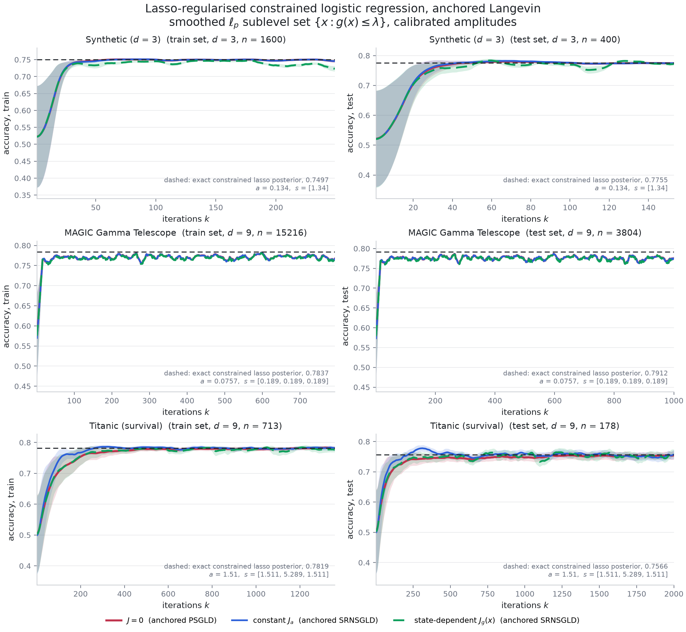

Full tables in
[`results/summary_anchored_srnsgld.md`](results/summary_anchored_srnsgld.md).
`band` is the first iteration whose mean test accuracy is within 0.005 of the
exact posterior's; `error` is the whitened distance from the time-averaged mean
to the exact posterior's mean, in units of its own standard deviations.

| problem | set | exact test acc. | `J = 0` band / error | `J_a` band / error | `J_s` or `J_g` band / error |
|---|---|---|---|---|---|
| Synthetic `d` = 3 | ball | 0.7752 | 30 / 0.253 | 29 / 0.261 | 29 / 0.291 |
| Synthetic `d` = 3 | sublevel | 0.7755 | 30 / 0.615 | 29 / 0.614 | 31 / 1.551 |
| MAGIC | ball | 0.7910 | 13 / 21.5 | 13 / 21.5 | 13 / **21.3** |
| MAGIC | sublevel | 0.7912 | 16 / 5.93 | 16 / 5.77 | 16 / **5.35** |
| Titanic | ball | 0.7530 | 486 / **0.409** | **109** / 0.612 | 485 / 0.489 |
| Titanic | sublevel | 0.7566 | 839 / 0.545 | **179** / **0.353** | 462 / 0.366 |

Titanic is the only one of the three where the dynamics are slow enough for the
question to have an answer: `n` is 713 rather than 15216, so the paper's
`eta = 1e-4` is 20 times smaller relative to the gradient, and the chain takes
hundreds of iterations to arrive.  There the constant field reaches the band
**4.5x** faster on the ball and **4.7x** faster on the sublevel set, and the
state-dependent `J_g` **1.8x** faster on the sublevel set.  On the sublevel set
both fields also end up closer to the exact posterior mean (0.353 and 0.366
against 0.545).  On the ball the constant field is the odd one out: it reaches
the accuracy band 4.5 times sooner but its time-averaged mean is *worse* than
the baseline's (0.612 against 0.409), and the reason is visible in the same run
-- it is the only field whose boundary push is oblique, 77 of its 150000 pushes
miss the sphere and fall back to a projection, and it sits on the boundary twice
as often as the baseline.  On MAGIC and the synthetic set every field reaches
the band within 30 iterations and the three are indistinguishable; the
state-dependent field is slightly ahead of both others in posterior-mean error
on MAGIC, which is the only trace of the paper's ordering that survives here.

### The paper's own amplitudes

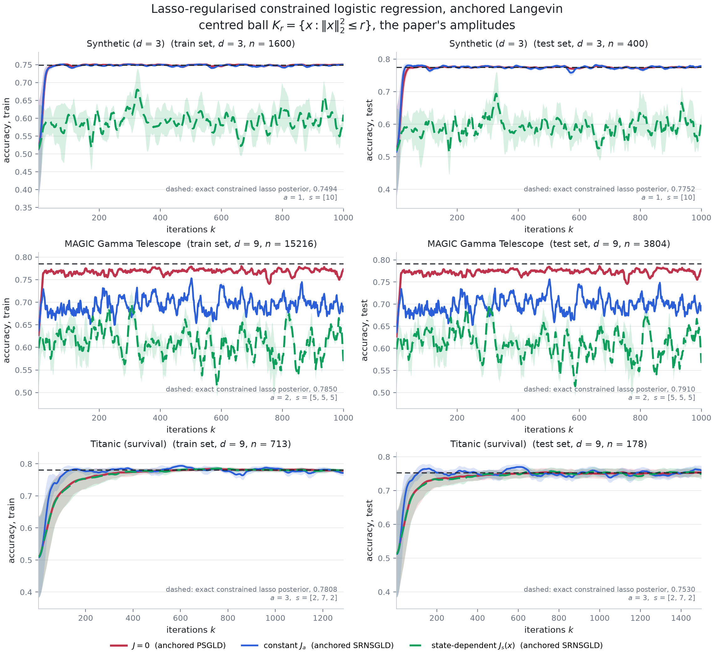

At `kappa = 1` the rotational displacement per step is a multiple of the whole
constraint set on the two larger problems, and the result is not a slower chain
but a broken one:

| problem | set | field | test accuracy | error | on boundary | pushes that missed |
|---|---|---|---|---|---|---|
| Synthetic | ball | `J_s`, `s` = 10 | 0.6365 | 26.0 | 98% | 0 |
| Synthetic | sublevel | `J_g`, `s` = 10 | 0.4968 | 23.4 | 99% | 9239 |
| MAGIC | ball | `J_a`, `a` = 2 | 0.7426 | 136.6 | 78% | 72303 |
| MAGIC | ball | `J_s`, `s` = [5,5,5] | 0.5266 | 247.1 | 98% | 0 |
| MAGIC | sublevel | `J_a`, `a` = 2 | 0.6782 | 33.2 | 68% | 58415 |
| MAGIC | sublevel | `J_g`, `s` = [5,5,5] | 0.5391 | 47.2 | 100% | 32099 |
| Titanic | ball | `J_a`, `a` = 3 | 0.7607 | 0.869 | 7% | 297 |
| Titanic | sublevel | `J_g`, `s` = [2,7,2] | 0.7570 | 0.664 | 0.3% | 0 |

The two failure modes are different and both are informative.  The constant
field overshoots the boundary so far that the oblique ray misses it -- on 72303
of MAGIC's 100000 walker steps, 93% of the pushes it had to make -- and degrades
to a projection, which is exactly the
`J n != 0` cost the paper's construction is designed to avoid.  The
state-dependent fields never miss, because for them the skew projection *is* the
plain projection, but being tangential they orbit: at `s = 5` they spend 98% of
their steps outside `K_r` and circle the boundary instead of descending, and
their accuracy sits at chance.  Titanic, whose gradient is twenty times smaller,
is the one dataset where the paper's amplitudes are almost harmless -- and it is
also the one where they help.

### What the clock is worth

Dropping the clock leaves a chain whose invariant law is the *smoothed* lasso,
`e^{-U_0} 1_K`, not the lasso; keeping it costs mixing, since the effective step
becomes `eta a(x)` with `a <= 1` (mean 0.31 to 0.90 in these runs).  So it earns
its keep only where the two laws differ by more than the mixing costs, which is
on the coordinates the lasso actually drives to zero
([`results/anchored_clock_effect_lp.md`](results/anchored_clock_effect_lp.md)):

| problem | field | error, anchored | error, anchor only | worst near-zero coordinate, anchored | anchor only |
|---|---|---|---|---|---|
| MAGIC (4 of 9 coords near zero) | `J = 0` | **5.93** | 6.42 | **0.0665** | 0.0708 |
| MAGIC | `J_a` | **5.77** | 6.28 | **0.0637** | 0.0681 |
| MAGIC | `J_g` | **5.35** | 5.50 | **0.0563** | 0.0566 |
| Synthetic (0 near zero) | `J = 0` | **0.615** | 0.711 | -- | -- |
| Titanic (0 near zero) | `J_a` | **0.353** | 0.558 | -- | -- |

The clock helps in eight of the nine field-by-problem comparisons, by 8-15% on
MAGIC where four coordinates sit at the kink, and the exception (`J = 0` on
Titanic, 0.545 against 0.377) is a problem with no near-zero coordinate at all,
where there is nothing for it to correct and only mixing to lose.  Pushing
`delta` up makes the correction larger and the chain worse: at `lam delta = 4`
on a `d = 3` toy the clock's floor is `exp(-12)` and walkers that wander to the
origin stop moving for the rest of the run.  That is the trade-off the
`delta = 0.5 / lam` rule is set by, and it is the same one the
[unconstrained lasso section](#the-target-the-anchor-u_0-and-the-clock) hits.

### How much of the remaining gap is the step size

All of these chains are unadjusted, so they are biased at the paper's `eta`.
Holding the total simulated time `eta k` fixed and shrinking `eta`
([`results/anchored_step_bias_ball.md`](results/anchored_step_bias_ball.md)):

| problem | `eta` | iterations | whitened error |
|---|---|---|---|
| Titanic | 1e-4 | 1500 | 0.409 |
| Titanic | 2.5e-5 | 6000 | 0.412 |
| Titanic | 6.25e-6 | 24000 | 0.319 |
| MAGIC | 1e-4 | 1000 | 21.5 |
| MAGIC | 2.5e-5 | 4000 | 6.32 |
| MAGIC | 6.25e-6 | 16000 | 1.39 |

Titanic is essentially converged at the paper's step size; MAGIC is not, and its
error falls roughly like `eta`.  This is why MAGIC's accuracy curves plateau
0.017 below the exact posterior's while its posterior mean is 21 standard
deviations out: with `n = 15216` the posterior's own standard deviation is about
0.03 and `eta E|grad U_0|` is 0.6, so one step crosses the whole posterior
twenty times over.  Titanic's plateau gap is 0.002 and its `eta E|grad U_0|` is
0.03.  Accuracy cannot see that, which is worth knowing before
reading any accuracy figure in this setting -- including the paper's.

### Making both fields beat `J = 0`

The amplitudes above come from one conservative a-priori rule, which says nothing
about whether they are any *good*.  Sweeping them
([`experiments/sweep_anchored.py`](experiments/sweep_anchored.py), several walker
seeds shared across fields) answers two different questions, and the answers are
not the same: the constant field beats `J = 0` at the right amplitude on every
problem where the accuracy metric has room to move, and the paper's
state-dependent field **cannot** beat it on a centred ball at any amplitude, for
a reason that is a two-line calculation rather than a tuning failure.

#### Why no amplitude can help, on a ball

Assumption 2 of the paper is `J(x) n(x) = 0` on the boundary.  On a centred ball
its construction meets that with the axial vector `k = s x`, and then
`J_s(x) x = 0` holds not only on the boundary but *everywhere*, so

```
d|x|^2 / dt  =  -2 x . (I + J_s(x)) grad U  =  -2 x . grad U,
```

identically, at every point and for every amplitude.  The field cannot change
the radial motion at all.  Measured over a run, the mean radius of the
state-dependent chain tracks the baseline's to three digits (0.799, 0.816, 0.910
at iterations 50, 100, 200, against the baseline's 0.799, 0.816, 0.912) while the
constant field is already at 1.312 by iteration 200.

That is fatal on these problems because the radial direction is *the* stiff one:
the constrained lasso posterior's smallest-standard-deviation eigenvector has
`|cos|` = 0.963 with `x*/|x*|` -- the ball's boundary is what pins it -- and
decomposing the error along the reference posterior's eigendirections shows the
transient is entirely that component: 20.5 standard deviations at iteration 50
and still 3.5 at 1500, against 0.3 and 0.4 for the two *slowest* directions,
which are converged from the start.  So the whole convergence story on a ball is
radial, and Assumption 2 with a radial `h` hands that direction to the kernel of
`J`.  The same degeneracy hits `J_g` exactly at `p = 2`, where `grad g` is
parallel to `x`, and not for other `p` -- which is why the paper's `J_g` at
`p = 2.4` does beat the baseline on the sublevel set without any modification.
Both statements are checked in
[`tests/test_nds.py`](tests/test_nds.py).

#### The fix is in the paper's own recipe

Its general construction (2.3) is `psi = (level - g) h` with `k = grad psi` and
`h` *any* function that does not vanish on the boundary; the two fields it uses
take `h = 1`, and it suggests `h = 1 + |x|^2`.  Both are radial, which is
exactly the degenerate choice.  Take instead

```
h(x) = 1 + c (u . x),      k(x) = -h(x) grad g(x) + (level - g(x)) c u.
```

On the boundary the second term vanishes, so `k` is still parallel to the
normal and Assumption 2 holds; `k` is still a gradient, so `div J = 0` holds;
and inside, `k` is no longer parallel to `x`, so the radial motion is free
again.  At large `c` it becomes a rotation about `u` that switches itself off at
the boundary -- the opposite of the paper's fields, and the right way round for
a cold start that has to travel outward.

`u` is not a free parameter either.  The tilt's contribution to the radial drift
is `-2 (level - g) c s  u . E[grad U x x]`, which is *linear* in `u`, so the unit
vector that maximises the mean outward push is
`u* = -normalise(E[grad U x x])` blockwise -- one pilot evaluation on the
initial ensemble, no search.  On Titanic it scores +3.51 against +3.02 for the
best of 2000 random directions, +0.34 for the MAP direction and **-1.11** for
the slowest Hessian eigenvector, which would have pushed the walkers the wrong
way.

#### What the sweep picks, and what it buys

[`experiments/select_anchored.py`](experiments/select_anchored.py) chooses, for
each field, the amplitude with the fewest iterations to the accuracy band among
those that do not lose stationary accuracy (final whitened error within one
standard error of the baseline's) and do not fall back on a missed boundary push
(under 0.1%).  Full table in
[`results/anchored_selected_amplitudes.md`](results/anchored_selected_amplitudes.md);
`kappa` multiplies the paper's own `a` and `s`, `c` is the tilt.

| problem | set | `eta` | field | `kappa` | `c` | iterations to band | speed-up | error |
|---|---|---|---|---|---|---|---|---|
| Titanic | ball | 1e-4 | `J = 0` | -- | -- | 388 +/- 68 | 1.00x | 0.518 +/- 0.062 |
| Titanic | ball | 1e-4 | `J_a` | 0.6 | -- | **136 +/- 2** | **2.85x** | 0.538 +/- 0.047 |
| Titanic | ball | 1e-4 | `J_psi` | 0.3 | 3 | **185 +/- 20** | **2.10x** | **0.495 +/- 0.025** |
| Titanic | sublevel | 1e-4 | `J = 0` | -- | -- | 737 +/- 58 | 1.00x | 0.582 +/- 0.051 |
| Titanic | sublevel | 1e-4 | `J_a` | 1 | -- | **163 +/- 9** | **4.52x** | **0.418 +/- 0.037** |
| Titanic | sublevel | 1e-4 | `J_psi` | 0.3 | 3 | **367 +/- 12** | **2.01x** | **0.441 +/- 0.045** |
| Synthetic | ball | 6.25e-6 | `J = 0` | -- | -- | 513 +/- 20 | 1.00x | 0.094 +/- 0.018 |
| Synthetic | ball | 6.25e-6 | `J_a` | 1 | -- | **401 +/- 0** | **1.28x** | **0.057 +/- 0.015** |
| Synthetic | ball | 6.25e-6 | `J_psi` | 0.1 | 1 | **401 +/- 0** | **1.28x** | **0.077 +/- 0.015** |
| Synthetic | sublevel | 6.25e-6 | `J = 0` | -- | -- | 561 +/- 36 | 1.00x | 0.078 +/- 0.025 |
| Synthetic | sublevel | 6.25e-6 | `J_a` | 1 | -- | **401 +/- 0** | **1.47x** | 0.077 +/- 0.042 |
| Synthetic | sublevel | 6.25e-6 | `J_psi` | 0.1 | 2 | **481 +/- 0** | **1.17x** | 0.084 +/- 0.020 |

On both Titanic constraint sets and both synthetic ones, **both** fields now
reach the exact posterior's accuracy in fewer iterations than `J = 0` without
giving up any stationary accuracy -- 1.17x to 4.52x, and the two that improve
most improve the posterior-mean error as well.  The state-dependent field needs
`c > 0` on the ball, for the reason above; on the sublevel set it wins with the
paper's own `c = 0` too, just by less (521 against 737, 1.41x).

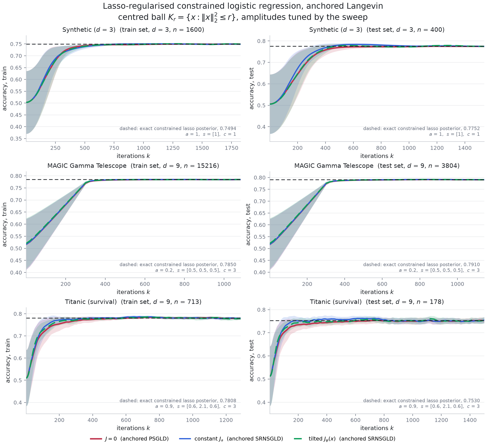

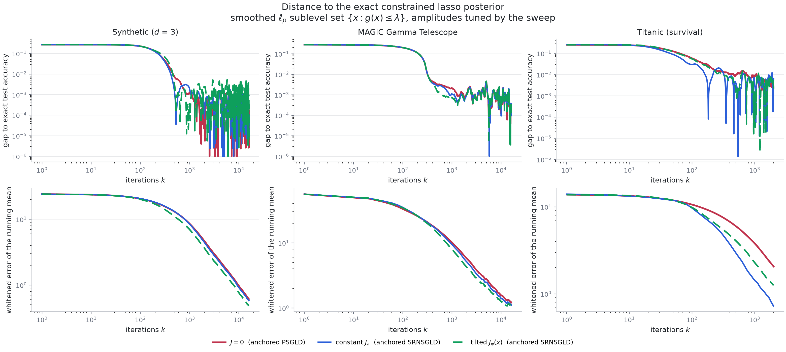

Two settings had to change to get here, and both are worth naming.  The sweep is
over the amplitude, which the paper leaves free; and on the synthetic problem the
step size has to come down from `1e-4` to `6.25e-6`, because at the paper's step
every field reaches the accuracy ceiling within 30 iterations and there is
nothing left to win -- the same reduction that
[the bias ladder](#how-much-of-the-remaining-gap-is-the-step-size) shows is
needed for the chain to resolve the posterior at all.

#### MAGIC is the exception

On MAGIC no amplitude of either field clears the bar.  The band improves -- 294
to 214 iterations at `kappa` = 0.3 for both fields on the ball, a 1.37x speed-up
-- but the stationary error grows with it, from 1.42 to 2.0-2.5 standard
deviations, and at amplitudes small enough to leave the error alone
(`kappa` = 0.03) the band does not move.  The transient error does improve for
both fields (9.31 to 8.36 for `J_a`, to 6.87 for the tilted field, a quarter of
the way into the run), so the rotation is doing something; it just cannot be
collected without paying discretisation bias.  MAGIC is the problem where the
posterior is smallest relative to the constraint set -- standard deviation 0.03
in a ball of radius 1.41 -- so the run is a long drift-dominated descent with
little diffusive mixing for a rotation to improve, and the unadjusted step is
what limits the answer.

### Caveats specific to this section

* The paper does not state the coefficient vector its synthetic data is
  generated from; `beta = [1, -0.7, 0]` is used, the first two coordinates from
  its Section 3.2 and the third set to zero so that one feature is genuinely
  irrelevant and the lasso has something to find.
* The Titanic features here are the nine standardised, intercept-free ones of
  [`nds.data.load_nine`](nds/data.py); with those, the paper's sublevel set
  (`p` = 2.4, `eps` = 0.18, `lambda` = 4) does not bind at all -- the exact
  posterior mean has `|x|` = 1.47 and `g` well under 4 -- so that row is a
  comparison of non-reversibility in the interior, with the reflection idle.
* One split and one `kappa` per problem; the accuracy bands are across walkers,
  which covers walker noise but not the split.  The sweeps use three to five
  walker seeds, shared across fields, and quote standard errors over them.
* The tuned amplitudes are selected on the same runs they are reported on, with
  a stated rule and a guard against trading stationary accuracy, but they are
  still selected: the honest reading of the speed-up table is "the best this
  family can do here", not an out-of-sample number.  The amplitude ladder is
  coarse (factors of two to three), and the band is resolved only to the
  scoring interval, which is `n_iter / 200`.
* `lam` is chosen to keep the constraint active, which caps how much the lasso
  can bite: on the ball only MAGIC reaches a near-zero coordinate, and only on
  the sublevel set does it reach four.  A stronger lasso makes the anchored
  machinery matter more and the constrained machinery matter less, and
  `--lam-scale` moves along that trade-off.

## Datasets

| dataset | n (train/test) | d | source |
|---|---|---|---|
| Titanic (survival) | 623 / 268 | 10 | Kaggle Titanic training split, via the `seaborn-data` mirror |
| MAGIC Gamma Telescope | 13314 / 5706 | 11 | UCI `magic04.data` (19020 events) |
| Breast Cancer Wisconsin | 398 / 171 | 31 | shipped with scikit-learn (`load_breast_cancer`) |
| Spambase | 3221 / 1380 | 58 | UCI `spambase.data`, features `log1p`-scaled |

The `d` column is the unconstrained preprocessing, which standardises every
feature and prepends an intercept.  The
[constrained experiment](#constrained-sampling-in-d--9-psgld-against-skew-reflected-srnsgld)
uses `nds.data.load_nine` instead, which drops the intercept and, on MAGIC, the
redundant `fConc1`, giving `d = 9` on both -- a multiple of three, as the
block-diagonal field needs, and a dimension where the ball is the only prior.

`nds/data.py` caches the raw files under `data/` (git-ignored) and checks each
one against the SHA256 digest in `EXPECTED_SHA256`, so a mirror that changes its
contents raises rather than silently changing the dataset.  UCI and OpenML are
unreachable from some environments, including the one this was run in, which is
why the two UCI files come from a public GitHub mirror.

## Reproducing

```bash
pip install -r requirements.txt
python3 tests/test_nds.py                    # correctness checks, ~2 minutes
./experiments/run_all.sh                     # four datasets, one process each, ~30 min
python3 experiments/plot_accuracy.py         # figures + results/summary.{csv,md}
python3 experiments/paired_comparison.py     # per-walker paired differences
python3 experiments/acceptance_scaling.py --dataset titanic   # the step-size mechanism
python3 experiments/run_alpha_sweep.py && python3 experiments/plot_alpha_sweep.py
python3 experiments/run_correction_bias.py
python3 experiments/plot_correction_bias.py --datasets titanic
```

The designed-rotation experiment of
[Making the rotation pay](#making-the-rotation-pay):

```bash
ARGS="--n-iter 200" ./experiments/run_designed_all.sh
python3 experiments/plot_three_lines.py                # the three-field figures
python3 experiments/plot_accuracy.py --tag designed --suffix _designed \
    --variants zero constant state \
    --title 'Accuracy from the $w = 0$ start, unadjusted dynamics with a designed rotation'
python3 experiments/gate_diagnostics.py                # is the gate open in the bulk?
```

The non-differentiable target of
[A non-differentiable regularizer](#a-non-differentiable-regularizer-and-anchored-langevin):

```bash
python3 experiments/run_anchored.py                 # Titanic and MAGIC, ~20 min
python3 experiments/run_anchored_bias.py --delta 0.02 --n-iter 30000
python3 experiments/run_anchored_bias.py --delta 0.1  --n-iter 20000
python3 experiments/plot_anchored.py
```

The constrained `d = 9` experiment of
[Constrained sampling](#constrained-sampling-in-d--9-psgld-against-skew-reflected-srnsgld):

```bash
python3 experiments/run_srnsgld.py                  # both datasets, ~6 min, most of it
                                                    # the two Metropolis references
python3 experiments/plot_srnsgld.py                 # the three figures and the tables
python3 experiments/srnsgld_spectrum.py             # predicted rate gain vs measured
python3 experiments/srnsgld_seeds.py                # the same comparison over six seeds
python3 experiments/run_srnsgld.py --frame eigen    # the pairing that did not help
python3 experiments/run_srnsgld.py --grad fd --tag-suffix _fd   # derivative free
```

The lasso-regularised, anchored version of the paper's Section 3.3
([The paper's Section 3.3](#the-papers-section-33-with-a-lasso-and-anchored-langevin)):

```bash
python3 experiments/calibrate_anchored_lasso.py       # the lasso-strength ladder
python3 experiments/run_anchored_srnsgld.py           # calibrated amplitudes, ~25 min,
                                                     # most of it the six references
python3 experiments/run_anchored_srnsgld.py --amp-scale 1.0 --tag-suffix _paper
python3 experiments/run_anchored_srnsgld.py --domains lp --no-clock --tag-suffix _noclock
python3 experiments/plot_anchored_srnsgld.py         # the four figures and the tables
python3 experiments/anchored_clock_effect.py         # what the clock is worth
python3 experiments/anchored_step_bias.py            # how much of the gap is the step size
```

Making both fields beat `J = 0`
([Making both fields beat `J = 0`](#making-both-fields-beat-j--0)):

```bash
python3 experiments/sweep_anchored.py --problem titanic --domain ball \
    --tilts 0.0 1.0 3.0 --seeds 0 1 2 3 4        # one sweep per problem and set
python3 experiments/select_anchored.py           # the amplitude each field wants
python3 experiments/run_anchored_srnsgld.py --problems titanic --domains ball \
    --amp-scale-constant 0.3 --amp-scale-state 0.3 --tilt 3.0 --tag-suffix _tuned
python3 experiments/plot_anchored_srnsgld.py --suffixes _tuned --gap \
    --summary summary_anchored_srnsgld_tuned.md
```

The unpreconditioned robustness check, whose outputs are suffixed so that they
do not overwrite the defaults:

```bash
for ds in titanic breast_cancer; do
  python3 experiments/run_accuracy.py --datasets $ds --geometry identity
done
python3 experiments/plot_accuracy.py --datasets titanic breast_cancer \
    --geometry identity --suffix _identity
python3 experiments/paired_comparison.py --datasets titanic breast_cancer \
    --geometry identity
```

Two notebooks walk the machinery on Titanic and MAGIC only, scoring both
accuracy and predictive log-loss, and each runs in about ten minutes on nothing
beyond `requirements.txt` plus Jupyter:
[`notebooks/titanic_magic.ipynb`](notebooks/titanic_magic.ipynb) for the smooth
ridge target, and
[`notebooks/anchored_l1_titanic_magic.ipynb`](notebooks/anchored_l1_titanic_magic.ipynb)
for the non-differentiable `ell_1` target and anchored Langevin.

Single runs are configurable, for instance

```bash
python3 experiments/run_accuracy.py --datasets magic --alpha 0.5 --geometry identity
```

## Caveats

* The sampler is a reconstruction (see [Provenance](#provenance)); the numbers
  describe *this* kernel, not necessarily the one behind the original figure.
* One split, one preconditioner, one random `A` and one walker seed per dataset.
  Differences quoted with standard errors are paired across the 32 walkers,
  which covers walker noise but not the choice of `A` or of the split.
* `alpha = 1` throughout the accuracy figure; the strength sweep covers
  `alpha = 0` to `4` on Titanic and Breast Cancer only.
* Step sizes are calibrated to about 50% average acceptance from the `w = 0`
  start.  On the near-separable Breast Cancer posterior the acceptance-versus-`h`
  curve is a cliff rather than a slope, so every variant ends up at a
  conservative step size with 0.82-0.93 acceptance, and the `J = 0` versus
  `J_a` step-size ratio there (1.5x) understates the effect seen elsewhere.
* 600 iterations does not equilibrate the posterior *mean* on Breast Cancer or
  Spambase -- the whitened error is still 3 and 12 standard deviations at the
  end.  Accuracy converges anyway, which is the point of the section above.
* The four targets are smooth posteriors.  Nothing in the kernel uses that, but
  a genuinely non-differentiable target -- a Laplace prior, or a hinge
  pseudo-likelihood -- would be a stronger test of the derivative-free claim,
  and `nds.target` is the only file that would have to change.
* In the constrained experiment the mini-batch noise is of the same size as the
  injected Brownian noise (ratio 1.4-1.6), which is normal for SGLD and is part
  of why the unadjusted chains sit a little off the exact constrained posterior.
  It is the same for all three fields, and shrinking it means a larger batch,
  not a different field.
* The constrained runs use one split and `rho` on a five-point ladder; the
  quoted speed-ups carry standard errors over six walker seeds only.
* Cost is counted in iterations, not in potential evaluations.  Every variant
  pays the same `2 d` evaluations per step, so the ranking is unaffected, but a
  fair comparison against a gradient-based sampler would have to count them.

## Where to go next

The remaining gap is exactness.  The designed rotation wins with the unadjusted
dynamics, whose invariant law is only correct to `O(h)`, and no amount of
Metropolis correction can keep the win: an accept/reject step makes the chain
reversible whatever the proposal, which is the whole content of the first
experiment.  Two routes keep both properties, neither implemented here:

1. A **lifted or guided chain** -- an auxiliary velocity or direction flag that
   persists until a rejection and then flips -- is irreversible *and* exact.
   This is how non-reversibility is usually made rigorous, and the designed
   pairing above says which directions the lift should move along.
2. **Composing a volume-preserving flow with a reversible kernel.**  For
   constant skew `J` the flow `dw/dt = J grad U(w)` conserves `U` exactly
   (`grad U . J grad U = 0`) and preserves volume, so its exact solution leaves
   the target invariant; a discretisation of it can carry its own accept/reject
   step without sharing the reversible step size.  The composed chain is still
   reversible overall, so this buys a better proposal rather than genuine
   irreversibility -- worth measuring, not a substitute for the lift.

## Layout

```
nds/data.py        dataset loaders, caching, standardisation, splits
nds/target.py      logistic posterior, central-difference surrogate, prediction
nds/skew.py        J = 0, constant, radial and directional fields, and their divergence
nds/design.py      designing J from the geometry: pairing, step-size rule, calibration
nds/anchored.py    the l1 target, its smooth anchor, anchored Langevin, an exact reference
nds/constrained.py constrained target, ball with skew reflection, J_a and block-diagonal J_s
nds/anchored_constrained.py  the paper's fields and constraint sets, lasso target, anchored SRNSGLD
nds/sampler.py     Metropolis-corrected irreversible steps, warm-up, calibration
nds/reference.py   MAP, Laplace covariance, long gradient-based reference chain
nds/metrics.py     autocorrelation, ESS, iterations-to-reference
experiments/       runners, plotting scripts, diagnostics
notebooks/         titanic_magic.ipynb: the two-dataset walkthrough, accuracy and loss
                   anchored_l1_titanic_magic.ipynb: the same for the non-differentiable target
tests/test_nds.py  divergence identities, surrogate accuracy, invariance
results/           traces (.npz), per-dataset summaries, summary.csv
figures/           the figures referenced above
```
