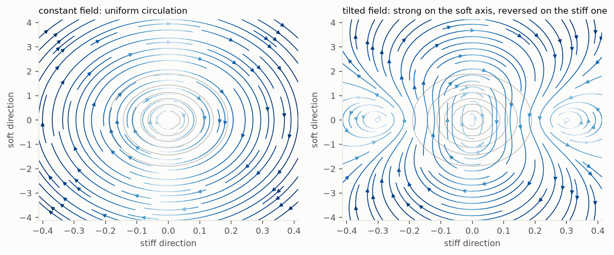
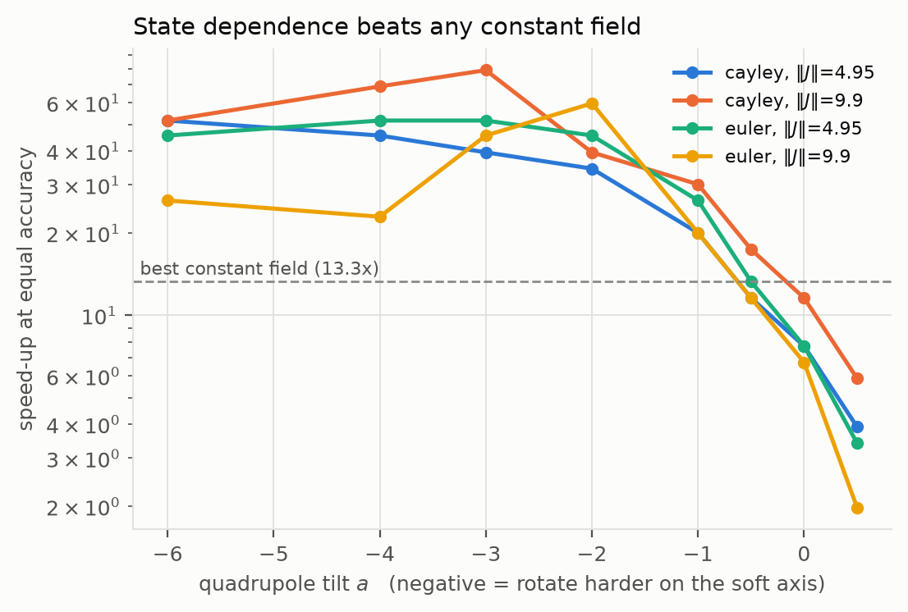

# Accelerating anchored Langevin sampling with a skew-symmetric drift

An extension of **Anchored Langevin Algorithms** (Gürbüzbalaban, Nguyen, Zhang
and Zhu, [arXiv:2509.19455](https://arxiv.org/abs/2509.19455)) to *non-reversible*
anchored dynamics, applied to heavy-tailed targets.

The paper's anchored Langevin SDE replaces the potential $U$ by a smooth
reference $U_0$ and corrects with a multiplicative scaling:

$$dX_t = -\nabla U_0(X_t)e^{(U-U_0)(X_t)}dt + \sqrt2\,e^{(U-U_0)(X_t)/2}dW_t .$$

We insert a **skew-symmetric** matrix $J = -J^\top$ into the drift:

$$dX_t = e^{(U-U_0)(X_t)}\,(J-I)\,\nabla U_0(X_t)\,dt
        + \sqrt2\,e^{(U-U_0)(X_t)/2}\,dW_t .$$

The added field $e^{U-U_0}J\nabla U_0$ is $\pi$-divergence free, so the target is
untouched while the dynamics becomes non-reversible — the classical acceleration
mechanism of Hwang–Hwang-Sheu–Sheu and Lelièvre–Nier–Pavliotis, transplanted
into the anchored framework where it also reaches heavy tails.

## Headline: a state-dependent field, and a better integrator

Two changes improve on the first round's constant field, at equal accuracy and
equal cost per iteration ($d=2$, $\nu=5$, $\kappa(\Sigma)=100$). How much they
improve it depends on what "equal accuracy" means, and the honest answer is a
range: **79× at matched bulk accuracy, 10.8× at matched covariance accuracy.**
Both are measured; they answer different questions. A skew perturbation's
discretisation error concentrates in the tail, so a criterion built on
mid-range quantiles cannot see it and a covariance criterion is dominated by it.
The ordering of methods is the same under either.

**Let $J$ depend on $x$ — but add the correction term.** Keeping the drift in
the form $e^{U-U_0}J(x)\nabla U_0$ forces
$\langle\operatorname{div}J, \nabla U_0\rangle = 0$, whose complete solution in
two dimensions is a radial profile that cannot tell the stiff axis from the soft
one — and it makes things *worse* (0.4× against a constant field's 3×). Adding
$-e^{U-U_0}\operatorname{div}J$ removes the condition outright: **every** skew
matrix field then preserves the target. In $d=2$ the complete family is
$c = e^{U}J_0\nabla\Phi$ for an arbitrary stream function $\Phi$.

**Tilt the rotation towards the soft axis.** The rotation's job is to carry mass
onto the stiff direction, where the reversible drift is a hundred times faster
and contracts it. Rotating while *on* the stiff axis undoes that. A constant
field does both in equal measure; a tilted one is a ratchet.

**Fix the integrator.** The binding constraint is discretisation bias, not
stability — the equal-bias stepsize sits 14 to 50 times below the stability
limit. The part that grows with $\|J\|$ is explicit Euler's error on a
rotation. Advancing the linear part by its Cayley transform or matrix
exponential removes it.

| method | matched bulk accuracy | matched covariance accuracy |
|---|---|---|
| Euler, $J = 0$ | 1.0× | 1.0× |
| Euler, best constant field | 7.7× | 3.5× |
| Cayley, best constant field | 13.3× | 6.6× |
| Euler, best tilted stream field | 59.7× | **10.8×** |
| Cayley, best tilted stream field | **79.0×** | 7.4× |

Under either criterion the tilted state-dependent field is the best method and
beats the best constant field by more than the integrator does on its own.
Under the strict criterion it is worth roughly a further 2 to 3 times over the
first round.

Confirmed on the paper's own sliced-2-Wasserstein metric with 5000 particles and
8 replications: 2470 iterations to twice the estimator floor at $J=0$, 350 with
the best constant field, and 59 with the tilted field — 41.9× — with every
final $W_2$ inside the floor's uncertainty, so the fast methods really are
converged rather than passing through.

At matched *effective* rotation strength and the same integrator the comparison
is starker still: 59.7× for the tilted field against 5.9× for the constant one.

Full numbers and caveats: [`results/RESULTS_STATE_DEPENDENT.md`](results/RESULTS_STATE_DEPENDENT.md);
theory in [`docs/STATE_DEPENDENT.md`](docs/STATE_DEPENDENT.md).





## First round: constant fields

**The paper's Section 6.4 experiment reproduces**, and it is where the skew
extension stops.  At $\iota=2$, $\beta=1$, $\eta=0.01$ and 5 000 particles the
anchored method reaches the measurement floor in 136 iterations against ULA's
2085 — a 15× margin, in line with the paper's Figure 8.  But
$\pi \propto (1+\|x\|^2)^{-\iota}$ is radial, so the added drift generates
rotations that act unitarily on $L^2(\pi)$ and no skew matrix can help; and
$\iota > 1 + d/2$ with $\iota = 2$ forces $d = 1$, where the only skew matrix is
zero anyway.  We keep that as a **negative control** — measured speed-up
1.000×, and at $\|J\| = 8$ the scheme blows up outright — and then move to
anisotropic heavy-tailed targets, where the perturbation does work.

**Speed-up at equal discretisation bias and equal cost per iteration**, computed
exactly from the second-moment analysis (no Monte Carlo error), on Student-t
targets with condition number $\kappa(\Sigma)$:

| $\kappa$ | $d=2$ | $d=3$ | $d=5$ | $d=10$ |
|---|---|---|---|---|
| 1 | 1.00× | 1.00× | 1.00× | 1.00× |
| 10 | 1.20× | 1.19× | 1.13× | 1.16× |
| 100 | **6.83×** | 3.57× | 2.08× | 1.53× |
| 1000 | **64.2×** | 20.3× | 9.49× | 4.91× |

Confirmed by simulation, three independent ways at $d=2$, $\nu=5$, $\kappa=100$:

* **Ensemble.**  5 000 particles from $\mathcal N(0,10I)$, 10 replications: the
  iterations needed to bring the slow direction's variance within 10 % of the
  truth fall from **3 316** at $J=0$ to **831** at $\|J\|_2 = 3.46$ — a measured
  **4.0×**.  From $\mathrm{Uniform}(-5,5)$ the margin is 2.7×.
* **Single chain.**  The integrated autocorrelation time of the slow coordinate
  falls from **1 456** to **221** — a **6.6×** reduction with non-overlapping
  confidence intervals, sitting right on the 6.8× the exact analysis predicts.
* **Heavy tailed *and* non-differentiable.**  On a Student-t core plus the
  paper's MCP penalty, the same measurement gives **4.8×**, while subgradient
  ULA fails to reach the measurement floor at any stepsize tried.

At $d=5$ the measured margin drops to **1.8×**, against 2.1× predicted — the
dimension trend in the table above, confirmed rather than assumed.  There a
well-tuned MALA ties the skew variant, so the perturbation buys back the
anchored method's deficit rather than opening a lead.

**The continuous-time gain is far larger than the realisable one.**  The SDE's
second-moment rate improves by up to 396×; the per-iteration rate improves by at
most 64×, because a larger drift forces a smaller stable stepsize.  The
classical spectral-gap criterion, which is what the non-reversible literature
optimises, overstates what a practitioner gets by roughly an order of magnitude.
`experiments/exp5_rate_decomposition.py` quantifies the split.

Full numbers, figures and threats to validity: [`results/RESULTS.md`](results/RESULTS.md).


## What is proved, and what is not

Proved for every constant skew $J$: invariance of $\pi$; the random-time-change
representation and the exact equivalence of the two discretisations (the paper's
Theorems 11 and 15); that every Lyapunov drift condition
established with a function of the form $\Psi\circ U_0$ transfers to every skew
$J$ unchanged, with **no** smallness condition (and for the paper's own radial
target its Assumption 1 and Theorems 2 and 3 hold verbatim); the ceiling
$\operatorname{Tr}(A)/d$ on the attainable rate, together with an explicit $J$
attaining it; and the no-go theorem for radial targets.

Not proved: any extension of the paper's Theorem 14 (2-Wasserstein).  Its
Assumption 12 requires $\beta > \tfrac d2 \kappa(\Sigma)$, which already fails at
$J = 0$ for the ill-conditioned targets of interest — for $d=2,\kappa=100$ it
would need $\nu > 200$.  In its place we derive an **exact** second-moment
recursion for the discretisation, which gives the mean-square stability
threshold, the stationary bias and the per-iteration rate in closed form rather
than as bounds.  Details and the full list of non-claims: [`docs/THEORY.md`](docs/THEORY.md).

## Fairness

Adding $J$ makes the drift larger, so it needs a smaller stepsize.  Comparing at
a common stepsize would be meaningless, so three protocols are run and all three
are reported:

* **common** — every method at one stepsize;
* **equal bias** — each variant at the stepsize putting its stationary
  covariance at the same relative error, solved from the exact analysis;
* **tuned** — each method at its own best stepsize from a grid, with the whole
  grid saved, not just the winner.

Every convergence curve is plotted against the **estimator floor**: the same
Wasserstein statistic evaluated on exact i.i.d. draws.  For the paper's own
$\nu=3$ target that floor is $\approx 0.22$ at $n = 5\,000$ and decays like
$n^{-1/6}$ (fitted exponent $-0.166$ against $-0.167$ predicted), so a curve
below it is measuring noise, not convergence.  The estimator's own sampling
distribution is heavy tailed too — single repetitions land five times the
median — so **averaging it over runs is dominated by outliers**, and the tables
here quote medians.  A naive midpoint quantile estimator understates the
distance by 1.9× because it truncates the tail cells; both are implemented.

## Layout

```
skewanchor/
  targets.py     log-quadratic (Student-t) targets: exact sampler, exact projected quantiles
  nonsmooth.py   heavy-tailed and non-differentiable at once (Student-t core + MCP penalty)
  skew.py        constant skew matrices, including the one attaining the Tr(A)/d ceiling
  skewfield.py   state-dependent fields: radial, curl (d>=3), and the d=2 stream family
  samplers.py    ULA, skew-ULA, anchored, skew-anchored, time-changed, MALA, underdamped;
                 Euler, Cayley and exponential stepping for the anchored drift
  analysis.py    exact second-moment theory per integrator: stability, bias, rate
  metrics.py     sliced W2 with tail-resolving quadrature, the estimator floor, MMD, energy, IACT
  runner.py      repeated ensemble runs, bootstrap bands, divergence reporting
  plotting.py    figure style on a colour-vision-validated palette
experiments/
  exp0_paper_replication.py   the paper's Figure 8, then the same target where J exists
  exp1_theory_sweeps.py       exact equal-bias sweeps over ||J||, dimension, condition number
  exp2_anisotropic.py         the main simulation, under three fairness protocols
  exp3_single_chain.py        autocorrelation time of the slow coordinate
  exp4_nonsmooth_heavy.py     heavy tailed and non-differentiable at once
  exp5_rate_decomposition.py  the SDE's gain versus the realisable one
  exp6_estimator_noise.py     how trustworthy the Wasserstein number is on a heavy tail
  exp7_state_dependent.py     state-dependent fields and rotation-aware integrators
  make_figures.py             all figures, light and dark
  summarize.py                every result file in one place, quoting medians
docs/            THEORY.md, STATE_DEPENDENT.md, paper_section.tex, derivations/
tests/           23 correctness tests
results/         data (JSON), figures (PNG), RESULTS.md, RESULTS_STATE_DEPENDENT.md
```

## Running it

```bash
pip install -r requirements.txt
python -m pytest tests -q                       # 23 correctness tests, ~4 min

python experiments/exp1_theory_sweeps.py        # exact sweeps, no simulation
python experiments/exp5_rate_decomposition.py   # SDE gain vs realisable gain
python experiments/exp6_estimator_noise.py      # is the metric trustworthy here?
python experiments/exp0_paper_replication.py    # the paper's Figure 8 + the control
python experiments/exp2_anisotropic.py --setting d2_nu5_k100
python experiments/exp3_single_chain.py
python experiments/exp4_nonsmooth_heavy.py
python experiments/exp7_state_dependent.py      # state-dependent J and the integrators
python experiments/make_figures.py
python experiments/summarize.py                 # read everything back
```

`exp2` accepts `--setting`, `--prior {normal10,uniform5}`, `--n`, `--steps`,
`--reps` and `--bias`.  The paper's protocol is `--n 5000 --reps 100`.

## Correctness

The tests are the argument that the implementation is right, not that the method
is good.  They check, among other things, that the paper's Section 6.4 target is
reproduced exactly; that gradients match finite differences; that the correction
term really does make an otherwise inadmissible skew field target-preserving,
and that it is inadmissible without it; that
Euler–Maruyama and time-changed discretisations agree to $10^{-15}$; that every
sampler started at stationarity stays there; that the predicted stationary
covariance matches a 150 000-particle simulation; that the mean-square stepsize
limit really is where the scheme blows up; and that an isotropic target is inert
to $J$.
