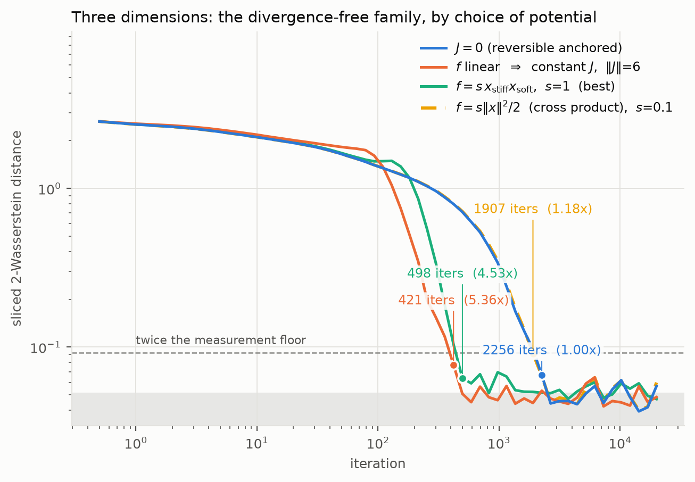

# State-dependent skew fields

The first round used a constant skew matrix $J$. This note works out what
happens when $J$ is allowed to depend on $x$: what is admissible, what the
complete families are, and what actually helps.

## 1. The naive condition, and why it is the wrong one

Keep the drift in the form the constant case uses,
$c(x) = e^{(U-U_0)(x)} J(x)\nabla U_0(x)$. Writing $\rho_0 = e^{-U_0}$,

$$\operatorname{div}(\pi c) \;\propto\; \operatorname{div}\big(\rho_0 J\nabla U_0\big)
 = \underbrace{-\rho_0\langle \nabla U_0, J\nabla U_0\rangle}_{=\,0}
 + \underbrace{\rho_0\langle J, \nabla^2 U_0\rangle_F}_{=\,0}
 - \rho_0\langle \operatorname{div} J, \nabla U_0\rangle,$$

with $(\operatorname{div} J)_j := \sum_i \partial_i J_{ji}$. So the target is
preserved **iff**

$$\langle \operatorname{div} J(x), \nabla U_0(x)\rangle = 0 \quad \text{for all } x. \tag{INV}$$

A constant $J$ satisfies (INV) trivially. The next simplest family is
$J(x) = \psi(q(x))J_0$, a radial modulation of the rotation strength, which
satisfies (INV) for every profile $\psi$ because $\nabla q$ and $\nabla U_0$ are
parallel and $\langle v, J_0 v\rangle = 0$.

In $d = 2$ that family is not merely an example, it is everything. Any
$J(x) = \psi(x)J_0$ obeying (INV) needs $\psi$ constant along the orbits of
$x \mapsto J_0\Sigma^{-1}x$, and those orbits are exactly the level sets of
$q$, since $\Sigma^{-1}J_0\Sigma^{-1}$ is skew. So under (INV) the only freedom
in two dimensions is one scalar profile of one variable — and that profile is
**blind to direction**, because $q$ cannot tell the stiff axis from the soft one.

That is a bad place to be, and the experiments confirm it: at matched average
rotation strength every non-constant radial profile is *worse* than constant,
some catastrophically.

## 2. The correction that removes the condition

(INV) is an artefact of insisting on the form $e^{U-U_0}J\nabla U_0$. Add one
term and it disappears entirely:

$$\boxed{\;c(x) = e^{(U-U_0)(x)}\Big[\,J(x)\nabla U_0(x) \;-\; (\operatorname{div} J)(x)\,\Big]\;}\tag{COR}$$

preserves $\pi$ for **every** skew matrix field $J$, with no constraint.

*Proof.* Two divergences cancel:
$\operatorname{div}(\rho_0 J\nabla U_0) = -\rho_0\langle\operatorname{div}J,\nabla U_0\rangle$
from the computation above, and

$$\operatorname{div}(\rho_0 \operatorname{div}J)
 = -\rho_0\langle\nabla U_0,\operatorname{div}J\rangle
 + \rho_0\underbrace{\textstyle\sum_{ij}\partial_i\partial_j J_{ji}}_{=\,0},$$

the last sum vanishing because a symmetric second derivative is contracted with
an antisymmetric matrix. Subtracting gives $\operatorname{div}(\pi c) = 0$. $\square$

Equivalently: $\pi c = \operatorname{div} S$ for the antisymmetric matrix field
$S = -e^{-U_0}J$, and the divergence of the divergence of an antisymmetric field
is identically zero. Every $\pi$-divergence-free drift arises this way, so (COR)
is not one construction among many — it is the general one.

Two things change. The corrected drift is **no longer tangent to the level sets
of $U_0$**: $\langle\nabla U_0, c\rangle = -e^{U-U_0}\langle\nabla U_0,
\operatorname{div}J\rangle$ need not vanish. And the design space becomes the
full set of skew matrix fields.

## 3. Complete families

**In $d = 2$.** Any divergence-free planar field is a skew gradient, so

$$c(x) = e^{U(x)}\,J_0\,\nabla\Phi(x) \tag{2D}$$

for an arbitrary scalar stream function $\Phi$, and this is the complete family.
The constant field of norm $\delta$ is $\Phi = -\delta e^{-U_0}$. Writing
$u = \Sigma^{-1/2}x/\sqrt\nu$ and $q = 1 + |u|^2$, the experiments use

$$\Phi = -\delta\, q^{-\beta}\Big(1 + a\,\frac{u_1^2-u_2^2}{q} + b\,\frac{2u_1u_2}{q}\Big),$$

whose $a = b = 0$ member is the constant field. The quadrupole term $a$ tilts
the rotation towards the soft axis ($a<0$) or the stiff one ($a>0$). Neither
tilt is admissible as a bare $J(x)$ field; both become legal through (COR).

**In $d \ge 3$.** $J = \operatorname{div}A$ for a totally antisymmetric
3-tensor $A$ has $\operatorname{div}J \equiv 0$, so it satisfies (INV) with no
correction and preserves *any* target with *any* anchor. For $d = 3$ this is
$J(x)v = v\times\nabla f(x)$ for an arbitrary scalar $f$. No such family exists
in $d = 2$, which is precisely why two dimensions are confined to radial
modulation under (INV).

## 3b. The curl family in three dimensions, and what it can and cannot do

In $d \ge 3$ the field $J(x)v = \nabla f(x)\times v$ has $\operatorname{div}J
\equiv 0$ for **every** scalar $f$, so it satisfies (INV) outright: it goes
straight into the anchored drift with no correction term and preserves any
target with any anchor. Two familiar objects are members:

| $f$ | field | conserves besides $U_0$ |
|---|---|---|
| linear | a **constant** $J$ | nothing |
| $s\|x\|^2/2$ | $J_s(x)v = s\,(x\times v)$ | $\|x\|$ |
| $s\,x_{\text{stiff}}x_{\text{soft}}$ | hyperbolic | $x_{\text{stiff}}x_{\text{soft}}$ |

**Every** field of the form $c = e^{U-U_0}J\nabla U_0$ conserves $U_0$, because
$\langle\nabla U_0, J\nabla U_0\rangle = 0$ for skew $J$. The curl family
conserves a *second* function as well, namely $f$, since
$\nabla f\times\nabla U_0$ is orthogonal to both. Two conserved functions in
three dimensions pin the flow to a one-dimensional curve, and which curve
decides whether the field is any use.

For $J_s(x)v = s(x\times v)$ the second conserved quantity is $\|x\|$, and with
the canonical anchor the drift reduces exactly to the quadratic field
$c(x) = s(2\beta/\nu)(x\times\Sigma^{-1}x)$. That is an attractive object — it
vanishes identically on an isotropic target, which is precisely where no skew
perturbation can help, and grows with the anisotropy. But conserving $\|x\|$ is
fatal for the mechanism that actually accelerates. The useful transport carries
mass from the soft axis to the stiff axis **at fixed $q$**, where the reversible
drift is $\kappa$ times faster; those two points differ in $\|x\|$ by a factor
$1/\sqrt\kappa$. A field that conserves $\|x\|$ cannot connect them.

The measurements agree. On the three-dimensional anisotropic Student-t
($\nu=6$, $\kappa=100$), at stepsizes chosen to equalise accuracy with an
adaptive search, every field carrying the warm-up ramp it needs and every row
converging in all five replications ([`exp10`](../experiments/exp10_curl_potentials.py)):

| curl potential $f$ | conserves | $s$ | $\eta$ | iterations to 2× floor | speed-up |
|---|---|---|---|---|---|
| linear (a **constant** $J$), $\|J\|=6$ | — | — | 8.52e-4 | **421** | **5.36×** |
| $s\,x_{\text{stiff}}x_{\text{soft}}$ | $x_{\text{stiff}}x_{\text{soft}}$ | 0.3 | 1.14e-3 | 1153 | 1.96× |
| $s\,x_{\text{stiff}}x_{\text{soft}}$ | ″ | 0.5 | 1.11e-3 | 824 | 2.74× |
| $s\,x_{\text{stiff}}x_{\text{soft}}$ | ″ | 0.7 | 1.09e-3 | 589 | 3.83× |
| $s\,x_{\text{stiff}}x_{\text{soft}}$ | ″ | **1.0** | 1.10e-3 | **498** | **4.53×** |
| $s\,x_{\text{stiff}}x_{\text{soft}}$ | ″ | 1.5 | 1.69e-4 † | 2256 | 1.00× |
| $s\|x\|^2/2$ (cross product) | $\|x\|$ | 0.1 | 1.16e-3 | 1907 | 1.18× |
| $s\|x\|^2/2$ | $\|x\|$ | 0.3 | 1.83e-4 † | 12087 | 0.19× |
| $s\|x\|^2/2$ | $\|x\|$ | 0.5 | 1.76e-4 | 12087 | 0.19× |
| $J = 0$ | — | — | 1.17e-3 | 2256 | 1.00× |

† the equal-accuracy stepsize was unstable from the wide prior, so it was backed
off (2.5× and 6.2×) until every replication survived. A backed-off row runs at a
*smaller* stepsize than equal accuracy requires, hence more accurately: it is
charged the extra iterations and given no credit for the extra accuracy.

The cross-product curve lies almost exactly on top of $J=0$, which is why it is
dashed.

Two things had to be got right before these numbers meant anything, and both
were got wrong first — see § 3c.

**The verdict on each potential.** The cross-product field $J_s$ is inert at
small $s$ (1.18× at $s=0.1$: the added drift is under a fifth of the reversible
one in root-mean-square) and actively harmful above it, because the quadratic
growth costs more in stepsize than the rotation returns. It never beats $J=0$
by more than the measurement noise. The diagnosis holds: it conserves $\|x\|$,
and the transport that accelerates has to change $\|x\|$ by $1/\sqrt\kappa$.

Breaking that conservation works, and works well. The hyperbolic potential
$f = s\,x_{\text{stiff}}x_{\text{soft}}$, whose level sets contain both
endpoints, does break it — $\langle x, c\rangle$ goes from $5\times10^{-13}$ to
$2.2\times10^{3}$ — and climbs monotonically with $s$ to **4.53×** at $s=1$,
four and a half times the reversible anchored sampler, with the best constant
field 18 % faster still. Past $s=1$ the equal-accuracy stepsize goes unstable and
the back-off costs more than the extra rotation returns.

So the conclusion is quantitative rather than qualitative. The best member of
the three-dimensional curl family we found is still the linear potential — a
*constant* $J$, at 5.36× — but it leads a tuned state-dependent member
by only 18 %, not by the factor of two it looked like before the ramp and the
divergence accounting were fixed. State dependence pays much more in two
dimensions, through the stream construction of § 3, precisely because there the
correction term of § 2 frees the field from the second conservation law
entirely. The curl family buys freedom from the correction term and pays for it
with an extra invariant.

**Independent seeds.** The ordering above is not a seed artefact;
[`exp11`](../experiments/exp11_seed_robustness.py) re-asks it of three disjoint
seed blocks, five replications each:

| field | blk 500 | blk 20500 | blk 40500 |
|---|---|---|---|
| $J=0$ | 2137 | 1844 | 1844 |
| constant $\|J\|=6$ | 364 (**5.87×**) | 364 (**5.07×**) | 422 (**4.37×**) |
| hyperbolic $s=0.5$ | 882 (2.42×) | 882 (2.09×) | 761 (2.42×) |
| hyperbolic $s=0.7$ | 657 (3.25×) | 657 (2.81×) | 657 (2.81×) |
| hyperbolic $s=1$ | 489 (4.37×) | 489 (3.77×) | 489 (3.77×) |
| hyperbolic $s\ge 1.5$ | diverges | diverges | diverges |

Every cell that reports a number had no divergences; $s \ge 1.5$ reports none
because it diverged in all three blocks. The constant field is ahead in every
block, by 1.16× to 1.34×, and the level of each speed-up moves by up to 15 %
between blocks — which is the honest error bar on any single number here.

Note the dimensions differ: the 29–79× figures elsewhere are $d = 2$ stream
fields, and are not comparable with any of these. Every number in this section
is $d = 3$ and like-for-like with every other number in it.

## 3c. Two ways to fool yourself, both of which we did

The first version of the table above reported the hyperbolic potential at
$s = 1$ converging in **301** iterations, a 7.50× that beat the constant field.
It was wrong, and it is worth recording exactly how.

**The mean over replications hid the divergences.** A convergence curve here is
the mean over five chains, and `np.nanmean` stays finite as long as *one* chain
survives. At the stepsize in question, four chains out of five blew up; the
curve reported was the survivor's, and the survivor happened to be fast. Asked
of three disjoint seed sets, that configuration diverges in five replications
out of five in every one of them. The fix is to count divergences and treat a
field as stable only when *every* replication is — which is what the table
above does, and why it carries no "diverged" column: nothing in it diverged.

**The ramp was too short for a field that grows with $\|x\|$.** The warm-up
length is computed from the target's stiff relaxation time, a property of the
*linear* drift. Both non-constant potentials here have $\nabla f$ linear in
$x$, so their field strength is proportional to $\|x\|$: started from an
$\mathcal N(0, 10I)$ prior they are an order of magnitude stronger through the
transient than they will ever be at stationarity, and a hold long enough for a
constant field is not long enough for them. Ten relaxations leave a 1.18×
overshoot on $s=0.5$ and let $s\ge 0.7$ blow up; forty leave nothing and keep
the equal-accuracy stepsize usable, which is where most of the improvement in
the table comes from — $s=0.7$ goes from 1.96× to 3.83× purely by no longer
needing its stepsize backed off. Measured on $s=0.5$:

| ramp | ramp iterations | rise out of a trough | iterations to 2× floor |
|---|---|---|---|
| 10 | 77 | 1.18× | 697 |
| 20 | 154 | 1.03× | 824 |
| 40 | 308 | **1.00×** | 824 |
| 80 | 617 | 1.00× | 975 |

Unlike a constant field, where the ramp is free, here it is a real trade — and
one worth making, because forty relaxations is also what buys the stability.

## 4. The price

A constant $J$ makes the anchored drift linear in $x$ (for the canonical anchor
$\beta = \iota - 1$). Any genuinely state-dependent field makes it nonlinear:
a linear skew drift $e^{U}J_0\nabla\Phi$ requires $\nabla\Phi = q^{-\iota}Lx$
to be curl-free, which forces $L \propto \Sigma^{-1}$, i.e. back to a constant
field.

That matters because the binding constraint on the whole method is
**discretisation bias, not stability** — the equal-bias stepsize sits a factor
of 14 to 50 below the mean-square stability limit. Linearity is what lets the
drift be integrated exactly, and exact integration is what removes the bias.
So state-dependence buys expressiveness and pays for it in integrability, and
the experiments have to settle which wins.

The implementation splits the difference: the constant part of the field is
advanced exactly and only the nonlinear remainder is taken explicitly.
