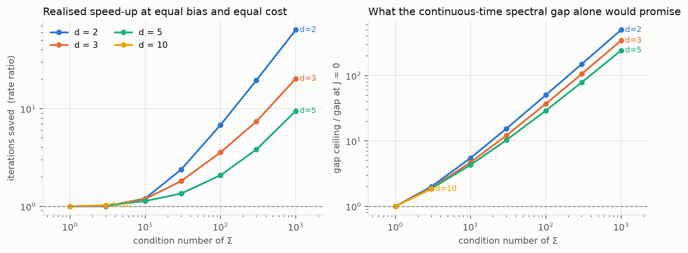
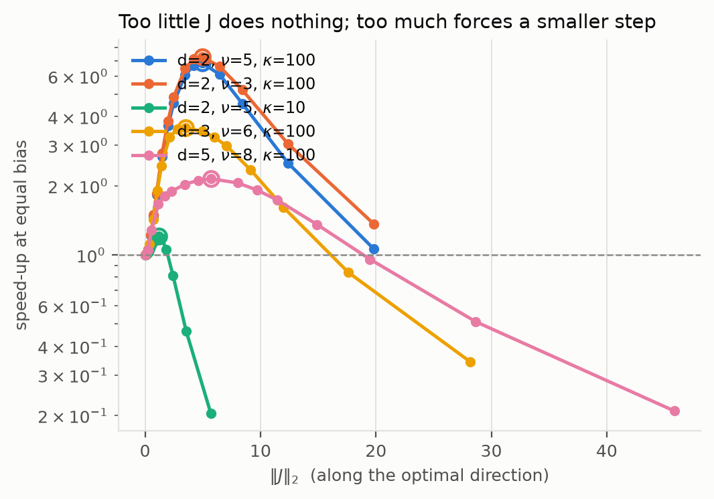
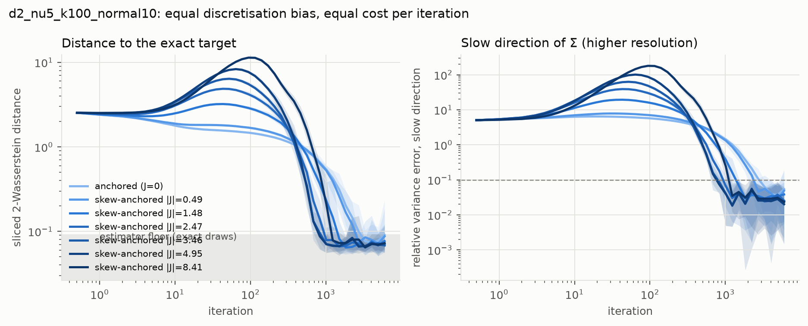
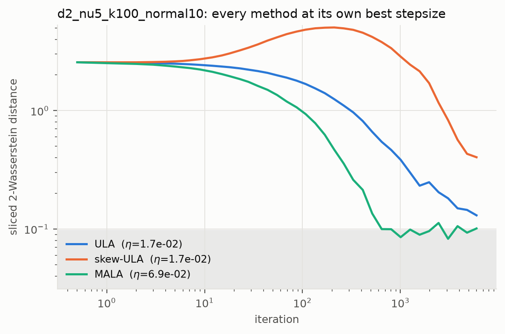
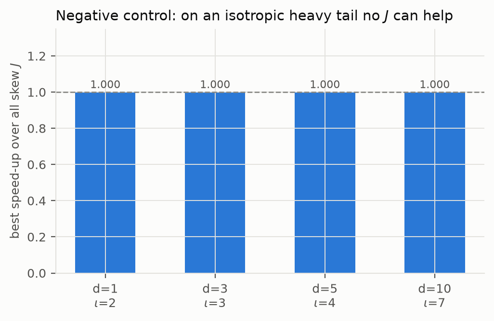
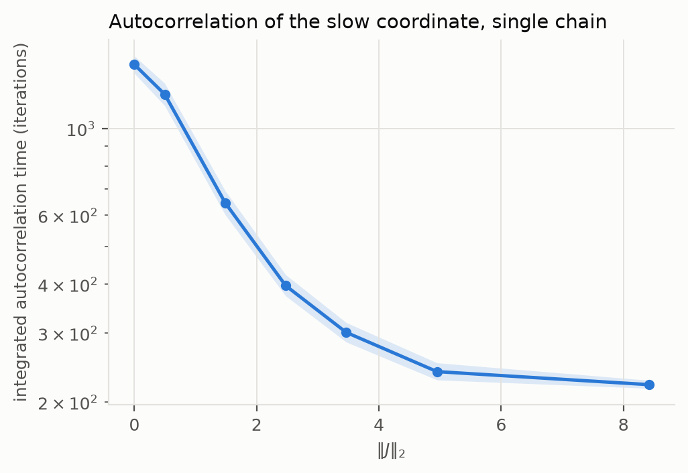
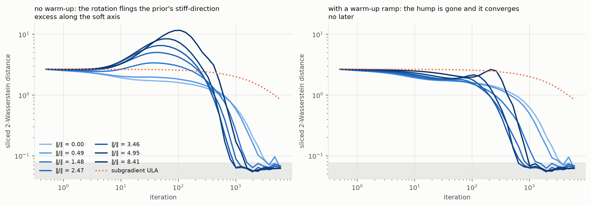

# Results

All numbers below are reproduced by the scripts in `experiments/`; the raw JSON
is in `results/data/` and the figures in `results/figures/`.

Two kinds of number appear and they must not be confused.

* **Exact** — from the closed-form second-moment analysis of the discretisation
  (`skewanchor/analysis.py`).  No Monte Carlo error.
* **Measured** — from ensemble simulation, with bootstrap bands over
  replications and always shown against the estimator's own noise floor.

---

## 1. The paper's own heavy-tailed target is inert to $J$

Section 6.4 of the paper uses $\pi(x)\propto(1+\|x\|^2)^{-\iota}$ with
$\iota = 2$, anchor $\beta = 1$, $\eta = 0.01$, 5 000 particles.  Because
$\iota > 1 + d/2$, that forces $d = 1$, where the only skew-symmetric matrix is
$0$.  Lifting the same family to $d = 3$ makes skew matrices available but the
target stays radial, and the added drift then generates rotations that act
unitarily on $L^2(\pi)$.

Exact (`exp1`):

| target | gap at $J=0$ | ceiling over all skew $J$ | best speed-up |
|---|---|---|---|
| $d=1$, $\iota=2$ | 2.000 | 2.000 | 1.0000× |
| $d=3$, $\iota=3$ | 4.000 | 4.000 | 1.0000× |
| $d=5$, $\iota=4$ | 6.000 | 6.000 | 1.0000× |
| $d=10$, $\iota=7$ | 12.000 | 12.000 | 1.0000× |

This is a negative control, not a failure: it says the skew extension has to be
tested on **anisotropic** heavy-tailed targets, which is what the rest does.

### Measured (`exp0`)

Setting A is the paper's Figure 8 exactly: $d=1$, $\iota=2$, $\beta=1$,
$\eta=0.01$, 5 000 particles, 20 replications.  Medians across replications,
since the estimator's sampling distribution is heavy tailed (below).

| prior | method | iterations to $2\times$ floor | final $W_2$ (median) |
|---|---|---|---|
| $\mathcal N(0,10I)$ | ULA | 2085 | 0.347 |
| $\mathcal N(0,10I)$ | anchored | **136** | 0.218 |
| $\mathrm{Uniform}(-5,5)$ | ULA | 839 | 0.243 |
| $\mathrm{Uniform}(-5,5)$ | anchored | **113** | 0.218 |

This reproduces the paper's claim: anchored Langevin reaches the measurement
floor about 15× sooner than ULA, and its final value equals the floor's own
median (0.221), i.e. it has converged as far as the metric can see.

Setting B lifts the same family to $d=3$ ($\iota=3$, so $\nu=3$ again), where
skew matrices exist but the target is still radial.

| variant | iterations to $2\times$ floor | final $W_2$ (median) |
|---|---|---|
| anchored ($J=0$) | 163 | 0.223 |
| skew-anchored $\|J\|=0.5$ | 163 | 0.232 |
| skew-anchored $\|J\|=2$ | 235 | 0.279 |
| skew-anchored $\|J\|=2$, random $J$ | 196 | 0.276 |
| skew-anchored $\|J\|=8$ | — | blew up to $\sim10^{29}$ |
| ULA | 2501 | 0.466 |

So on a radial heavy-tailed target the skew matrix does not help, and at large
enough magnitude it destroys the scheme.  The exact analysis says the same and
says it more sharply: at $\eta=0.01$ the continuous-time second-moment rate is
2.0000 for **every** $J$, while the per-iteration rate falls from 0.01857 at
$J=0$ to 0.01830 at $\|J\|=0.5$ and 0.01409 at $\|J\|=2$, the covariance bias
rises from 8.7 % to 10.3 % to 43 %, and mean-square stability fails outright
at $\|J\|=8$.

### Measuring on this target at all is hard

The $\nu = 3$ tail makes the empirical 2-Wasserstein distance a slow estimator.
Its floor — the same statistic evaluated on exact i.i.d. draws — is

| $n$ | 500 | 1 000 | 5 000 | 20 000 |
|---|---|---|---|---|
| $W_2$ floor | 0.337 | 0.316 | 0.265 | 0.186 |

decaying like $n^{-1/6}$.  Fitting the exponent over $n$ from 500 to 50 000
gives $-0.166$ against the $-(1/2 - 1/\nu) = -0.167$ the tail index predicts
(`exp6`).  At the paper's $n = 5\,000$ nothing below $\approx 0.22$ is signal,
and quadrupling the sample size buys about 20 %.

Worse, the estimator's own sampling distribution is heavy tailed.  On exact
draws from the $\nu=3$ target at $n=5\,000$, over 200 repetitions:

| | median | mean | std | max | max / median |
|---|---|---|---|---|---|
| $d=1$, $\iota=2$ (paper) | 0.221 | 0.239 | 0.079 | 1.121 | 5.1 |
| $d=3$, $\iota=3$ | 0.225 | 0.246 | 0.076 | 0.941 | 4.2 |
| $d=2$, $\nu=5$, $\kappa=100$ | 0.068 | 0.074 | 0.029 | 0.295 | 4.4 |
| $d=2$, $\nu=8$, $\kappa=100$ | 0.035 | 0.037 | 0.011 | 0.126 | 3.6 |

Single repetitions land five times the median.  **Averaging this statistic over
runs, as the paper does, is dominated by outliers**; the median across
replications is the summary to compare, and it is what the tables here quote.

A naive midpoint quantile estimator reports about half the true value on the
$\nu=3$ targets (ratio 1.9×) because it truncates the two tail cells.  Both
estimators are implemented (`metrics.axis_sliced_w2` and
`metrics.sliced_w2_midpoint`); the tail-resolving one is the default.

---

## 2. Anisotropic heavy tails: the exact speed-up

Student-t targets, comparison at **equal stationary covariance bias (2 %) and
equal cost per iteration**.  Exact (`exp1`).

| $\kappa(\Sigma)$ | $d=2$ | $d=3$ | $d=5$ | $d=10$ |
|---|---|---|---|---|
| 1 | 1.00× | 1.00× | 1.00× | 1.00× |
| 3 | 1.00× | 1.01× | 1.02× | 1.03× |
| 10 | 1.20× | 1.19× | 1.13× | 1.16× |
| 30 | 2.38× | 1.82× | 1.35× | 1.21× |
| 100 | 6.83× | 3.57× | 2.08× | 1.53× |
| 300 | 19.6× | 7.41× | 3.82× | 2.01× |
| 1000 | 64.2× | 20.3× | 9.49× | 4.91× |

Two readings.  The gain grows fast with the condition number and **falls with
dimension** — at $d = 10$, $\kappa = 100$ it is only 1.53×.  And it is far below
what the continuous-time spectral gap would suggest: at $d=2$, $\kappa=1000$ the
gap ceiling is 500×, the realisable per-iteration gain 64×.

The result is not sensitive to the bias level held fixed: 6.64× at 0.5 % bias,
6.83× at 2 %, 7.19× at 5 % ($d=2$, $\kappa=100$).

---

## 3. Where the acceleration goes (`exp5`)

For $d=2$, $\nu=5$, $\kappa=100$, along the optimal $J$ direction:

| $\|J\|_2$ | SDE second-moment rate | ×  | equal-bias $\eta$ | per-iteration rate | × |
|---|---|---|---|---|---|
| 0 | 1.499 | 1.0 | 1.07e-3 | 0.00160 | 1.00 |
| 1.48 | 4.794 | 3.2 | 8.97e-4 | 0.00428 | 2.68 |
| 3.46 | 18.78 | 12.5 | 5.18e-4 | 0.00967 | 6.05 |
| 4.95 | 32.86 | 21.9 | 3.36e-4 | 0.01092 | **6.83** |
| 8.41 | 51.07 | 34.1 | 1.45e-4 | 0.00729 | 4.56 |
| 14.85 | 57.78 | 38.5 | 4.6e-5 | 0.00289 | 1.81 |

The **dynamics** keeps getting faster as $\|J\|$ grows — up to 38× here, and up
to 396× at $\kappa = 1000$.  The **algorithm** does not, because the larger
drift shrinks the mean-square-stable stepsize.  There is an interior optimum,
and a criterion that ignores the stepsize will sit far to the right of it.

The isotropic control passes here too: the SDE rate is 2.0000 both at $J=0$ and
at $\|J\|=4$.

---

## 4. Simulation confirms it (`exp2`)

$d=2$, $\nu=5$, $\kappa=100$, 5 000 particles, prior $\mathcal N(0,10I)$,
10 replications, equal-bias stepsizes.  The estimator floor is
$0.075 \pm 0.018$.

| $\|J\|_2$ | $\eta$ | predicted rate | iterations to $2\times$ floor | iterations to 10 % slow-direction error | final $W_2$ |
|---|---|---|---|---|---|
| 0 | 1.07e-3 | 0.00160 | 2233 | 3316 | 0.091 |
| 0.49 | 1.05e-3 | 0.00195 | 2233 | 2721 | 0.087 |
| 1.48 | 8.97e-4 | 0.00428 | 1234 | 1503 | 0.077 |
| 2.47 | 6.95e-4 | 0.00731 | 831 | 1012 | 0.068 |
| 3.46 | 5.18e-4 | 0.00967 | **682** | **831** | 0.068 |
| 4.95 | 3.36e-4 | 0.01092 | 682 | 831 | 0.072 |
| 8.41 | 1.45e-4 | 0.00729 | 1234 | 1234 | 0.073 |

No replication diverged.  The measured gain is **4.0×** on the slow-direction
metric and **3.3×** on Wasserstein, against 6.8× predicted asymptotically — the
transient is not purely the asymptotic rate, so the measured number is the
conservative one.  All final $W_2$ values sit inside the floor's uncertainty,
which is the check that the equal-bias protocol really did equalise accuracy.

At a **common** stepsize instead ($\eta = 1.07\times10^{-3}$ for everyone), the
skew variant reaches $2\times$ floor in 254 iterations against 2233 — 8.8× —
but at a larger bias, which is precisely why the equal-bias protocol is the one
to quote.

### The other prior

The same experiment from $\mathrm{Uniform}(-5,5)$ instead of
$\mathcal N(0,10I)$ gives the same picture with a smaller margin: 2721
iterations at $J=0$ against 1012 at $\|J\|=2.47$, a measured **2.7×**.  The
uniform prior starts closer to the target's scale, so there is less transient to
save.  The direction and the location of the optimum are unchanged.

### Higher dimension

The same protocol at $d=5$, $\nu=8$, $\kappa=100$ (6 replications, floor
0.029) tracks the exact prediction down to a smaller margin, as expected:

| $\|J\|_2$ | $\eta$ | predicted rate | iterations to $2\times$ floor |
|---|---|---|---|
| 0 | 1.05e-3 | 0.00244 | 2233 |
| 1.15 | 9.67e-4 | 0.00405 | 1503 |
| 3.44 | 6.65e-4 | 0.00495 | **1234** |
| 5.73 | 4.68e-4 | 0.00523 | 1503 |
| 8.02 | 3.45e-4 | 0.00502 | 1503 |
| 11.46 | 2.31e-4 | 0.00423 | 1832 |
| 19.48 | 1.05e-4 | 0.00234 | 3316 |

Measured **1.81×** against 2.14× predicted, with the optimum where the theory
puts it and the curve turning over past it.  Note also that the Corollary 13
condition here would need $\beta > 250$, i.e. $\nu > 495$, so this target too
sits well outside the paper's Wasserstein theorem.

Under tuned stepsizes at $d=5$ the picture is the same as at $d=2$, and just as
unflattering to a naive reading: skew-anchored reaches $2\times$ floor in 413
iterations, but **tuned MALA ties it at 413**, with anchored at $J=0$ needing
516 and ULA 6000.  At this dimension the skew perturbation buys back the
anchored method's deficit against MALA rather than opening a lead.

### Against tuned baselines

Each method at its own best stepsize from a grid (2 000 particles, floor 0.089;
the whole grid is saved, not just the winner).  Selection is by iterations to
$2\times$ floor, so it favours speed over final accuracy — both columns are
shown for that reason.

| method | best $\eta$ | iterations to $2\times$ floor | final $W_2$ |
|---|---|---|---|
| skew-anchored $\|J\|=4.95$ | 4.3e-3 | **169** | 0.224 |
| MALA | 6.9e-2 | 516 | 0.101 |
| anchored ($J=0$) | 4.3e-3 | 645 | 0.103 |
| underdamped Langevin | 6.9e-2 | 1259 | 0.086 |
| ULA | 1.7e-2 | 3841 | 0.130 |
| skew-ULA | 1.7e-2 | never | 0.404 |

Read honestly, this says three things (and see the $d=5$ figures for the same
comparison there).  The skew variant is the fastest to a
given accuracy, by 3.8× over the reversible anchored method.  A **well-tuned
MALA is a strong baseline** on this target — better than anchored at $J=0$ —
so the anchored family's advantage over Metropolis-adjusted methods is smaller
than a common-stepsize comparison suggests.  And the unscaled skew perturbation
of ULA (drift $J\nabla U$ rather than $e^{U-U_0}J\nabla U_0$) is actively
harmful here: it never reaches the floor.

---

## 5. Single-chain efficiency (`exp3`)

The ensemble experiments measure how fast the law of the chain reaches the
target.  Classical non-reversible theory makes a second, independent prediction:
the asymptotic variance of a time average falls.  Measured on the slow direction
of $\Sigma$, from 48 chains of 60 000 iterations started at stationarity, at the
same equal-bias stepsizes ($d=2$, $\nu=5$, $\kappa=100$).

| $\|J\|_2$ | integrated autocorrelation time | 95 % interval | effective samples per iteration | reduction |
|---|---|---|---|---|
| 0 | 1456 | [1383, 1532] | 6.9e-4 | 1.00× |
| 0.49 | 1223 | [1144, 1305] | 8.2e-4 | 1.19× |
| 1.48 | 646 | [602, 693] | 1.5e-3 | 2.26× |
| 2.47 | 396 | [373, 423] | 2.5e-3 | 3.67× |
| 3.46 | 301 | [285, 319] | 3.3e-3 | 4.83× |
| 4.95 | 239 | [228, 252] | 4.2e-3 | 6.09× |
| 8.41 | **221** | [217, 227] | 4.5e-3 | **6.58×** |

The intervals do not overlap, so this is the cleanest measurement in the study,
and its 6.6× sits right on the 6.8× the exact second-moment analysis predicts.

One honest discrepancy: the ensemble measure peaks at $\|J\| \approx 5$ and
degrades after, while the autocorrelation keeps improving out to $\|J\| = 8.4$.
They are different functionals — a second-moment convergence rate against an
asymptotic variance — and there is no reason for their optima to coincide.  The
autocorrelation is the quantity classical non-reversible theory speaks to.

## 6. Heavy tailed *and* non-differentiable (`exp4`)

The anchored framework exists to handle a non-smooth $U$; heavy tails are the
paper's other motivation.  Combining them is the case it is really for.  We take

$$U(x) = \iota\log q(x) + \sum_i \mathrm{MCP}_\lambda(x_i),\qquad
  U_0(x) = \beta\log q(x) + \sum_i \mathrm{MCP}^\varepsilon_\lambda(x_i),$$

with $q$ the anisotropic Student-t quadratic form ($d=2$, $\nu=5$,
$\kappa=100$), $\mathrm{MCP}$ the minimax concave penalty of the paper's
Section 6.2 ($\lambda=1$, $a=2$) and $\mathrm{MCP}^\varepsilon$ its smoothing from
the paper's Eq. (67) ($\varepsilon = 0.1$).  The penalty is bounded, so the
polynomial tail survives and exact reference draws come from rejection sampling
off the Student-t core (acceptance rate 0.54).  Estimator floor 0.068.

| $\|J\|_2$ | $\eta$ | iterations to $2\times$ floor | iterations to 10 % slow-direction error | speed-up |
|---|---|---|---|---|
| 0 | 1.07e-3 | 3073 | 3841 | 1.00× |
| 0.49 | 1.05e-3 | 2458 | 3073 | 1.25× |
| 1.48 | 8.97e-4 | 1259 | 1574 | 2.44× |
| 2.47 | 6.95e-4 | 1007 | 1007 | 3.81× |
| 3.46 | 5.18e-4 | 806 | 1007 | 3.81× |
| 4.95 | 3.36e-4 | **806** | **806** | **4.77×** |
| 8.41 | 1.45e-4 | 1259 | 1574 | 2.44× |

The acceleration survives the non-smoothness intact — 4.77×, slightly better
than the 4.0× on the smooth target — and the optimum sits at the same
$\|J\|$.

**With the warm-up ramp** (`--ramp 5`), which removes the transient overshoot
described in [`RESULTS_STATE_DEPENDENT.md`](RESULTS_STATE_DEPENDENT.md) § 9,
every curve descends monotonically *and* converges sooner:

| $\|J\|_2$ | hump | iterations to 2× floor | iterations to 10 % slow-direction error | speed-up |
|---|---|---|---|---|
| 0 | 1.00× | 3073 | 3841 | 1.00× |
| 0.49 | 1.00× | 2458 | 3073 | 1.25× |
| 1.48 | 1.00× | 1007 | 1574 | 2.44× |
| 2.47 | 1.00× | 806 | 806 | 4.77× |
| 3.46 | 1.00× | **645** | **645** | **5.96×** |
| 4.95 | 1.00× | 645 | 645 | 5.96× |
| 8.41 | 1.00× | 1007 | 1007 | 3.81× |

No configuration now exceeds its starting distance at any point, and the best
speed-up rises from 4.77× to 5.96×.  Subgradient ULA, which is what one would otherwise reach for when
$\nabla U$ does not exist at $x_i = 0$, fails to reach $2\times$ floor within
6 000 iterations at any of three stepsizes spanning 16×.

Stepsizes here are taken from the Student-t core's exact analysis; the composite
potential is not log-quadratic, so its second-moment recursion is not exact and
the equal-bias property is approximate.

## 7. Figures

Regenerate with `python experiments/make_figures.py`; a dark-mode variant of
each is written alongside.

**Speed-up against the condition number, and what the spectral gap alone would
promise.**  The two panels use the same axes, so the vertical gap between them
is the price of the smaller stepsize.

**The tuning curve.**  Every target has an interior optimum in $\|J\|$; past it
the equal-bias stepsize falls faster than the rate rises.

**Convergence at equal bias.**  Note the transient hump: the multiplicative
noise inflates the ensemble first and the rotation mixes the badly scaled fast
direction into the slow one, so a larger $\|J\|$ overshoots further before
converging sooner.  The shaded band is the estimator floor.

**Against tuned baselines.**

**The negative control.**

**Autocorrelation of the slow coordinate.**

**Heavy tailed and non-differentiable together.**

## 8. Cost per iteration is identical

For the log-quadratic family the step folds ``J`` into a precomputed matrix,
``M = ((J - I) Sigma^{-1})^T``, and then does one ``z @ M`` per iteration --
exactly the operation the ``J = 0`` step already does.  Adding the skew matrix
costs nothing per step, so "per iteration" and "per unit work" are the same
comparison here.  The measured wall-clock times bear this out: across the seven
equal-bias configurations the per-run times were 59-81 s with no trend in
``||J||``.

For a general anchored potential (`samplers.generic_skew_anchored_step`) the
skew term does add one matrix-vector product per step, which is negligible
beside the gradient evaluation.

## 9. Threats to validity

* **Equal covariance bias is not equal bias in every functional.**  The protocol
  equalises the second moment exactly; higher moments are only equalised to the
  extent the final $W_2$ values agree, which here they do to within the floor.
* **The exact analysis needs the canonical anchor.**  It relies on
  $\beta = \iota - 1$, which makes the drift linear.  For other $\beta$, and for
  the composite non-smooth target, stepsizes are chosen empirically.
* **Dimension.**  Everything is $d \le 10$.  The trend with $d$ is unfavourable
  and we do not claim the method helps in high dimension.
* **The optimal $J$ needs $\Sigma$.**  `lnp_optimal` is built from
  $\Sigma^{-1}$.  A practitioner without it would need to estimate the
  covariance online; that is not studied here.
* **Baselines.**  ULA, skew-ULA, MALA and underdamped Langevin are included, each
  at its own tuned stepsize with the full grid saved.  Well-tuned ULA is much
  better than ULA at the anchored method's stepsize, and tuned MALA beats
  anchored at $J=0$, so a common-stepsize comparison flatters the anchored
  family; the tuned columns are the honest ones.
* **The transient gets worse before it gets better.**  Starting from
  $\mathcal N(0,10I)$, the multiplicative noise $q^{1/2}$ inflates the ensemble
  first, and the rotation mixes the badly scaled fast direction's excess into
  the slow one, so a larger $\|J\|$ overshoots further before converging much
  sooner.  The net effect is still a gain, but the curves are not monotone and
  a summary taken early in the run would mislead.
* **Detecting divergence needs a magnitude test.**  A mean-square-unstable
  scheme can grow geometrically to $10^{29}$ and stay finite for a whole run.
  The isotropic control at $\|J\|=8$ and the paper's $\eta = 0.01$ does exactly
  this, as the exact analysis predicts; runs are now flagged by magnitude as
  well as by non-finiteness.
