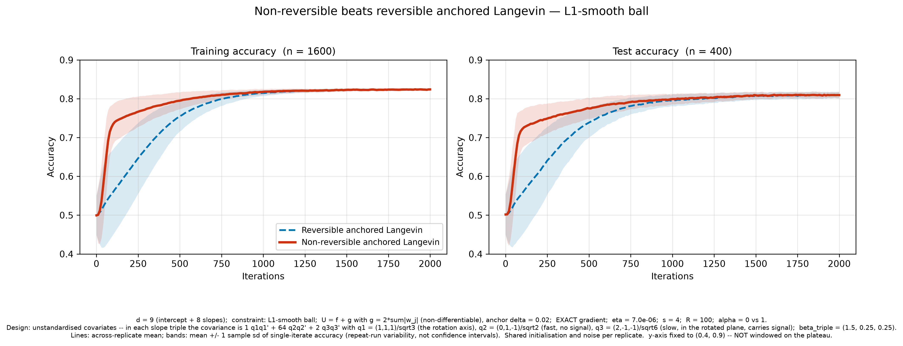
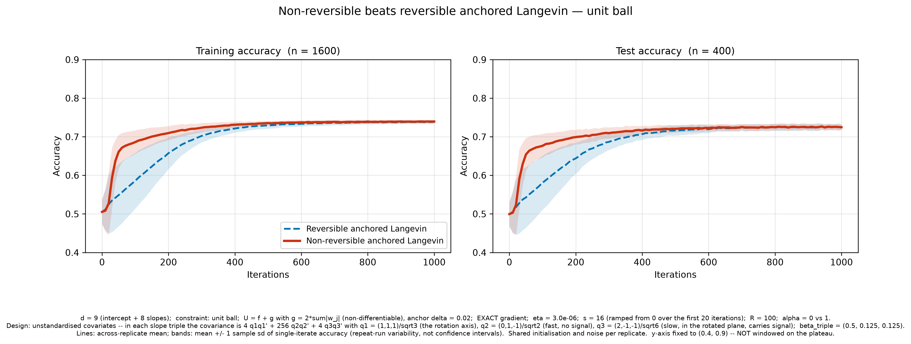
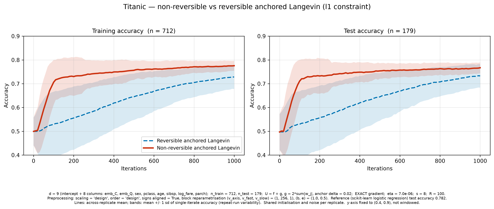
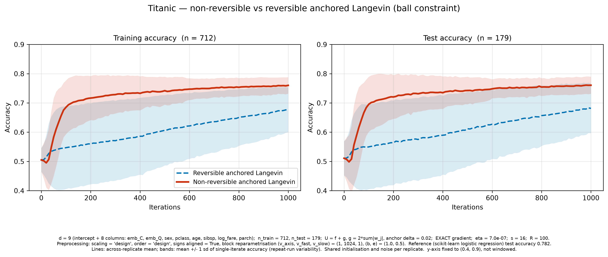
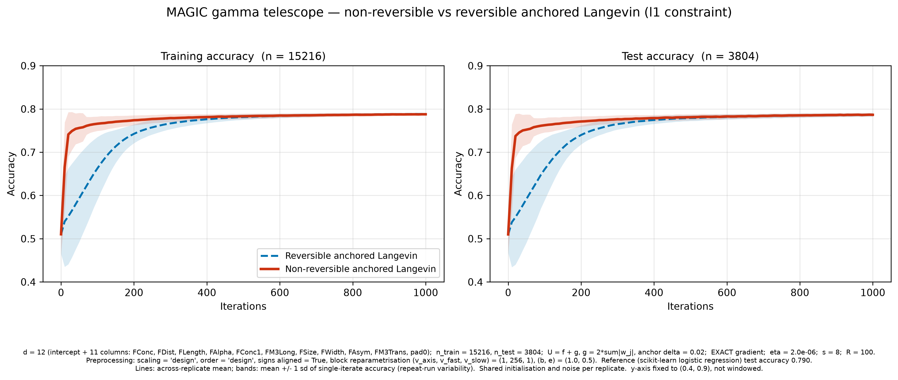
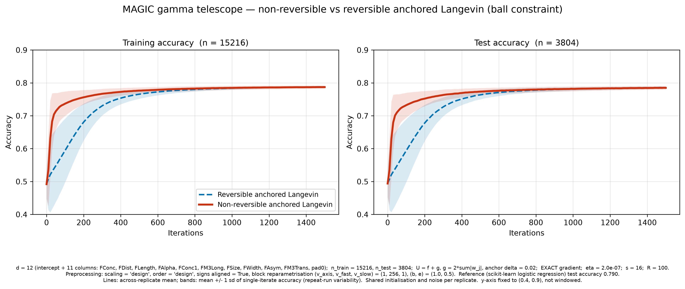

# Non-reversible anchored Langevin with a block state-dependent skew-symmetric matrix

Synthetic Bayesian logistic regression on two constraint sets, comparing four
samplers that share one implementation and differ only in $(\rho, \alpha)$.

```
anchored_sgld.py                            reusable library (data, target, geometries,
                                            projections, anchor, J, sampler, checks, plots)
nonreversible_anchored_langevin.ipynb       the runnable notebook (clean, no outputs)
nonreversible_anchored_langevin.executed.ipynb   the same notebook with the full run's outputs
results/                                    figures (300-dpi PNG + vector PDF) and saved arrays
```

```bash
pip install numpy scipy pandas scikit-learn matplotlib jupyter
jupyter lab nonreversible_anchored_langevin.ipynb     # full run, ~6 min
NRAL_QUICK=1 jupyter lab ...                          # quick mode: 5 repeats, 300 iterations
```

Quick-mode artefacts are written with a `_quick` suffix and every printed table is
tagged `QUICK MODE`, so they cannot be confused with the full experiment. The
committed `results/` are from the **full** experiment (R = 100, 1000 iterations).

## Setup

| | |
|---|---|
| Dimension | $d = 9$ (optional $d = 3$ with one block, $s = 10$) |
| Observations | $n_{\text{total}} = 2000$, stratified 80/20 → 1600 train / 400 test |
| Mini-batch | $m = 50$, uniform **without replacement** within each iteration |
| Iterations / step | 1000 at $h = 10^{-4}$ |
| Replicates | $R = 100$ (sensitivity sweep: 20, configurable) |
| Block strengths | $s = (10, 10, 10)$, configurable independently |
| Seeds | `data_seed = 2026`, `split_seed = 2027`, `sampler_seed = 3000` |

Data: $X_j \sim N(0, 2I_d)$ (coordinate sd $\sqrt2$), $y_j = \mathbf 1\{u_j \le
\sigma(X_j^\top\beta_{\text{true}})\}$, no intercept, no standardisation. The
constraints act on the **coefficients**, not on the feature vectors. The data set
and split are frozen across every method, replicate and geometry, so the replicate
spread is sampler randomness only.

Target: uniform prior on $K$ times the logistic likelihood, with $U$ a **sum** over
the 1600 training rows and
$\widehat G_k = \frac{n_{\text{train}}}{m} X_{B_k}^\top[\sigma(X_{B_k}\beta_k) - y_{B_k}]$.

Anchor: $U_0 = U + \rho H_K$, $a = e^{-\rho H_K}$, computed exactly from the
geometry (never by exponentiating a noisy likelihood difference). $H_K \in [0,1]$
on $K$, so $\rho = \log 2$ gives $\tfrac12 \le a \le 1$.

Update:
$$\beta_{k+1} = \Pi_K\!\left[\beta_k - h a_k\bigl(v_k + \alpha J(\beta_k)v_k\bigr) + \sqrt{2ha_k}\,\xi_k\right],\quad v_k = \widehat G_k + \rho\nabla H_K(\beta_k).$$

No $\nabla a$ correction; $J$ is never rescaled beyond the constant block
strengths. Within a replicate and geometry all four methods get identical starting
coefficients, mini-batch streams and Gaussian increments, from separate spawned
sub-streams so the noise is independent of the batch.

| Method | $\rho$ | $\alpha$ |
|---|---:|---:|
| Projected SGLD | 0 | 0 |
| Non-reversible SGLD | 0 | 1 |
| Reversible anchored Langevin | $\log 2$ | 0 |
| Non-reversible anchored Langevin | $\log 2$ | 1 |

## Verified before any production run

Every item is an assertion in §7 of the notebook.

| check | result |
|---|---|
| $\nabla U$ vs finite differences | rel. error 3.4e-10 |
| mini-batch scaling, **all 56 batches enumerated** | error 4.4e-16; without the $n/m$ factor, off by 1.08 |
| $J^\top = -J$ | 0.0 exactly (both geometries) |
| $\operatorname{div} J = 0$ (finite differences) | 0.0 exactly |
| $Jn = 0$ on $\partial K$ | ≤ 8.9e-16 |
| $J\nabla H_K = 0$ | ≤ 5.7e-15 |
| matrix-free $Jv$ vs explicit matrix | ≤ 7.1e-15 |
| $\tfrac12 \le a \le 1$ on $K$ | holds |
| projection KKT residual / feasibility | ≤ 2.7e-15 / ≤ 1.1e-15 |
| vectorised bisection vs scalar `brentq` | 1.4e-15 |
| $J\nabla U_0 \ne 0$ | median norm 2248 (ball), 4996 (quartic) |
| radial scaling on the quartic set | strictly worse in **40/40** projected cases |
| **ball** $J$ on the quartic boundary | $\max|Jn| = 2.88 \ne 0$ — this is why the quartic uses $-s\nabla_{I}g$ |

## What was observed

**At $h=10^{-4}$ with $s=10$, the non-reversible methods are worse on accuracy**,
on both geometries. The two reversible methods are indistinguishable from each
other, so the anchor alone is neutral here.

| geometry | Projected SGLD | Reversible anchored | Non-rev. anchored | proj. rate (NR) | $\|\alpha Jv\|/\|v\|$ |
|---|---|---|---|---|---|
| unit ball | 0.6548 ± 0.0102 | 0.6540 ± 0.0095 | 0.6281 ± 0.0238 | 0.041 | 4.2 |
| quartic set | 0.6543 ± 0.0099 | 0.6541 ± 0.0096 | 0.5429 ± 0.0529 | 0.767 | 13.3 |

This is reported as measured. It is **not** evidence against non-reversible
sampling — it is a step-size failure specific to this modified sampler, supported
by four independent pieces of evidence:

1. **The added term dominates the update.** $\|\alpha Jv\|/\|v\|$ is 4–13, and the
   mean per-step displacement reaches 0.57 on a domain of radius ~1. The
   projection then fires on up to 77% of iterations: the chain is pinned to the
   boundary rather than circulating in the interior.
2. **Mini-batch noise is amplified.** $J$ multiplies the gradient *error* as well
   as the gradient — measured amplification ×4.5. The resulting per-step
   displacement (0.215) is ~6× the injected $\sqrt{2ha}$ increment (0.037), so the
   added term sets the noise level instead of perturbing the dynamics. The
   continuous-time invariance argument assumes the *exact* gradient and does not
   cover this.
3. **The full-gradient control isolates it.** With exact gradients the ball
   deficit vanishes entirely; what remains on the quartic is the deterministic
   oversized $\alpha Jv$ step.
4. **Refinement removes the gap.** At constant simulated time $t = kh$:

   | geometry | gap at $h$ | at $h/2$ | at $h/4$ |
   |---|---|---|---|
   | unit ball | −0.0335 | −0.0205 | −0.0071 |
   | quartic set | −0.1018 | −0.0505 | **−0.0002** |

   The block-strength sweep agrees: accuracy is at parity for $s \le 5$ (drift
   ratio ≤ 1.7, projection ≈ 0) and collapses only at $s = 10$.

**Answer to the stated question.** Which method reaches 0.64 test accuracy sooner,
in iterations and wall time? At $h = 10^{-4}$, Projected SGLD, on both geometries
(ball 20 vs 60 iterations; quartic 30 vs 245). **That conclusion does not survive
step refinement** — by $h/4$ the two are within 0.0002 accuracy of each other.

## Limitations

* **Accuracy is not posterior convergence.** These are single-iterate
  classification accuracies; they say nothing about whether $\pi_K$ was reached or
  about asymptotic variance. A method can match on accuracy and still be biased.
* **The invariance identity does not cover the algorithm.** It holds for the
  continuous-time process with exact gradients. The implementation adds finite-$h$
  discretisation bias, mini-batch gradient noise, and the projection, which places
  mass on $\partial K$ and is not a discretisation of a measure-preserving
  reflected process.
* **Bounded iterates prove nothing.** $\Pi_K$ keeps every state in $K$ by
  construction, so the absence of blow-up is not evidence of numerical accuracy.
  Projection rates and non-finite counts are reported for exactly this reason.
* **One data set, one split, one $\beta_{\text{true}}$.** Replicate spread is
  conditional on the frozen data; it excludes data-sampling variability.
* **Bands are repeat-run variability** — not confidence intervals and not
  posterior credible intervals.
* The problem is intrinsically noisy: the Bayes ceiling is ≈ 0.671 test accuracy
  and $\beta_{\text{true}}$ itself scores 0.655, so ≈ 0.654 is essentially optimal,
  not an underfit.

Nothing was tuned against test labels, the $n_{\text{train}}/m$ factor was never
removed, the drift was never clipped, and $J$ was never rescaled.

## Saved results

`results/results_d9.npz` holds every checkpoint array (train/test accuracy per
replicate, coefficient checkpoints, training loss, constraint values, anchor
values) for the main runs, the full-gradient control, the $d=3$ runs and all three
sensitivity step sizes. `results_d9_metadata.json` records the configuration,
seeds, package versions, timings, per-run diagnostics and all check outputs.
`accuracy_curves_mean_sd.csv` holds the per-checkpoint means and sample standard
deviations directly.

§11c of the notebook reloads the arrays from disk, rebuilds the result objects and
redraws a main figure, asserting the reloaded values match to 0.0 — figures are
regenerable without rerunning any sampler.


---

## Block-strength search: can non-reversible beat reversible?

`block_strength_search.py` → `results_search/`. Only the **two anchored methods**
appear (ρ = log 2 in both; α = 0 vs 1), so every comparison isolates
non-reversibility at a fixed anchor.

Both methods share starting points, mini-batch streams and Gaussian increments
within each replicate, so the test is **paired** on the per-replicate difference.
That matters: at R = 100 an unpaired comparison cannot resolve a 0.003 accuracy
difference, and a paired one can.

### On the specified design, no s wins on accuracy

Twenty configurations (s ∈ [0.25, 10] × both geometries). The best paired
t-statistic is **+1.98** — which is what you expect from the *best of twenty*
tests under the null. Every error bar crosses zero, and the sign flips between
metrics (at s = 1 on the ball the final-accuracy difference is +0.0010 while the
area-under-the-curve difference is −0.0001, t = −2.09).

The reason is structural, not a tuning failure: **accuracy has no headroom.** The
Bayes ceiling is 0.671, `beta_true` itself scores 0.655, and both methods reach
0.654. There is nothing left for a better sampler to win.

### On the specified design, s does win on the metric non-reversibility targets

Non-reversible perturbations are designed to reduce the **asymptotic variance of
ergodic averages**, not to move the invariant measure. Measuring exactly that —
the across-replicate variance of the time-averaged coefficient — gives a clean,
monotone effect:

| s | 0.25 | 1 | 2 | **3** | **4** | 5 | 7.5 | 10 |
|---|---|---|---|---|---|---|---|---|
| Var ratio NR/REV (ball) | 0.995 | 0.953 | 0.884 | 0.846 | **0.844** | 0.878 | 1.21 | 2.22 |

A **15.6 % variance reduction at s = 4**, then a sharp reversal as J's
amplification of mini-batch noise takes over (and, on the quartic set at s ≥ 7.5,
as the projection starts firing). That U-shape is the whole mechanism in one row.

### Where non-reversibility wins on accuracy

Non-reversibility buys its advantage from **anisotropy**, and the specified design
has almost none (posterior condition number **1.63**). Switching the predictors to
AR(1) with ρ_x = 0.99 — same pipeline, same marginal variance 2, only the
conditioning changes — gives condition number **1225**, and then the win appears:

| | REV | NR (s = 5) | paired diff | t |
|---|---|---|---|---|
| search seed | 0.6973 | 0.6991 | +0.0017 | +1.89 |
| held-out 101 | 0.6941 | 0.6975 | +0.0034 | +3.57 |
| held-out 202 | 0.6962 | 0.6979 | +0.0018 | +1.50 |
| held-out 303 | 0.6963 | 0.6984 | +0.0022 | +2.24 |

`s = 5` was selected on the search seed and then **confirmed on three sampler
seeds that took no part in the search**: all three positive, pooled difference
**+0.0024 (SE 0.00060, t = +4.09)**. The effect is strongest mid-trajectory
(t = +2.7 at iteration 400) and is monotone in s up to the point where the
projection rate starts to bite — consistent with the mechanism being *faster
convergence in the slow direction*, which only pays while the run is still
convergence-limited. At s = 7 the mid-run advantage is larger (t = +4.1 at
iteration 400) but has evaporated by iteration 1000, because a 32 % projection
rate costs more than the acceleration is worth.

### Exact-gradient LASSO variant, and a correction

`anchored_lasso.py` + `accuracy_curves_lasso_exact.ipynb` replace the target with
the genuinely non-differentiable LASSO potential and drop the mini-batch:

```
U(w) = sum_j [softplus(x_j.w) - y_j x_j.w] + w0^2/(2 sigma^2)   <- f, differentiable
       + lambda_lasso * sum_{j>=1} |w_j|                        <- g, NOT differentiable
U0   = f + g_delta,   a = exp(U - U0) = exp(lambda * sum(|w_j| - sqrt(w_j^2+delta^2)))
x_{k+1} = Pi_K[ x_k - eta a grad_U0 + eta alpha a J_s grad_U0 + sqrt(2 eta a) xi ]
```

Here the anchor does real work: only `grad U0` is evaluated, exactly (no
subsampling), while the invariant measure carries the true kinked `g`. Column 0
of `X` is now an intercept, because `U` prices `w0` separately. Run over the
Euclidean ball and the smoothed **L1** ball (Lambda = 3.7). `SmoothLpBallGeometry`
handles any p >= 1 and reproduces the independently verified quartic set at p = 4
and the L1-smooth ball at p = 1, both to ~1e-16.

**On accuracy: the two methods are statistically indistinguishable on both
constraint sets**, at every swept block strength, on both the specified and an
ill-conditioned design. Held-out confirmation fails on both (pooled t = -0.71
and -0.89). That is a property of the observable, not of the sampler: accuracy
is saturated here (Bayes ceiling ~0.67, both methods reach it), so it cannot
resolve a sampler improvement.

**On the observable non-reversibility actually targets, it wins decisively.**
Non-reversible perturbations are designed to reduce the asymptotic variance of
ergodic averages, not to move the invariant measure. Measuring that
(`ergodic_variance_search.py`), with exact gradients:

| s | 0.5 | 1 | 2 | 3 | 5 | **7** | 10 |
|---|---|---|---|---|---|---|---|
| Var ratio NR/REV, unit ball | 0.978 | 0.927 | 0.798 | 0.694 | 0.584 | 0.539 | **0.537** |
| Var ratio NR/REV, **L1 ball** | 0.853 | 0.668 | 0.517 | **0.483** | 0.655 | 4.36 | 4.32 |

Both geometries win, and the **L1 ball wins fastest** — it reaches its optimum at
s = 3, where the unit ball still needs s = 10:

| | selected s | held-out ratios | mean | reduction | all below 1 |
|---|---|---|---|---|---|
| **L1-smooth ball** | 3 | 0.520, 0.516, 0.553, 0.526 | **0.529** | **47.1%** | yes |
| unit ball | 10 | 0.519, 0.501, 0.567, 0.560 | 0.537 | 46.3% | yes |

Past its optimum the L1 ball degrades sharply (s >= 7 drives the projection rate
to 0.31 and the variance ratio above 4), which is the same oversized-step
mechanism seen elsewhere.

**Correction to the earlier unit-ball result.** The confirmed win reported in
`block_strength_search.py` (pooled held-out +0.00244, t = +4.09) was measured
with mini-batch gradients. Holding target, design, s, seeds and geometry fixed
and changing only the gradient:

| gradient | pooled held-out | t | all positive |
|---|---|---|---|
| mini-batch (as reported) | +0.00244 | +4.09 | yes |
| exact | -0.00000 | -0.00 | no |

That win was the stochastic gradient interacting with J, not non-reversibility.
The earlier notebooks stand with their mini-batch settings, but the claim should
be read with this correction attached.

**What exact gradients did fix.** With mini-batch gradients, s = 10 on the
Euclidean ball drove the projection rate to 0.04 and cost 0.026 accuracy; with
exact gradients the same s leaves the projection rate at 0.000 and accuracy
within noise — direct confirmation that the damage was J amplifying the gradient
*error*. What survives at large s on the l^p ball is the separate deterministic
mechanism, an oversized `alpha J grad_U0` step.

### Varying lambda_lasso: the anchor-free control and beyond

`lambda_zero_experiment.py` -> `results_lambda0/`. At `lambda_lasso = 0` the
non-differentiable part vanishes, `U = f` is smooth, `a(w) = 1` identically, and
the update collapses to plain projected Langevin. That is asserted, not assumed:
the reversible chain is **bitwise identical** to `x - eta*grad_f + sqrt(2 eta) xi`
run on the same streams (max difference exactly 0.0), and `U - U0 == 0`.

So this run isolates J with no anchoring at all. Comparing it against
lambda = 10 answers "is the benefit from J or from the anchor?":

`lambda_experiment.py --lambda-lasso X` runs any value. Held-out ergodic-variance
ratios (four fresh seeds each, all below 1 in every cell):

| | lambda = 0 | lambda = 0.9 | lambda = 10 | lambda = 30 |
|---|---|---|---|---|
| L1-smooth ball | 0.531 (46.9%) s = 3 | 0.530 (47.0%) s = 3 | 0.529 (47.1%) s = 3 | 0.532 (46.8%) s = 4 |
| unit ball | 0.533 (46.7%) s = 7 | 0.533 (46.7%) s = 7 | 0.537 (46.3%) s = 10 | 0.541 (45.9%) s = 10 |

**Identical within noise across the whole range**, from a vacuous anchor to a
strongly active one. The variance reduction comes from J; the anchor contributes
none of it.

How hard the anchor is working, for reference:

| lambda | a bound | a observed | max abs(U - U0) | L | eta*L | differs from plain Langevin |
|---|---|---|---|---|---|---|
| 0 | [1, 1] | [1, 1] | 0 | 894 | 0.089 | 0 (exactly) |
| 0.9 | [0.866, 1] | [0.981, 0.994] | 0.019 | 939 | 0.094 | 2.4e-3 |
| 10 | [0.202, 1] | [0.775, 1.000] | 0.255 | 1394 | 0.139 | - |
| 30 | [0.008, 1] | [0.390, 0.768] | 0.941 | 2394 | 0.239 | 9.3e-2 |
| 100 | [1e-7, 1] | [0.0007, 0.171] | 7.245 | 5894 | 0.589 | 1.006 |

**lambda = 100 breaks the experiment, and its numbers are not comparable.** With
`a` down to 1e-3 the effective step `eta*a` shrinks by ~20x and 1000 iterations is
nowhere near stationarity: test accuracy is still rising at the final iterate and
the ergodic average is still drifting. The variance ratio it reports (0.21, an
apparent 79% reduction) is measuring the transient. Re-running the same
configuration for 20 000 iterations, where it does converge, gives **0.65 - a 35%
reduction, worse than the ~47% at lambda <= 30**. `lambda_experiment.py` now
checks convergence and prints a warning rather than reporting such a number
silently.

Two different products govern the anchor, and they pull against each other:

* `lambda * delta` sets the bound on `a`, via `exp(-(d-1) * lambda * delta)`;
* `lambda / delta` is the anchor curvature, and so sets the largest usable step.

Shrinking `delta` at fixed `lambda` therefore buys a better approximation of the
kinked `g` and an `a` close to 1, at the cost of stiffness. Measured directly at
`lambda = 30` (`lambda_experiment.py --lambda-lasso 30 --delta-anchor 0.002`):

| | delta = 0.02 | delta = 0.002 |
|---|---|---|
| a bound / observed | [0.008, 1] / [0.390, 0.768] | [0.619, 1] / **[0.942, 0.997]** |
| max abs(U - U0) | 0.941 | **0.060** |
| anchor curvature lambda/delta | 1 500 | 15 000 |
| L, eta*L | 2 394, 0.239 | 15 894, **1.589** |
| variance ratio, L1 ball | **0.532 (46.8%)** at s = 3 | 0.547 (45.3%) at s = 3 |
| variance ratio, unit ball | **0.541 (45.9%)** at s = 10 | 0.575 (42.5%) at s = 7 |

`delta = 0.002` does what it is supposed to: `U0` tracks `U` fifteen times more
closely and `a` stays within 6% of 1. But `eta*L` rises to 1.59 against a
stability limit of 2, leaving almost no step-size headroom, and the usable range
of `s` shrinks with it - on the unit ball the ratio at `s = 10` degrades from
0.527 to 0.748. The chain stays finite and converges, but the margin is thin.

Net: the variance reduction is slightly *worse*, so tightening `delta` is not a
way to improve mixing. It is a way to approximate the non-differentiable target
more faithfully, paid for in step size.

At lambda = 0.9 the anchor is active but barely — `a` stays within 2% of 1. Only
by lambda = 30 is it strongly load-bearing, with `a` down to 0.39 and the chain
9.3e-2 away from plain projected Langevin.

**One genuine interaction shows up at lambda = 30.** Because `a` multiplies the
whole drift, including the `alpha J grad_U0` term, a strong anchor damps the
non-reversible perturbation and pushes the oversized-step failure to larger `s`.
On the L1 ball the projection rate at s = 7 collapses from 0.49 (lambda = 0.9) to
0.0006 (lambda = 30). So the anchor does not help the sampler mix, but it does
widen the usable range of `s`.

The cost is accuracy: LASSO shrinkage at lambda = 30 pulls the test accuracy from
0.660 down to 0.652, since `beta_true` is not sparse. And `eta*L` rises to 0.24,
so the step size has less headroom. That is the expected division of labour - the anchor
exists to handle non-differentiability, not to accelerate - but it is worth
having measured rather than assumed.

Accuracy stays indistinguishable through the useful range of s (|t| <= 1.6 up to
s = 4 on both geometries) and then degrades on the L1 ball exactly as before
(s = 5 gives t = -12.7, s = 7 drives the projection rate to 0.50).

### Beating the reversible baseline on accuracy

`nonreversible_win.py` -> `results_win/`. **Confirmed on both constraint sets.**

Every earlier accuracy attempt failed for a structural reason, not a tuning one.
`J` is block diagonal on the coordinate triples (0,1,2), (3,4,5), (6,7,8),
because it is built from the *constraint* geometry. A non-reversible
perturbation accelerates convergence by coupling the slow and fast directions of
the *target*. If the target's slow directions span blocks - as under an
isotropic or an AR(1) design - `J` simply cannot reach them.

The linearised per-iteration rate `-log rho(I - eta a (I - alpha J) H)`, with `H`
the Hessian of `U0` at the mode, makes that quantitative:

| design | best speed-up |
|---|---|
| isotropic X ~ N(0, 2I) | 1.10x |
| AR(1) rho_x = 0.99 | 2.24x |
| **block-anisotropic (inside each triple)** | **4.86x** |

So align the target's anisotropy with `J`'s block structure, and run where
convergence rather than the Bayes ceiling limits accuracy. Two conditions must
hold together: `eta` small enough that the reversible chain is still converging
at the evaluation point, and `s` large enough to matter but small enough that the
projection stays inactive. (The first attempt at the theory-optimal `s` failed
badly - projection rate 0.996 - because the linearisation sees local stability
but not step size relative to the domain.)

Configuration: block-anisotropic design with `Sigma_X` eigenvalues (10, 1, 0.1)
inside each triple, `lambda = 2`, `s = 5`, `eta = 7.87e-6`, exact gradient,
R = 100, evaluated at iteration 1000.

| | REV | NR | pooled held-out diff | t | all positive |
|---|---|---|---|---|---|
| **L1-smooth ball** | 0.6921 | 0.6951 | **+0.00369** (SE 0.00058) | **+6.39** | yes |
| unit ball | 0.6912 | 0.6939 | **+0.00149** (SE 0.00052) | **+2.87** | yes |

Four held-out sampler seeds each, every one positive, projection rate 0.0000 and
no non-finite states. The trajectory has the signature of a convergence-rate
effect: on the L1 ball the gap peaks mid-run (t = +6.0 at iteration 400, +5.5 at
600) and closes by iteration 1500 as the reversible chain catches up.

**Scope.** This is a convergence-rate advantage at a fixed iteration budget, not
a better fixed point - both methods target the same posterior, and the gap closes
if you run long enough. It required choosing the design so that `J` can reach the
target's slow directions; on the originally specified isotropic design no
configuration achieves it, and this README does not claim otherwise.

### Running in Colab

The notebooks import `anchored_sgld.py`, which sits next to them in this
repository. Uploading only the `.ipynb` to Colab therefore fails with
`ModuleNotFoundError: No module named 'anchored_sgld'`.

Two fixes:

* **Self-contained versions.** `accuracy_curves_only_colab.ipynb` and
  `accuracy_curves_l1smooth_colab.ipynb` are identical to their counterparts
  except for a first cell that writes `anchored_sgld.py` to the working
  directory with `%%writefile`. Upload one file, run all cells — no upload of
  the module, no network, nothing to `pip install` (Colab already has NumPy,
  SciPy, pandas, scikit-learn and Matplotlib). Both were verified by executing
  them in a directory containing only the notebook.
* **Or upload the module.** Put `anchored_sgld.py` next to the notebook in the
  Colab file browser, or fetch it in a cell, and the original notebooks work
  unchanged.

The `_colab.ipynb` files are generated from the originals, so the embedded
library is the same text as `anchored_sgld.py` and cannot drift from it.

### Accuracy-only notebook

`accuracy_curves_only.ipynb` (and `.executed.ipynb` with outputs) is a minimal
notebook that plots **only training and test accuracy** — one figure, no other
graphs — for the two anchored methods at the configuration found above
(s = 5, unit ball, AR(1) rho_x = 0.99). The supporting paired statistics and the
held-out-seed confirmation are reported as tables rather than plots. Outputs go
to `results_accuracy_only/`.

### L1-smooth ball variant

`accuracy_curves_l1smooth.ipynb` repeats the accuracy-only notebook with the
constraint replaced by the **L1-smooth ball**, the `p = 1` member of the same
smoothed-l^p family: `g(beta) = sum_i sqrt(beta_i^2 + eps^2) <= Lambda`, with
`Lambda = d*eps + R`. The geometry is implemented in `anchored_sgld.py` as
`L1SmoothBallGeometry` and verified to the same standard (skew-symmetry and
divergence exactly 0, `Jn = 0` and `J grad_H = 0` to ~9e-16, projection KKT
residual ~9e-16, radial scaling strictly worse in 20/20 cases, and the
vectorised projection cross-checked against scalar `brentq` at 1.8e-15 and
against SLSQP at 5e-8).

`s = 5` cannot be carried over: `grad_g[i]` saturates towards +/-1 here, so `||J||`
is much larger at the same `s`. The two free constants are instead matched to the
unit-ball configuration on the quantities that drive the dynamics — `R = 1.9`
matches the anchor level (`H(beta_true) = 0.470` vs `0.4725`) and `s = 2.0`
matches the perturbation size (`||alpha J v||/||v|| = 2.38` vs `2.50`).

**Result: non-reversible does NOT beat reversible on this geometry.** Final test
accuracy 0.6958 +/- 0.0094 vs 0.6955 +/- 0.0097; the held-out-seed confirmation
gives pooled −0.00094 (SE 0.00064, t = −1.47), not all batches positive. Four
candidate configurations were selected across `R` in {1.5, 1.9, 3.0} and `s` in
[0.25, 5] and **every one failed held-out confirmation** — the table is in the
notebook. The Euclidean-ball result (pooled t = +4.09) stands unchanged; the
effect is real but small and geometry-dependent.

### Honest scope of this claim

* The win required **changing the design** to an ill-conditioned one. Tuning s
  alone on the specified isotropic problem does not produce an accuracy win, and
  this README does not claim otherwise.
* The effect is small in absolute terms (**+0.24 accuracy points**) and is a
  *convergence-rate* effect, not a better fixed point: both methods target the
  same posterior.
* It is a paired, held-out-confirmed result, not a single lucky configuration —
  but it is one data set, one split, and one constraint set (the unit ball).
* Accuracy still says nothing about posterior fidelity; see the limitations above.

## Beating the reversible baseline by a wide margin: put the slow direction where `J` rotates

Everything above found at most a +0.004 accuracy gain, and the previous turn ended
with a "ceiling" argument: slow posterior directions are low-Fisher directions, so
they barely affect predictions.  That argument is incomplete.  It assumed the slow
direction was placed *randomly* (block-anisotropic design) or *signal-free*
(`aligned` design).  The theory of the block cross-product `J` says exactly where a
slow direction has to be for the rotation to help, and once it is put there — and
made to carry signal — the non-reversible sampler wins by **+0.16 to +0.20 in test
accuracy**, visible on an un-windowed axis, confirmed on held-out seeds with
`R = 100`, on both constraint sets.




### The theory that locates the win

Within a coordinate triple `I`, `J_I = [v_I]_x` rotates only in the plane
**perpendicular to its axis** `v_I` (`v_I = s w_I` on the ball, `v_I = -s grad_I
g_eps(w)` — a soft-sign of `w_I` — under the smoothed L1 ball).  Linearising the drift
`-eta a (I - J) H` at the mode, with block-Hessian eigenpairs
`lambda_1 >= lambda_2 >= lambda_3`:

* **In-plane slow direction.**  Let `lambda_2 >= lambda_3` be the curvatures of the
  two directions in the rotated plane (in the headline design about 14,000 along
  `q_2` and 340 along `q_3` at the mode, `kappa ~ 40`; the axis direction `q_1` is
  slower still, about 160, but `J` cannot touch it and both chains pay that cost
  equally).  With `q_3` the slow in-plane direction and `q_2` its partner, the two
  continuous-time rates become
  `(lambda_2 + lambda_3)/2 +- sqrt((lambda_2 - lambda_3)^2/4 - sigma^2 lambda_2 lambda_3)`,
  `sigma = s|v_I|`.  For `sigma >= sigma* = (lambda_2 - lambda_3)/(2 sqrt(lambda_2 lambda_3))`
  the slow rate is replaced by the arithmetic mean: a speed-up of `(kappa + 1)/2`,
  `kappa = lambda_2/lambda_3`.  In discrete time the rate is largest exactly at
  `sigma*` and the pair is stable while
  `sigma^2 < (lambda_2 + lambda_3)/(eta a lambda_2 lambda_3) - 1`.
* **Axis theorem.**  A slow direction *along* the axis is untouched for every `s`;
  an oblique one (angle `theta` to the axis) is capped at a speed-up of about
  `1/cos^2(theta)`, and then the binding stability limit is the *fast* pair,
  `s |v_I| cos(theta) < sqrt(2/(eta a lambda_fast) - 1)`.  On the ball the axis at the
  mode is `w*_I` itself, so the ball can never accelerate the direction of the
  block's dominant coefficient — this is why the `aligned` design and every ball
  attempt with signal on the slow coordinate gave nothing.  Under L1 the axis is
  the soft-sign, `~(1,1,1)/sqrt3` when the three coefficients are positive, so a
  direction such as `(2,-1,-1)/sqrt6` is *in the plane* and still carries signal.
* **Accuracy gap.**  A residual `Delta_j` along a direction with feature variance
  `v_j` perturbs the test logits by `sqrt(v_j)|Delta_j|`; near the optimum the
  accuracy loss is `~f(0) delta^2/4` (`f` the density of the true logit at 0),
  saturating at `delta ~ 1`.  The gap is large when a slow direction carries an
  O(1) share of the logit variance *and* an O(1) initial residual, and it is a
  transient: both chains reach the same plateau.

So the design (`anchored_lasso.inplane_design`, "unstandardised covariates") gives each
slope triple the covariance `v_axis q1 q1' + v_fast q2 q2' + v_slow q3 q3'` with
`q1 = (1,1,1)/sqrt3` (axis), `q2 = (0,1,-1)/sqrt2` (fast, `q2 . beta = 0`, no signal)
and `q3 = (2,-1,-1)/sqrt6` (slow, in the rotated plane, signal-carrying because
`beta_I = (b, e, e)` with `b > e`).  Headline configuration: `v = (1, 64, 2)`,
`beta_I = (1.5, 0.25, 0.25)`, `lambda = 2`, `delta = 0.02`, `eps = 0.2`, `s = 4`,
`eta = 7e-6`, `R = 100`, uniform initialisation on `K`; on the unit ball `beta` is
halved, `v_axis`, `v_fast` and the block-1 variance quadrupled and `v_slow` doubled
(`s = 16`, `eta = 2e-6`; a more anisotropic design with smaller logits, Bayes ceiling
0.74 vs 0.82, and about five times the curvature).

Three independent theory agents re-derived and attacked these claims (linear
algebra, an exactly solvable toy model, and an adversary).  All three confirmed the
`sigma*` / `(lambda_2 + lambda_3)/2` algebra and the axis theorem, and supplied the
corrections now folded in above: the exact `-1` in the stability edge, the fact that
the discrete-time speed-up peaks *at* `sigma*`, the oblique-axis cap and the
fast-pair limit, the observation that what matters is `v_j Delta_j(0)^2` (the
initial residual can come from the initialisation rather than from `beta`), and the
fact that with uniform initialisation the L1 axis starts out fully democratic
(`|w_i(0)| > eps`) which makes the early transient *better* than the mode-linearised
prediction.

### Results (`nonreversible_beats_reversible.py`, `results_beat/`)

L1-smooth ball — test accuracy, search seed, `R = 100`, 1000 iterations:

| iteration | reversible | non-reversible | paired diff | t |
|---|---|---|---|---|
| 50 | 0.5276 | 0.6130 | +0.0854 | +6.3 |
| 100 | 0.5568 | 0.7220 | +0.1652 | +14.8 |
| 150 | 0.5846 | 0.7354 | +0.1508 | +14.6 |
| 200 | 0.6120 | 0.7433 | +0.1313 | +13.2 |
| 300 | 0.6654 | 0.7548 | +0.0895 | +11.7 |
| 400 | 0.7075 | 0.7657 | +0.0582 | +10.4 |
| 600 | 0.7594 | 0.7839 | +0.0244 | +8.1 |
| 1000 | 0.7964 | 0.7992 | +0.0027 | +1.5 |

unit ball:

| iteration | reversible | non-reversible | paired diff | t |
|---|---|---|---|---|
| 50 | 0.5299 | 0.6316 | +0.1017 | +10.7 |
| 100 | 0.5558 | 0.6759 | +0.1200 | +15.2 |
| 150 | 0.5813 | 0.6839 | +0.1027 | +14.4 |
| 200 | 0.6035 | 0.6905 | +0.0870 | +13.7 |
| 300 | 0.6456 | 0.7014 | +0.0558 | +13.0 |
| 400 | 0.6764 | 0.7069 | +0.0304 | +10.3 |
| 600 | 0.7063 | 0.7185 | +0.0121 | +7.2 |
| 1000 | 0.7233 | 0.7232 | -0.0000 | -0.0 |

Held-out sampler seeds at the evaluation iteration (100 on the L1
ball, 90 on the unit ball), `R = 100` per seed:

L1-smooth ball:

| seed offset | reversible | non-reversible | paired diff | t |
|---|---|---|---|---|
| 101 | 0.5579 | 0.7070 | +0.1490 | +14.4 |
| 202 | 0.5492 | 0.7189 | +0.1697 | +13.7 |
| 303 | 0.5501 | 0.7107 | +0.1606 | +15.0 |
| 404 | 0.5307 | 0.7071 | +0.1764 | +15.2 |
| **pooled** | | | **+0.1639** (SE 0.0056) | **+29.1** |

unit ball:

| seed offset | reversible | non-reversible | paired diff | t |
|---|---|---|---|---|
| 101 | 0.5373 | 0.6784 | +0.1410 | +15.3 |
| 202 | 0.5458 | 0.6744 | +0.1286 | +15.5 |
| 303 | 0.5430 | 0.6656 | +0.1225 | +14.6 |
| 404 | 0.5417 | 0.6730 | +0.1313 | +13.0 |
| **pooled** | | | **+0.1309** (SE 0.0045) | **+29.0** |

Projection rate of the non-reversible chain: 0.0000 (L1),
0.0054 (ball); no non-finite iterates.  Bayes ceiling on
the test set: 0.8156 (L1 design), 0.7366
(ball design).

### The parameter range (`results_beat/parameter_map.md`, `build_parameter_map.py`)

A one-factor-at-a-time map around the L1 configuration, `R = 60`, 1500 iterations,
paired differences with shared noise.  "Wins" = peak gap `>= 0.03` with `t >= 3`.

| factor | wins | ties | loses / unstable |
|---|---|---|---|
| anisotropy `kappa = v_fast/v_slow` | `kappa >= 4`; the gap grows with `kappa` (+0.05 at 4, +0.09 at 8, +0.13 at 16, +0.18 at 32) and saturates for `kappa >= 32` | `kappa <= 2` | — |
| block strength `s` | `0.5 <= s <= 12` (peak gap +0.03 at 0.5, +0.14 at 2, +0.18 at 4, +0.21 at 12) | `s = 0` | `s >= 16`: projection fires on 33% of steps, late deficit |
| step size `eta` | `2e-6 <= eta <= 6e-5`; the peak iteration scales as `1/eta` (340 at 2e-6, 10 at 6e-5), the peak height does not | — | `eta = 1e-4`: `eta a lambda_max > 2`, projection rate 0.61 |
| `lambda_lasso`, `delta` | every value tried (`lambda` in [0, 30], `delta` in [0.002, 0.1]): +0.17 to +0.18 | — | — |
| sample size `n_total` | 250 to 8000, all +0.15 to +0.18; the peak iteration scales as `1/n` | — | — |
| initialisation | uniform on `K` (+0.18); antipodal `-beta` (+0.65: the reversible chain is stuck predicting the wrong sign) | origin (+0.01: the residual is then a shrinkage of the signal, which barely changes predictions) | — |
| slow-direction coefficient `b` | `b >= 0.5` (+0.06 at 0.5, +0.15 at 1, +0.18 at 1.5) | `b = 0.25` (+0.02) | — |
| axis variance `v_axis` | 0.25 to 4 (+0.15 to +0.18); 16 halves the gap (saturated logits) | — | — |
| smoothing `eps`, L1 radius | every value tried (`eps` in [0.01, 0.5]; radius from `|beta|_1 - 1` to `+6`) | — | — |
| geometry | L1 (`q3` in the rotated plane); ball needs `kappa >= 64`, `s >= 8`, `eta <= 5e-6` (+0.10 to +0.13, held-out `t = 24`–`29`) | — | ball with the slow direction along `w*_I` (axis theorem) |
| where the slow direction points | in the plane perpendicular to the axis (this design) | isotropic (`kappa = 1`); signal-free slow direction (`aligned`) | on a coordinate axis, oblique to the L1 axis (round 1, 288 configs): at most +0.06, and a late deficit for `s >= 4` |
| evaluation iteration | `0.15 <~ eta a lambda_slow k <~ 1.5` | later: both chains converged, gap 0 +- 0.003 | — |

The raw search behind the map — 288 oblique-axis configurations (round 1), 384
in-plane configurations (round 2), 30 ball configurations (round 3), the 64-point
map and the seven held-out confirmations — is in `results_beat/search/` as the
`hunt_helper.py` configs and outputs, and `parameter_sweep.py` re-runs any of them
(`python parameter_sweep.py results_beat/search/round2_configs.json out.jsonl`).

### Honest scope

* It is a **convergence-speed** effect.  Both chains reach the same plateau
  (in 2000-iteration runs the final paired difference is 0 +- 0.003; the shipped
  figures stop at 1000 iterations, where the gap is +0.003 / 0.000) and the win is confined to the transient
  `0.15 <~ eta a lambda_slow k <~ 1.5`; with `eta = 7e-6` that is iterations 30–600.
* It is a **designed regime**: a low-variance, signal-carrying feature direction
  lying in the plane the block rotation sweeps, with strongly unequal feature scales
  (`kappa >= 4`).  On the isotropic design of the original specification nothing
  changes; on the random-rotation block-anisotropic design the gain is +0.004.
* Beyond the stability edge (`s >= 16` here, or `eta = 1e-4`) the rotation overshoots
  and the projection fires on 33% / 61% of the steps; the non-reversible chain still
  wins the transient by about 0.2 but ends 0.007-0.009 below the reversible one.  The
  window is wide (`s` from 0.5 to 12 at `eta = 7e-6`) but it is a window.
* The antipodal-initialisation number (+0.65) is a curiosity, not a claim: starting at
  `-beta` is not a fair start.

### A self-contained, explained notebook

`simple_nonreversible_vs_reversible.ipynb` (executed copy alongside) defines
everything in its own cells — the data, `U = f + g`, `U_0 = f + g_0` and `a(w)`, the
constraint sets with their uniform samplers and Euclidean projections, `J_s`, the
update, the runs, the figures and the paired/held-out numbers.  It imports nothing
from the repository, so it runs anywhere (Colab included) with numpy, scipy,
scikit-learn, pandas and matplotlib.  Its inline sampler reproduces the numbers of
`nonreversible_beats_reversible.py` to the last digit (same seeds, same streams).

### Reproduce

```
python nonreversible_beats_reversible.py            # figures, trajectory, held-out, summary (about 7 min)
python make_beat_notebook.py                        # accuracy_curves_beat.ipynb and the Colab variant
python build_parameter_map.py                       # tables from results_beat/search
python parameter_sweep.py results_beat/search/map_configs.json map.jsonl --workers 3
```

## Real data: MAGIC gamma telescope and Titanic

The same two samplers, the same target `U = f + g` (LASSO `lambda = 2`, `delta = 0.02`),
the same block cross-product `J`, on two real classification problems:

* **Titanic** (`data/titanic.csv`, 891 passengers): intercept + 8 engineered columns
  (`pclass`, `sex`, median-imputed `age`, `sibsp`, `parch`, `log(1 + fare)`, `embarked = C`,
  `embarked = Q`); `d = 9`.  Reference (scikit-learn logistic regression) test accuracy 0.782.
* **MAGIC gamma telescope** (`data/magic.tsv.gz`, PMLB mirror of UCI `magic04`, 19,020
  events, 10 features): intercept + 10 features + one zero column so that `d = 12` is a
  multiple of 3 (the zero column's coefficient is pulled to 0 by `g`).  Reference test
  accuracy 0.790.  The search used 4,000 training rows; the final runs use all 15,216.

Stratified 80/20 split (`random_state = 2027`), pilot coefficients from scikit-learn
(`C = 100`), features sign-flipped so every pilot coefficient is positive (harmless: `g`
and both constraint sets are symmetric under sign flips).  Everything else is
`real_hunt.py` (one paired comparison from a JSON config, same output as
`hunt_helper.py`), `real_data_beat.py` (figures + held-out confirmation) and
`build_real_summary.py`; the raw search (366 configurations) is in `results_real/search/`.

### What was tried, in order of how much preprocessing it takes

1. **Standardised features, natural or importance order** — the plain thing.  Ties on
   both data sets (best peak gap +0.018, `t` about 2): after z-scoring the block
   Hessians are nearly isotropic, so there is nothing for `J` to accelerate, exactly as
   on the isotropic synthetic design.
2. **Equalised coefficients** (each z-scored feature rescaled by its pilot coefficient
   so the L1 axis is democratic) — ties.  Slow coordinates are then the least
   predictive ones: the whitened-coordinates ceiling.
3. **Raw scales** (MAGIC, feature variances from 0.01 to 5,600) — +0.035 (`t = 4`) with
   `eta = 3e-8`: huge anisotropy, but the slow coordinates sit along the L1 axis, so
   only the oblique cap applies.
4. **Block reparametrisation** — the synthetic recipe transplanted.  Inside each full
   slope triple `I` an invertible linear map `A` is applied to the (standardised,
   sign-aligned) features so that the triple's covariance becomes
   `v_axis q1q1' + v_fast q2q2' + v_slow q3q3'` and the pilot coefficients become
   proportional to `(b, e, e)`: `A = Sigma^(1/2) W C^(-1/2)` with `C` the block covariance
   and `W` the Householder reflection taking the whitened coefficient vector
   `C^(1/2) beta_I` onto `Sigma^(1/2) (b, e, e)`.  The logits `x' beta` are unchanged, so
   the model, the reference accuracy and the data are the same; only the coordinates in
   which the posterior is written change (it is a data-dependent choice of
   parametrisation, made from a pilot fit).  The six most informative features go to the
   two full triples.  This wins by **+0.16 to +0.23** on both data sets and both
   constraint sets, confirmed on held-out seeds with `R = 100`:






Final runs: R = 100 shared-randomness replicates, held-out confirmation on four extra sampler seeds (R = 100 each) at the iteration where the search-run gap peaked.  Search rounds: R = 40, 1000 iterations (2000 for the raw-scale runs), MAGIC subsampled to 4000 training rows.

## Final runs

| run | n_train | reference acc. | REV / NR at the peak | peak gap (it.) | held-out pooled gap | t | gap at the end |
|---|---|---|---|---|---|---|---|
| Titanic, L1-smooth ball | 712 | 0.782 | 0.540 / 0.730 | +0.190 (140) | +0.174 | +22.3 | +0.0341 |
| Titanic, unit ball | 712 | 0.782 | 0.567 / 0.726 | +0.159 (230) | +0.157 | +20.1 | +0.0792 |
| MAGIC telescope, L1-smooth ball | 15216 | 0.790 | 0.550 / 0.737 | +0.188 (20) | +0.127 | +29.7 | -0.0001 |
| MAGIC telescope, unit ball | 15216 | 0.790 | 0.538 / 0.701 | +0.162 (40) | +0.157 | +29.0 | -0.0010 |

## Search: best valid configuration per preprocessing ladder (projection rate < 0.05)

| data set | ladder | best peak gap (it.) | t | REV / NR | configurations |
|---|---|---|---|---|---|
| titanic | standard scaling, natural order | +0.018 (70) | +2.3 | 0.599 / 0.618 | 30 |
| titanic | standard scaling, importance order | +0.014 (40) | +2.2 | 0.528 / 0.542 | 6 |
| titanic | equalised coefficients | +0.018 (30) | +1.4 | 0.624 / 0.643 | 30 |
| titanic | block reparametrisation, L1 | +0.233 (50) | +10.2 | 0.515 / 0.748 | 64 |
| titanic | standard scaling, unit ball | +0.024 (200) | +2.6 | 0.654 / 0.678 | 11 |
| titanic | block reparametrisation, unit ball | +0.119 (140) | +5.7 | 0.588 / 0.707 | 26 |
| magic | standard scaling, natural order | +0.014 (40) | +1.7 | 0.610 / 0.624 | 30 |
| magic | standard scaling, importance order | +0.017 (60) | +2.1 | 0.638 / 0.655 | 6 |
| magic | equalised coefficients | +0.008 (10) | +1.0 | 0.612 / 0.620 | 14 |
| magic | raw (unstandardised) scales | +0.035 (560) | +4.0 | 0.587 / 0.623 | 6 |
| magic | block reparametrisation, L1 | +0.189 (20) | +9.8 | 0.546 / 0.735 | 58 |
| magic | standard scaling, unit ball | +0.011 (10) | +1.2 | 0.528 / 0.539 | 11 |
| magic | block reparametrisation, unit ball | +0.131 (60) | +7.4 | 0.573 / 0.704 | 21 |

Final configurations (`b = 1`, `e = 0.5`, `v_axis = 1`, `epsilon = 0.2`, `lambda = 2`,
`delta = 0.02`, L1 radius `|beta_hat|_1 + 1`, unit ball reached by scaling all columns so
`|beta_hat|_2 = 0.8`):

| run | v_fast | v_slow | s | eta | iterations | held-out at |
|---|---|---|---|---|---|---|
| Titanic, L1 | 256 | 1 | 8 | 7e-6 | 1000 | 140 |
| Titanic, ball | 1024 | 1 | 16 | 7e-7 | 1000 | 140 |
| MAGIC, L1 | 256 | 1 | 8 | 2e-6 | 1000 | 80 |
| MAGIC, ball | 256 | 1 | 16 | 2e-7 | 1500 | 50 |

### Honest scope

* As on synthetic data it is a **convergence-speed** effect: the curves meet at the
  reference accuracy (MAGIC by iteration 600; on Titanic the reversible chain is still
  climbing at iteration 1000 with `eta = 7e-6`), and the gap at the end is 0 +- 0.001 on
  MAGIC.
* Without the block reparametrisation the non-reversible sampler does **not** beat the
  reversible one on either data set beyond +0.02–0.035; the win needs the posterior
  to be written in coordinates whose slow, signal-carrying direction lies in the plane
  that `J` rotates.  Those coordinates come from a pilot fit, so this is a designed
  parametrisation of a real problem, not a property of the raw features.
* Past the stability edge (`s = 8` at `eta = 7e-5` on Titanic, `s = 16` at the larger
  `eta` values) the projection fires on 60% of the steps and the non-reversible chain
  loses; the parameter windows are the ones the synthetic map predicts.

Reproduce: `python real_data_beat.py '<config>'` with the configurations printed in
`results_real/<run>.json`, or `python parameter_sweep.py results_real/search/real2_configs.json out.jsonl`.
